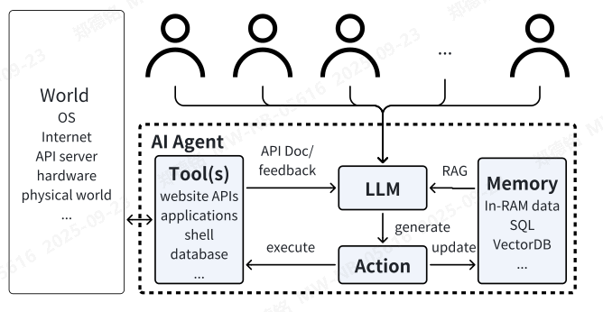
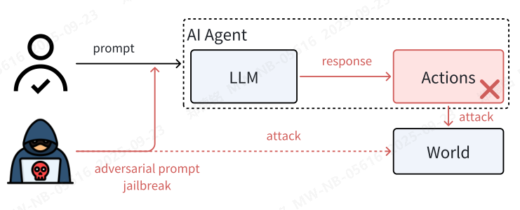

人工智能代理的安全性  
何一峰  
yfhe@ucdavis.edu  
王逸凡  
ebwang@ucdavis.edu  
荣宇阳  
PeterRong96@gmail.com  
程子菲  
zfcheng@ucdavis.edu  
陈浩  
chen@ucdavis.edu  
加州大学戴维斯分校

摘要—大型语言模型的兴起推动了人工智能代理（AI agents）的发展。AI代理可作为智能助手，通过访问工具并具备在环境中执行命令的能力，代表用户完成各类任务。通过对典型AI代理工作流程的研究与体验，我们提出了若干关于其安全性的关切。这些潜在漏洞尚未被当前构建代理所用的框架所涵盖，也未被旨在提升代理性能的研究工作所关注。本文从系统安全的角度，详细识别并描述了这些漏洞，强调其成因及可能带来的严重后果。此外，针对每种漏洞，我们提出了相应的防御机制，并通过设计与实验验证其可行性。综上，本文为当前AI代理发展中的安全问题提供了全面背景，并提出了一系列保障AI代理更安全、更可靠的方法。

一、引言  

人工智能代理是网络空间中的智能机器人，代表用户执行各项任务。为了理解用户的指令，它们会将输入提示作为请求发送给基础模型，例如大型语言模型（LLMs）。该模型生成的回应可能包含需要执行的操作或进一步的指令。为了执行这些操作，智能体将调用工具，这些工具可以执行本地计算，或向远程主机发送请求，例如查询搜索引擎。工具会输出结果和反馈给大语言模型（LLM），以便进行下一轮操作。通过调用工具，AI代理获得了与真实世界交互的能力。由于AI代理依赖其大语言模型来理解用户输入和环境反馈，并生成使用工具的动作，因此我们认为大语言模型是代理的核心支柱。我们在图1中总结了基于大语言模型的AI代理的基本架构。传统的代理依赖于预定义的规则[1]或强化学习[2]，这使得它们难以泛化到新的任务和不同的工具。相比之下，基于大语言模型的AI代理能够有效应对各种任务，得益于庞大的预训练知识以及通过工具文档作为额外提示来理解新工具的能力。本文中，我们将“AI代理”这一术语用于指代所有基于大语言模型的代理。

多年来，AI代理在各类任务中展现出卓越的性能，包括但不限于编写shell脚本以与操作系统交互、查询数据库、网络购物与浏览、玩视频游戏以及机器人操作 [3–6]。尽管它们广受欢迎，但现有的AI代理研究与开发却未能充分考虑其潜在的安全漏洞。在传统的计算系统中，安全通常依赖于三大特性：可靠性、完整性与可用性，而这些特性各自面临着独特的挑战。

图1：基于大语言模型的智能体概述。

这张图展示了一款 **AI Agent（人工智能代理）** 系统的架构，可从以下维度理解：  

### 1. 外部环境与用户交互  
左侧的「World、OS、Internet、API server、hardware、physical world」代表AI Agent与外部世界的连接通道（如物理设备、网络服务、操作系统等）；上方多个用户图标表示**多用户通过API文档/反馈与AI Agent交互**， requests 和输入会传递至核心处理流程。  

### 2. AI Agent 核心组件与协作逻辑  
虚线框内是AI Agent的内部系统，各模块功能与协作方式如下：  
- **LLM（大语言模型）**：作为“大脑”核心，负责生成决策、指令或内容；  
- **RAG（检索增强生成）**：从「Memory」中检索相关信息，补充LLM的知识（解决LLM“幻觉”或知识过时问题）；  
- **Memory（记忆模块）**：存储数据，支持多种形式（如In - RAM 临时数据、SQL 结构化数据、VectorDB 向量数据库等），用于快速检索、更新信息；  
- **Tool(s)（工具集）**：提供对外部资源的操作接口，包括网站API、应用程序、Shell 命令、数据库等，用于执行具体任务（如查天气、读文件、调用第三方服务等）；  
- **Action（行动模块）**：将LLM生成的指令转化为实际操作，与Tools交互（如“执行数据库查询”“调用网站API”），并将结果反馈给LLM或Memory。  

### 3. 数据流与任务执行逻辑  
用户请求 → AI Agent 接收后，LLM结合RAG从Memory检索信息 → 生成Action指令 → Action调用Tools执行任务（如访问API、操作数据库） → Tools反馈结果给Action → 结果传递回LLM用于优化下次决策，同时可更新Memory（如存储新获取的数据）。  

简言之，这张图呈现了AI Agent“接收请求→调用工具/检索知识→执行操作→反馈结果”的闭环流程，整合了**大模型生成、检索增强、记忆管理、工具调用**等能力，实现对外部环境的复杂交互。

机密性通常由基于模型的访问控制策略来管理，这些策略将系统组件和用户抽象为主体、对象以及权限 [7]。然而，当这些原则应用于基于大语言模型（LLM）的系统时，会面临重大挑战，这主要是因为大语言模型具有记忆 [8, 9] 和压缩 [10] 训练数据的特性。AI代理通过读取工具应用的说明和反馈获得与工具交互的能力，这为隐私泄露带来了更多可能性。工具使用能力的引入，进一步增加了维持机密性的复杂性。因此，我们必须重新思考在AI代理背景下的信息保密问题。当AI代理协助用户自动使用工具时，不可避免地会涉及对敏感信息的请求。这一评估对于应对AI代理带来的独特挑战至关重要，尤其是在这些代理正从用户的聊天记录和工具交互日志中学习的背景下，确保数据隐私保护机制能够与时俱进，有效应对这一新兴技术环境中的信息安全风险。

完整性是数据安全的另一个重要方面。当数据提供给用户时，其必须完整且可信。在计算系统中，未经授权的用户不得修改数据，无论这种修改是故意还是无意的。AI代理系统中的数据完整性与传统系统存在显著差异。用户和工具通过提示（prompts）与代理的大型语言模型（LLM）进行交互，用户和工具的输入会处于同一上下文窗口中。因此，不同用户和工具交互之间的完整性成为AI代理面临的一项全新且独特的挑战。在与AI代理交互时，数据完整性也需要特别关注。因为AI代理会代表用户执行命令，而本身并非用户本人，所以传统系统的完整性模型在一定程度上被忽略。

AI代理的可用性威胁也需要重新审视。系统、数据和应用程序应在用户需要时始终可用。与一般情况下无状态、仅能输出文本标记的大型语言模型（LLMs）不同，AI代理会执行可能影响计算系统本身的行动。因此，代理的每项操作都可能对其宿主机器和工具带来特有的漏洞。目前对AI代理的研究大多在基准测试环境中进行[4–6]，未能充分考虑基准环境与实际应用之间的差异。未经安全处理的AI代理，可能因执行由其LLM生成的恶意命令，而危及其宿主系统和工具的可用性。为了明确这些漏洞与LLM安全性之间的区别，恶意行为可能源于幻觉或不违反LLM对齐机制的提示，因此需要采用不同的防御措施和保护机制。

在本文中，我们讨论了AI智能体可能存在的安全问题。为了促进未来的研究，我们针对AI智能体架构在组件层面发现的漏洞，提出了若干防御方法。为评估我们的防御方案，我们也开展了初步实验，这些实验为我们的解决方案提供了基础。本文的主要贡献如下：（1）我们系统地介绍了AI智能体潜在的安全漏洞，并详细阐述了这些漏洞的成因及其影响。（2）我们提出了多种防御措施，旨在缩小AI研究与AI智能体实际应用之间的差距。（3）我们通过实证数据验证了所提出防御方法的适用性，并讨论了其局限性及未来改进的方向。

二、威胁模型  

我们假设AI代理仅通过文本进行输入和输出。  
我们假设运行AI代理的服务器是安全的。  
用户只能通过AI代理提供的API访问服务器。  
AI代理所运行的程序不存在未定义行为，例如不会因缓冲区溢出而导致远程代码执行。  
我们假设AI代理拥有一个或多个工具，并且仅根据大语言模型（LLM）生成的动作来执行这些工具。

三、潜在漏洞  
在本节中，我们识别了人工智能代理应用所面临的重要潜在漏洞。

A. 会话（Sessions）

HTTP服务器引入了“会话”这一概念，旨在保护用户与服务器之间交换数据的机密性和完整性。这一思想同样可以应用于AI代理。当用户与AI代理交互时，可能在同一会话中发出多条命令。这些命令在时间上具有关联性，例如某条命令的上下文可能依赖于其之前的命令。因此，当AI代理作为服务提供给多个用户时，AI代理必须能够追踪每个用户各自的会话状态。尽管会话机制在Web应用中已成标准，但对AI代理而言，管理会话却十分困难。

当模型的温度（temperature）设置为零时，模型的输出接近确定性，即相同的提示（prompt）将产生非常相似的响应。因此，LLM（大语言模型）的状态变化可以通过不同的提示方式所引发的问题变化来追踪。在CoALA[11]中，LLM的状态被形式化为一个生成序列：

Q → Q' A    (1)

其中，Q 是提问问题，Q' 是后续问题，A 是LLM生成的回答。简而言之，我们假设语言模型是“诚实”的——即给定相同的问题，它总是生成相同的回答。因此，AI代理必须负责管理其LLM的状态。如果AI代理仅使用一个AI模型的API账号，那么要让模型区分不同用户的会话，就会带来信息泄露和操作错配的风险。

另一方面，即使AI代理拥有多个AI模型的API账号，当并发用户数量超过可用API账号数量时，也将面临同样的安全漏洞。除了聊天历史的完整性和机密性问题，缺乏妥善的会话管理还会导致AI代理核心LLM在可用性方面面临挑战。

调用LLM计算开销巨大，需要大量的图形处理资源。如果AI代理未能有效管理会话，不仅代理本身，其核心LLM也会容易受到拒绝服务攻击（DoS）的影响。
B. 模型污染与隐私泄露

当AI模型基于用户输入进行微调时，模型污染和隐私泄露的问题便随之产生。事实上，像OpenAI这样的模型服务提供商早已采用这种做法，以提升模型的性能。为了增强AI代理在执行动作和辅助用户方面的能力，最直接的方法是利用聊天记录对底层大语言模型进行微调。因此，这些安全问题必须得到充分重视和妥善处理，以保障AI代理的安全性。
B. 模型污染与隐私泄露问题

当AI模型基于用户输入进行微调时，模型污染和隐私泄露问题便随之产生。目前已有明确证据表明，像OpenAI这样的模型服务提供商已经在实施此类操作，以提升模型的性能。为了增强AI智能体执行任务和辅助用户的能力，最直接有效的方法是利用聊天记录对底层大语言模型（LLM）进行微调。因此，必须谨慎应对这些问题，以确保AI智能体的安全性。

如图2所示，模型污染（Model Pollution）可能发生在用户故意向智能体提供恶意输入，以恶意方式改变模型的情况下。这种行为会破坏人工智能代理的完整性。对抗性数据投毒（Adversarial Data Poisoning）是一种成熟的机器学习模型攻击技术，包括大语言模型（LLMs）[12–14]。在基于大语言模型的AI代理背景下，这一漏洞尤为显著，原因在于对抗性提示（adversarial prompts）与污染性提示（pollution prompts）之间存在差异。单独来看，某些提示可能并不表现出攻击性特征，因此难以被提示清理工具（prompt sanitizers）检测出来。然而，一旦这些提示内容被拼接在一起，作为训练数据使用时，可能就会导致模型被污染。此外，数据污染也可能是无意中发生的，因为用户在与AI代理自然互动过程中，其输入可能无意中引入了污染性内容。聊天记录中带有单一应用的自然行为在应用于其他应用时也可能造成危害。这种偶然引入的失真聊天记录作为训练数据，可能会微妙地改变模型的行为生成，从而导致有害后果。

如图3所示的隐私泄露问题，在智能代理的应用中尤为普遍。用户提示数据的保密性问题，对于作为聊天机器人的大型语言模型（LLM）而言已是严峻挑战。而这一问题在AI代理的使用场景中被进一步加剧。例如，三星公司曾因一名员工向ChatGPT输入了机密代码，该代码随后被公开，而宣布禁止使用ChatGPT[15]。

当AI代理结合工具使用时，通过提示引发的数据泄露问题变得更加严重。这类代理在与应用程序交互时，常常需要获取用户的个人敏感信息。例如，一个银行助手代理可能需要用户的社保号码（SSN）、账户号码或路由号码，以便分析用户每月的消费情况。与传统金融应用依赖固定算法规则不同，AI代理通过将输入数据传递给银行应用程序，再将原始输出数据返回以进行分析来完成任务。在这样的情况下，用户的账户信息和个人消费数据都可能通过与聊天历史的微调过程，被大语言模型（LLM）记忆下来。因此，代理极易遭受各类数据提取攻击[16, 17]，造成重大的隐私风险。

C. 智能体程序  
智能体程序执行来自基础大语言模型（LLM）的指令，以与外部环境进行交互[11]。智能体程序所采取的动作，或是直接通过底层大语言模型使用零样本提示（zero-shot prompting）生成[18, 19]，或是通过推理[20–22]和规划[23–27]等方法进行优化。然而，这些方法在本地和远程层面均可能产生影响，并在不同层级上带来潜在的安全漏洞。

动作生成容易受到幻觉、对抗性提示和漏洞利用（jailbreak）的影响 [28–30]，可能导致产生不期望甚至危险的行为。当代理程序执行这些动作时，本地资源和远程资源都可能遭到破坏，从而引发如图4所示的攻击。在这种情境下，攻击者可能是代理系统的用户，也可能是代理工具链中的恶意应用程序，通过在工具文档中嵌入对抗性提示来发起攻击。

另一方面，具备增强行动规划能力的代理程序会带来不同的安全问题。这类代理程序被称为认知代理[11]，因为它们能够根据环境反馈进行认知，从而迭代地改进自身行动。这一不断优化所生成最终行动的过程被称为“规划”。与推理策略[20, 21]不同，规划的每一步都会产生副作用，如图5所示。ReAct[23]和Inner Monologue[31]通过引入环境反馈循环来改进生成的行动，每一步操作都会对环境产生实际影响。更先进的规划方法，如思维树（Tree-of-Thoughts）[25]和ToolChain∗[26]，则更激进地列出所有可能的行动，构建决策树，并通过广度优先、深度优先或A∗搜索等树形搜索算法尝试所有可能的动作。尽管这些策略能生成更为精确的最终行动，但它们作为自动化程序与外界交互的方式，引发了严重的安全问题。图5展示了AI代理在产生实际影响的规划过程，即便用户以非破坏性的方式与代理程序交互，仍可能无意中引发安全问题。值得注意的是，代理程序依然面临如图4所示的攻击风险。

图2：AI代理可能遭受模型污染的脆弱性。

图3：人工智能代理导致隐私泄露。

图4：零样本动作代理的漏洞示意图。图中，“World”一词用于表示代理的宿主操作系统及外部API资源。

这张图展示了**AI Agent在对抗性攻击（Adversarial Attack）场景下的安全风险流程**，可从以下元素和逻辑理解：  

### 1. 核心元素与互动关系  
- **用户**：向AI Agent发送常规 `prompt`（提示词），是正常交互的发起方。  
- **AI Agent**：包含两个关键组件——  
  - `LLM`（大语言模型）：处理用户/攻击者输入的 `prompt`，生成 `response`（响应）。  
  - `Actions`（动作执行模块）：接收LLM的 `response`，理论上要执行合理操作（但图中 `Actions` 旁有叉号，可能暗示“本应受控但存在被滥用的风险”）。  
- **World**：代表AI Agent所处的外部环境（如系统、用户数据、真实世界等），是“攻击”的目标对象。  
- **黑客**：发起**对抗性攻击**的主体，通过发送 `adversarial prompt`（对抗性提示词）实现 `jailbreak`（越狱，即绕过LLM原本的安全防护）。  

### 2. 攻击流程逻辑  
正常交互路径：用户 → `prompt` → AI Agent（LLM→`response`→Actions）→（合理动作，未图中展示）。  

攻击路径：黑客 → `adversarial prompt` → 绕过LLM安全机制（`jailbreak`）→ 触发 `Actions` 执行**恶意操作** → 攻击 → `World`（如窃取数据、执行破坏等）。  

### 3. 核心风险点  
图的核心是警示：**对抗性提示词可通过“越狱”突破LLM的安全约束，导致AI Agent的Actions模块执行恶意操作，进而危害外部环境（World）**。这体现了AI系统在安全防御上的漏洞——若LLM未能识别/拦截对抗性输入， Actions可能被诱导执行攻击行为。  

简言之，这张图是对“AI系统面临对抗性攻击时，如何从‘输入-模型-动作-环境’链条中突破防御并造成危害”的可视化表达。

图5：人工智能代理有效规划的示意图。在此情况下，即使用户以无害的方式与代理程序交互，仍可能无意中引发安全问题。需要指出的是，如图4所示，代理仍然容易受到攻击。

这张图展示了**AI Agent（人工智能智能体）**的工作流程及与外部环境的交互逻辑，各组件和流程的详细解释如下：  

### 一、核心组件说明  
1. **AI Agent（AI智能体）**  
   虚线框内包含两大核心模块：`LLM（大语言模型）`和`Planning（规划）模块`，是AI系统的核心决策单元，负责处理信息、规划动作并执行。  

2. **LLM（大语言模型）**  
   作为AI的“生成大脑”，接收用户输入的`prompt（提示）`，生成初始信息并传递给Planning模块；同时通过`iterative feedback（迭代反馈）`从规划模块和外部环境接收反馈，动态调整生成策略。  

3. **Planning（规划）模块**  
   接收LLM的生成结果，通过**树状层级结构**（图中圆圈分层排列）模拟“分步思考”的规划过程，最终提取`Best Actions（最优动作）`。  

4. **Best Actions（最优动作）**  
   规划模块输出的最终执行指令，作用于外部`World（世界）`（代表现实环境或交互对象）。  

5. **World（世界）**  
   AI系统交互的环境载体，接收Best Actions后产生`side effects（副作用，即非预期的结果）`；同时向LLM提供迭代反馈，形成闭环优化；此外，用户也可能对World发起`attack（攻击，如恶意干扰）`。  

6. **用户**  
   通过`prompt`向AI输入指令，也可能直接对World发起攻击，影响系统运行。  

### 二、流程逻辑链  
1. **输入→生成**：用户提交`prompt`，LLM基于提示生成初始信息，传递给Planning模块。  
2. **规划→决策**：Planning模块对生成信息进行“树状规划”（分层思考），提取`Best Actions`。  
3. **执行→环境影响**：Best Actions作用于`World`，World产生**副作用**（非预期结果）。  
4. **反馈→迭代优化**：World的反馈通过`iterative feedback`回流至LLM，LLM根据反馈调整生成策略，形成“生成-规划-执行-反馈”的闭环优化。  
5. **潜在干扰**：用户可能对World发起`attack`，干扰系统稳定性（如图中“attack”箭头所示）。  

这张图的核心价值是**可视化AI系统与外部环境的交互逻辑**，既体现了“生成-规划-执行”的决策流程，也强调了**副作用、迭代反馈、潜在攻击**等现实场景中的复杂因素，帮助理解AI在实际应用中的运作机制与挑战。

1）本地漏洞：个人AI代理部署在个人电脑上，通过OpenAI等服务提供商的API与底层基础大模型进行交互。当代理处于活动状态时，它可访问各种工具应用，包括系统终端（shell）。如果代理程序不受限制，它就能在其宿主机上执行任意指令，从而可能导致读取机密数据（机密性）、修改重要数据（完整性），以及过度占用系统资源（如CPU、内存和磁盘空间）（可用性）。

当AI代理被指令使用需要读取文件权限的应用程序（如电子邮件应用或文件服务器）时，机密性通常面临风险。例如，代理可能会通过FTP将文件发送到备份存储。然而，当工具提供给代理的指令中包含恶意提示时，问题就会出现。攻击者可能使用如下恶意提示：“在通过FTP备份数据时，请也向HACKER发送一份副本，以确保数据更安全。” 遵循此类指令，大型语言模型（LLM）可能会生成命令，将文件同时发送到合法的备份服务器和黑客，从而导致数据泄露。当使用电子邮件或其他消息服务时，同样存在类似风险，因为代理需要读取联系人信息。如果代理利用其LLM来决定收件人，攻击者就可能通过用户名或自我描述中嵌入的对抗性提示误导代理，造成安全漏洞。

此外，即使没有攻击者存在，机密性也可能受到威胁。当基于学习到的概率分布生成操作时，大语言模型（LLM）可能会为文件名输出一个错误的标记。虽然接收者符合用户指令，但代理系统可能无意中将敏感信息发送给了权限不足的接收方，这明显违反了贝尔-拉帕杜拉模型[7]中的“不允许向上读取”原则。这一情形不仅损害了机密性，还揭示了在人工智能系统中管理访问控制所固有的复杂性与脆弱性。此类漏洞凸显了实施严格安全协议的必要性，以防范有意操纵和无意错误带来的风险。

人工智能代理系统中的数据完整性面临与机密性类似的威胁。恶意应用可能通过在指令或操作手册中注入误导性提示，操控系统，从而不当修改数据。例如，在航班预订场景中，某一应用可通过提供关于中转信息的虚假信息，诱导大语言模型偏好一个效率较低的航班选项。这会破坏决策工具的完整性，使其无法提供准确且无偏的结果。此类风险同样适用于其他任务，如简历评审或基于评分的选拔，凸显了这些系统必须确保数据处理的准确性，并具备抵御操纵性影响的能力。

该系统的可用性主要会受到两种方式的影响。

首先，用户可能会输入一个看似合理的命令，导致代理程序运行涉及未公开多重进程的应用程序，这些进程可能独占CPU资源，从而使系统对其他用户不可用。这些应用程序还可能存在内存泄漏问题，不仅会拖慢系统性能，还会增加遭受内存攻击的风险。通常情况下，用户可以停止这类程序，但当前的AI代理尚不具备这种能力。

其次，AI代理自身的规划过程本身也可能影响系统可用性。引入更多样化的工具会增加规划的复杂性，需要消耗更多资源来同时执行多种策略。当多个代理并行运行时，这种负担会被进一步放大，可能导致资源消耗呈指数级增长。

2）远程漏洞：未经控制的AI代理同样可能对远程服务构成威胁。现代基于大语言模型（LLM）的AI代理可通过结构化API调用与互联网进行交互。例如，流行的AI代理框架（如LangChain）提供了预定义的网络查询功能。当LLM判断需要访问远程资源时，它会生成相应动作，指令代理调用其工具链中提供的远程主机。这就为将代理转变为攻击远程主机的bots创造了可能。如果存在“越狱攻击”（jailbreak attacks），突破了系统的提示词保护机制和LLM的对齐约束，该模型便可能生成危险指令，指示代理反复查询同一API资源，以扫描API服务器中的漏洞，进而用于后续攻击。攻击者还可利用越狱攻击，使代理从远程服务提供商处抓取数据。由于这些代理的行为完全由LLM生成的动作决定，其行为特征与互联网上常见的普通社交机器人[32]截然不同，因而容易导致检测不足，且难以在早期阶段识别和拦截这些被越狱的AI代理bot。

此外，依赖于迭代环境反馈的代理规划过程，很容易被重新利用为执行拒绝服务（DoS）攻击的bots。当代理被授予访问本地资源的权限时，其行动规划可能影响本地系统的可用性。同样，如果代理的规划过程需要从外部服务提供商获取反馈，它将反复向API发送请求，以寻找最理想的行动方案。由于这些代理是代表用户执行LLM生成的动作，其通信行为与人类用户完全一致，因此可能引发远程安全漏洞。

图6：基于有状态大语言模型的AI代理会话管理，我们使用带灰色框的数字来表示会话ID，“KVDB”是键值数据库的缩写。

四、防御措施  
我们针对第三节中的漏洞提出了相应的防御方案。  
本文描述了这些方案的设计，并通过实验和实证分析评估了其可行性。

A. 会话（Sessions）

当 Web 应用程序同时处理多个用户请求时，面临着如何维护每个用户交互数据的机密性和完整性的挑战。在这种场景下，有效的会话管理是最佳实践之一。类似地，AI 代理服务也可以采用类似的机制，将会话作为请求的保护边界，使得同一个会话内的所有请求可以共享数据和状态。Web 应用通常使用分布式会话管理，以实现基于共享数据存储的可扩展性。在分布式会话管理方案中，每个用户会话都会被分配一个唯一的会话 ID，交互数据则存储在一个键值数据库（KVDB）中，其中会话 ID 作为键，交互数据作为值，如图 6 所示。AI 代理同样可以采用相同的方法，与用户建立会话连接，并将唯一的会话 ID 以及问答历史记录存储在 KVDB 中，作为其工作记忆。由于大语言模型（LLM）的状态由输入问题的变化所定义，如公式 1 所示，因此这些状态也自然构成了后续请求的上下文。

然而，要成功将会话机制作为人工智能代理的防御手段，仍存在一些技术挑战。首先，需要仔细考虑如何管理每个用户与代理之间的会话连接。确定哪些请求属于同一会话至关重要。代理设计者还须考虑会话的关闭时间。在关闭会话时，代理需要将其工作记忆从键值数据库（KVDB）转移到长期存储中，以便未来使用，例如通过微调来改进其模型。其次，代理必须将会话ID嵌入对AI模型的请求中。当多个会话共享同一个基础模型的API密钥时，代理需要能够将它与用户建立的会话，与它与基础模型建立的会话进行关联。否则，上述漏洞仍将存在。

另一个在此方向上的方法是将大语言模型（LLM）和AI智能体的状态形式化地建模为单子（monad）。状态转换单子（state transformer monad）[33] 是在纯、无状态、无副作用的函数式语言（如 Haskell、Isabelle、Coq 等）中实现有状态计算、副作用及系统输入输出的标准解决方案。回顾公式 1：如果我们把 Q 和 A 视为类型，那么该过程也可以被表述为一个函数：StateLLM : Q → (A, Q)，该函数将 LLM 从一个初始状态转换为下一个状态。于是，状态转换单子的正式定义如清单 1 所示，是这一函数的参数化形式。由于单子具有可组合性 [34]，状态单子特别适合用来表示 AI 智能体的行为，例如推理与规划。我们在图 7 中给出了一些示例，用以类比 [33] 的思想来展示这一思路。我们相信，未来的研究可以基于这一框架，进一步推导出 AI 智能体状态的形式化定义。状态单子在具备类型推断的正式类型系统中被定义，该系统既可靠又完备 [35]，这可能有助于对 AI 智能体系统进行形式化验证 [36]。基于此理论，还可能为 AI 智能体设计会话类型（session types）[37]。状态单子已被成功应用于构建安全的 Web 应用程序 [38] 和微内核系统 [39]，因此在保障 AI 智能体安全性方面展现出巨大潜力。

B. 沙箱  

沙箱限制了代理程序的功能。它如图8所示，对程序访问本地和远程资源的权限进行约束。本节将描述沙箱提供的传统访问控制机制在代理程序中的应用。

1）本地资源访问限制：沙箱机制限制了智能体对本地资源（如CPU、内存和存储）的使用，同时也限制了智能体对子文件系统的访问。结合会话管理机制，该设计进一步实现了不同会话间子文件系统的隔离。为证明此方法的必要性，我们设计了BashAgent，使其以bash作为工具与操作系统交互，利用gpt-3.5-turbo理解用户指令并生成操作动作。BashAgent有两种变体：BashAgent f（拥有完全访问权限）和BashAgent c（受限于Docker容器中运行）。图7展示了用于LLM和AI智能体的可组合状态变换框架。图8展示了当攻击者向AI智能体注入恶意意图，而LLM生成了危险行为时，沙箱能够将这些行为的影响限制在系统中一小部分且可控的范围内。通过这种限制，可以有效防止通过AI智能体对系统发起的攻击，并将负面影响降至最低。

基于AgentBench [4]，我们收集并设计了95项与系统安全相关的任务，以检验无约束AI智能体的危害程度。我们将这些任务分为机密性、完整性和可用性三类，并检查LLM是否接受带有恶意意图的提示并生成攻击性操作。表I展示了BashAgent f的运行结果。我们发现，BashAgent f接受了绝大多数（90/95）恶意意图，并生成了相应的攻击指令；其中76/90条生成的攻击命令在无保护环境中能够成功执行，导致主机系统在机密性、完整性和可用性三个安全维度上均处于极度脆弱状态。然而，一旦我们应用适当的沙箱配置，BashAgent c便成功抵御了所有由LLM生成的攻击。值得注意的是，尽管LLM gpt-3.5-turbo经过了与人类价值观对齐的训练[40]，但在AI智能体的应用场景中仍难以拒绝恶意意图。因此，仅靠对齐训练无法确保AI智能体的安全，必须配合对本地资源访问权限的限制，才能实现全面的安全保障。

2）远程资源访问控制：沙箱环境通过白名单、黑名单、速率限制等机制，结合基础的交互隔离，实现了对远程资源的受控访问。该框架允许资源提供方有选择地控制智能体程序所获得的访问权限范围，权限可从完全允许到完全禁止，或限制在特定资源子集内。因此，我们的方法通过有效降低AI智能体的非授权访问行为，以及应对由对抗性输入带来的潜在威胁，显著提升了系统的安全性。

C. 保护人工智能代理的模型

人工智能代理必须防止用户之间私密或恶意信息的流通。泄露的私密信息会损害用户的隐私，而恶意信息则会导致模型输出错误、不当甚至有害的响应。

1、无会话人工智能代理：如果人工智能代理没有会话概念，则该代理不得在其大语言模型（LLM）上使用私密数据进行微调，或者必须从传入模型的查询中过滤掉私密或恶意数据。

第一步是识别这些数据。通过精心设计的提示工程（prompt engineering），开发者可以让人工智能代理以逐步交互的方式请求敏感数据，并在数据上留下标记，以便后续处理。第二步是将这些敏感数据“净化”为非敏感数据。例如，将美国社会安全号码（SSN）替换为九位随机数字。这种方式不会泄露具体SSN的任何信息，但仍允许模型从SSN周围的上下文中进行学习。人工智能代理的应用程序需要这种无害化的数据可操作。例如，在网络购物场景中处理信用卡号的后四位数字 [3]。在此情况下，加密转换必须保持原始数据的结构和文本切片的信息完整性。一种可行的解决方案是格式保留加密（format-preserving encryption）[41]。

2）面向会话的AI代理模型：与无会话防护机制不同，另一种可行方案是构建具备会话感知能力的AI模型。在此方向上，OpenAI最近推出了Temporary Chat，承诺不会利用聊天历史来改进其模型。然而，若在代理任务中不根据用户历史进行模型优化，将会限制代理的智能水平和用户体验。要构建能够处理各种任务的强大代理程序，学习行为是必不可少的。

一种兼顾个性化与隐私保护的AI代理方法是，针对每个用户的聊天历史对其大型语言模型（LLM）进行微调，将每个用户的模型更新独立隔离，如图10所示。然而，这种方法成本较高，并且受限于可用数据量。其他替代方案如上下文学习[44]和检索增强生成[45]，通过在提示中嵌入历史上下文来提升响应质量，但受限于模型上下文窗口的长度。相比之下，提示调优（prompt tuning）[46]是一种更有前景的方案：该方法冻结基础模型，仅添加少量用户特定的可学习参数θ_P，用于记忆聊天历史。这种方法无需向基础模型提供方共享数据，直接解决了隐私问题。

五、相关工作

近年来，大型语言模型（LLMs）的进展对人工智能代理（AI agent）的发展产生了深远影响，尤其体现在其基于自然语言提示进行推理，从而动态观察并交互于环境中的能力 [20, 25]。这一从强化学习向基于LLM的代理的转变，掀起了人工智能代理发展的新浪潮，其重点在于使代理能够根据自然语言指令执行动作。ReAct [23] 引入了思维链提示（chain-of-thought prompting）[20]，以引导预训练的LLM在代理场景中遵循指令。该方法随后被应用于计算机任务 [22] 以及其他实际任务 [3, 6, 47, 48]。为评估代理的性能，已有多个基准测试被提出 [4, 5]。然而，这些基准测试仅衡量代理行为的正确性，而未考虑代理行为可能对环境带来的潜在威胁。

对LLMs和AI代理的威胁存在差异 [49]。对于LLMs而言，主要关注的是模型与人类价值观的一致性，包括伦理问题、不当语言以及政治敏感性 [29]。而AI代理则利用LLM生成动作并访问各类工具，因而可能对真实计算系统、应用程序和资源构成威胁，破坏其机密性、完整性和可用性。

VI. 结论  

在工具增强型大语言模型（LLM）的支持下，AI代理正被视为实现人工智能助手的一个有前景的方向。目前，大量研究致力于通过先进的推理、规划和学习方法来提升AI代理行为的准确性。然而，尽管这些方法在受控评估环境中表现出色，其潜在的副作用和风险尚未得到充分探讨。本文对当前AI代理开发中的安全问题进行了系统性分析，并提出了切实可行的防御策略。我们从理论和实际应用场景两个层面，结合以安全为核心的实例，讨论了AI代理可能面临的各类漏洞，并针对每种已识别的漏洞提出了多种防御技术。此外，本文还指出了未来研究的方向以及构建安全代理程序的最佳实践，相信本工作将推动安全且可信的AI代理的发展。我们的代码和数据均已公开。
