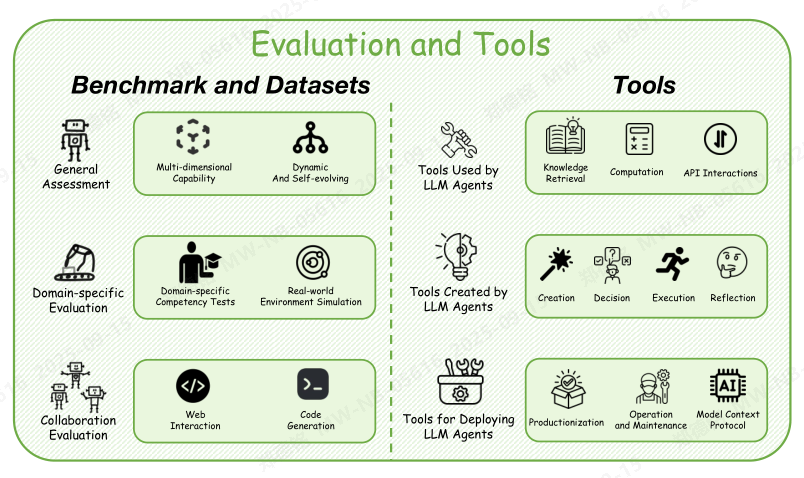
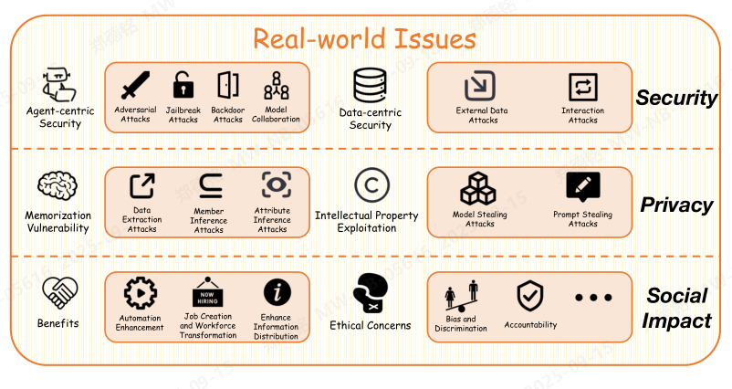

长期记忆。长期记忆系统地归档代理的中间推理轨迹，并将它们合成可重用的工具以备将来调用。

这个过程通过三种主导范式将短暂认知努力转化为持久的运营资产：

1. **技能库**：编码程序性知识的范式（例如，Voyager在Minecraft中的自动技能发现[35]，GITM基于文本的知识库[36]）。
2. **经验仓库**：存储成功/失败模式的范式（例如，ExpeL的蒸馏经验池[37]，Reflexion优化的内存[38]）。
3. **工具合成框架**：通过组合适应进化能力的范式（例如，TPTU的适应性工具组合[39]，OpenAgents的自扩展工具包[40]）。

跨域实施，如Lego-Prover的定理库[41]和MemGPT的分层内存架构[42]，进一步展示了通过策略性知识再利用，结构的长期存储如何增强推理效率。

知识检索作为记忆。这种范式与代理内部记忆生成的方式不同，通过将外部知识库集成到生成过程中，实际上扩展了代理可获取信息的边界。当前实现表现出三种主导方法：❶ 通过文本语料库（如RAG [43]）或结构化知识图谱（如GraphRAG [44]）进行静态知识基础构建；❷ 交互式检索，将代理对话与外部查询结合，正如Chain of Agents [45]中所展示的，其中短期代理间通信触发上下文感知的知识获取；以及❸ 推理整合检索，类似于IRCoT [46]和Llatrieval [47]，这些方法在逐步推理过程中交替进行动态知识获取。高级变体如KG-RAR [48]进一步在推理过程中构建任务特定的子图，而DeepRAG [49]引入了细化的检索决策模块，以平衡参数化知识和外部证据。这些混合架构使代理能够超越训练数据限制，同时保持上下文相关性，将知识检索确立为可扩展记忆系统的关键基础设施。
规划能力是LLM代理能力的关键方面 enabling他们以高精度导航 through复杂任务和问题解决场景[103]。有效的规划对于将LLM代理部署到现实世界应用中是必不可少的，在那里它们必须处理多样化的复杂任务和场景。LLM代理的规划能力可以从两个角度看待：任务分解和反馈驱动的迭代。

任务分解策略。任务分解通过将复杂问题拆分为更易于处理的子任务，代表了一种提升大语言模型（LLM）规划能力的基本方法。尽管对大型语言模型代理来说解决一个完整问题可能具有挑战性，但它们更容易处理子任务，然后将结果整合起来以应对整个问题。任务分解策略主要分为两类：单路径链式和多路径树状扩展。

单路径链式是一种简单的方法，其中最简单的版本是零样本思维链[104]、[105]。它首先要求智能体制定一个计划，该计划由一系列相互依赖的子任务组成。随后，智能体按照所呈现的顺序解决这些子任务[50]、[105]。

这种计划与求解范式[51]简单直接，易于实现。然而，在链式执行过程中，它可能因缺乏灵活性以及错误累积而受到影响，因为在解决问题的过程中，智能体必须严格遵循预先定义的计划，不允许有任何偏离。

因此，有研究提出采用动态规划，即仅根据智能体当前所处的环境状况来生成下一个子任务 [33], [105]。这使得智能体能够接收环境反馈并相应地调整其计划，从而提高其鲁棒性和适应性。

此外，另一项研究提出使用多个思维链来提高规划过程的鲁棒性。这类似于集成方法，包括自一致[62]、多数投票[107]以及代理讨论[52]等方式来融合多个思维链。通过综合多个思维链的智慧，智能体能够做出更准确的决策，并减少错误累积的风险。

一种更复杂的方法是使用树结构而非链式结构作为规划数据结构，这样在智能体规划时存在多种可能的推理路径，且智能体可以根据反馈信息进行回溯[53]，[54]。

Long 等人 [55] 提出了一种树状思维（Tree of Thought, ToT）方法，通过树状的思考过程探索解空间。该方法使大型语言模型能够回溯到之前的决策状态，从而纠正之前的错误，使得模型能够应对涉及“试错修正”过程的各类复杂任务。

在更现实的场景中，智能体可以从环境或人类那里获取反馈，并动态调整其推理路径，可能结合强化学习[56]、[108]。这使得智能体能够利用蒙特卡洛树搜索[109]等先进算法，在现实世界应用中做出更明智的决策，从而推动机器人[57]–[59]和游戏博弈[110]、[111]等领域的应用。

反馈驱动的迭代。反馈驱动的迭代是大语言模型规划能力的一个关键方面，使智能体能够从反馈中学习并随着时间推移不断提升其性能。反馈可来源于多种渠道，例如环境输入、人类指导、模型内省以及多智能体协作。

环境反馈是机器人学中最常见的反馈类型之一[60]，由具身智能体所处的环境产生。人类反馈是另一种关键类型的反馈，来源于用户互动或预先手动标注的数据[61],[112]。模型内省则提供了另一种反馈来源，由智能体自身生成[62]。多智能体协作也作为一种反馈机制，多个智能体共同协作解决问题并交换见解[63],[112]。

这些反馈来源帮助评估代理的性能，从而指导其规划。例如，代理可以利用反馈来更新（重新生成）其计划、调整其推理路径，甚至修改其目标。这一迭代过程将持续进行，直到达成满意的计划为止[64]，[65]。

2.1.4 动作执行  
在具备规划能力的前提下，大语言模型（LLMs）必须具备在现实世界中执行规划动作的能力。动作执行是LLM代理能力的关键方面，因为若代理无法有效执行计划，再好的计划也毫无意义。动作执行包括两个方面：工具使用[113]和物理交互[114]。

工具使用[113]是大语言模型（LLM）执行行动的重要方面，能够实现多种能力，例如精确的数值计算、获取最新信息以及高效生成代码。工具使用能力包含两个方面：工具使用决策与工具选择。工具使用决策是指判断是否需要借助工具来解决问题的过程。当代理在生成内容时信心不足，或面对与特定工具功能相关的问题时，应决定使用相应的工具[66]、[67]。工具选择是工具使用中的另一个关键环节，涉及对工具本身以及代理当前情境的理解[68]、[69]。例如，Yuan 等人[68]提出通过简化工具文档，以更好地理解可用工具，从而实现更准确的工具选择。

物理交互[114]是具身大型语言模型（LLM）智能体的一个基本方面。它们在现实世界中执行特定动作并理解环境反馈的能力至关重要。当在真实场景中部署时，LLM智能体必须理解多种因素，才能准确执行动作。这些因素包括机器人硬件[114]、社会知识[70]，以及与其他LLM智能体的交互[71][72]。

2.2 代理协作  
大语言模型（LLM）代理之间的协作在将它们的问题解决能力扩展至个体推理之外方面发挥着关键作用。有效的协作使代理能够利用分布式智能，协调行动，并通过多代理交互不断优化决策 [26], [121]。我们现有协作范式分为三种基本架构：集中式控制、去中心化协作以及混合架构。这些范式在决策层级、通信拓扑结构和任务分配机制方面各不相同，为不同应用场景提供了独特的优势。

2.2.1 集中式控制  
集中式控制架构采用分层协调机制，其中中央控制器通过任务分配和决策整合来组织各智能体的活动，而其他子智能体只能与控制器进行通信。该范式包含两种实现策略：显式控制器系统利用专用的协调模块（通常以独立的大型语言模型智能体形式实现）对任务进行分解并分配子目标；而基于区分的系统则通过提示词引导元智能体承担不同的子角色，从而实现集中式控制。集中式方法在需要严格协调的关键任务场景中表现出色，例如工业自动化[122]和科研活动[73]。

显式控制器系统。已有多个相关工作致力于显式实现集中式架构。Coscientist [73] 典型地体现了显式控制器范式，其中人类操作员充当中央控制器。它建立了标准化的科学实验工作流程，将专业化的智能体和工具分配给不同的实验阶段，并直接掌控最终的执行计划。LLM-Blender [74] 显式地构建了一个控制器，采用跨注意力编码器进行两两比较，以识别最佳响应，并融合排名靠前的响应，从而强化优势、弥补缺陷。MetaGPT [27] 模拟了现实世界中的软件开发工作流程，直接为不同的功能角色和阶段分配专门的管理者进行控制。

基于差异的系统。AutoAct [75] 典型地体现了基于差异的范式，其通过隐式地将元代理分解为三个子代理——规划代理、工具代理和反思代理——来分解复杂的 ScienceQA 任务。Meta-Prompting [76] 则通过精心设计的元提示，将复杂任务分解为特定领域的子任务。一个单一模型充当协调器，根据面向任务的提示动态地将子任务分配给专业化的子代理，随后中央管理器将所有中间输出整合，生成最终解决方案。这些工作主要采用能力强大的代理作为中心控制器，以优化任务分配和决策聚合。然而，WJudge [77] 表明，即使控制器的区分能力有限，也能显著提升代理系统的整体性能。

2.2.2 去中心化协作  
与集中式架构中单个控制节点因承担所有节点间通信、任务调度和冲突解决而常成为瓶颈不同，去中心化协作通过自组织协议实现节点间的直接交互。该范式可进一步分为两种截然不同的方法：基于修正的系统和基于通信的系统。

基于修订的系统。在这种范式中，代理仅观察由同伴生成的最终决策，并通过结构化的编辑协议迭代地优化共享输出。这种方法通常会产生更加标准化和确定性的结果。例如，MedAgents [78] 采用预定义的领域特定专家代理，这些代理依次提出并独立修改决策，最终通过投票达成共识。ReConcile [79] 通过相互响应分析、置信度评估以及人工精选样例，协调代理迭代优化回答。METAL [115] 为图表生成任务引入了专门的文本和视觉修订代理，展示了领域特定的优化如何提升输出质量。值得注意的是，修订信号不仅来源于代理之间的交互，也可能来自外部知识库 [116], [123]，从而支持混合优化策略。

基于通信的系统。与基于修订的方法相比，基于通信的方法具有更灵活的组织结构，允许智能体直接展开对话，并观察同伴的推理过程。这使其特别适用于建模动态场景，如人类社会互动 [30]。主要实现方式包括：MAD [80] 采用结构化通信协议，以解决“思维退化”问题，即智能体过度执着于初始解决方案。MADR [81] 在此基础上进行了优化，使智能体能够批判不合理的主张，完善论证，并生成可供验证的解释，以支持事实核查。MDebate [82] 通过在坚持合理观点与协作优化之间进行策略性交替，优化了共识的形成过程。AutoGen [26] 实现了一个群聊框架，支持多智能体参与迭代辩论，以不断优化决策。

2.2.3 混合架构  
混合架构战略性地结合了集中式协调与分布式协作，以在可控性与灵活性之间取得平衡，优化资源利用，并适应异构的任务需求。该方法引入了两种实现模式：具有预设协调规则的静态系统，以及具备自我优化拓扑结构的动态系统。

静态系统。静态系统为不同协作模式的组合预先定义固定的模式。典型的实现包括：CAMEL [25] 将代理划分为组内去中心化的团队以进行角色扮演模拟，同时通过中心化治理实现组间协调。AFlow [29] 采用三层层级结构，包括中心化的战略规划、去中心化的战术谈判以及基于市场的操作资源分配。EoT [117] 形式化了四种协作模式（BUS、STAR、TREE、RING），以使网络拓扑与特定任务特性相匹配。

动态系统。近期的创新引入了神经拓扑优化器，能够根据实时性能反馈动态重构协作结构，从而实现对变化环境的自动适应。关键实现展示了这一范式：DiscoGraph [118] 通过师生框架引入可训练的、姿态感知的协作机制。教师模型具备全局视图，输入通过特征图蒸馏指导学生模型，而基于矩阵的边权重则实现了代理之间的自适应空间注意力。DyLAN [119] 首先利用代理重要性得分识别出贡献最大的代理，然后动态调整协作结构以优化任务完成。MDAgents [120] 则根据当前任务动态分配协作结构。它首先进行复杂度分析，将任务划分为低、中、高三种复杂度。简单任务由单个代理处理，而更复杂的任务则通过层次化协作来解决。

2.3 代理演进  
大语言模型（LLM）代理正通过多种机制不断演进，这些机制使得自主优化、多代理交互以及外部资源集成成为可能。本节将探讨代理演进的三个关键维度：自主优化与自我学习、多代理协同演进，以及通过外部资源实现的演进。这些机制共同提升了模型在复杂环境中的适应性、推理能力与性能表现。相关方法总结见表2。

2.3.1 自主优化与自学习  
自主优化与自学习使大型语言模型（LLMs）能够在无需大量监督的情况下提升其能力。这包括自监督学习、自我反思、自我修正以及自我奖励机制，使模型能够动态地探索、适应并优化其输出。

自监督学习与自适应调整。自监督学习使大型语言模型能够利用无标注或内部生成的数据进行改进，从而降低对人工标注的依赖。例如，自进化学习（SE）[86]通过动态调整标记掩码和学习策略，增强了预训练过程。进化优化技术有助于高效地模型合并与适应，能够在不需大量额外资源的情况下提升性能[87]。DiverseEvol [88]通过提升数据多样性与选择效率，进一步优化了指令微调。这些进展促进了大型语言模型的自主适应能力，使其在各类任务中能够实现更高效的学习与泛化。

自我反思与自我修正。自我反思与自我修正使大型语言模型能够通过识别并纠正错误，迭代式地优化其输出。例如，SELF-REFINE [89] 采用迭代的自我反馈机制，在无需外部监督的情况下提升生成响应的质量。在推理任务中，STaR [90] 和 V-STaR [91] 通过训练模型验证并优化自身的解题过程，从而减少对标注数据的依赖。此外，自我验证技术使模型能够事后评估并修正其输出，从而提升决策的可靠性 [92]。这些方法共同增强了大型语言模型代理的自我反思与自我修正能力，有效降低幻觉现象，并提升推理质量。

自我奖励与强化学习。自我奖励与强化学习方法使大型语言模型能够通过生成内部奖励信号来提升性能。自我生成的奖励有助于模型优化决策过程，相关技术可确保学习过程的稳定性和一致性 [93]。对比性知识蒸馏进一步使模型通过自我奖励机制实现自我对齐 [94]。此外，RLC [95] 利用评估与生成之间的差距，结合强化学习策略，推动模型的自我改进。这些方法通过整合自我奖励机制与强化学习范式，显著提升了大型语言模型的适应能力。

2.3.2 多智能体协同进化  
多智能体协同进化使大型语言模型（LLMs）能够通过与其他智能体的互动实现改进。这包括协作学习，即智能体之间共享信息并协调行动；也包括竞争性协同进化，即智能体通过对抗性互动来优化策略并提升性能。

协作与合作学习。多智能体协作通过促进知识共享、联合决策和协同问题解决，提升了大语言模型（LLMs）的能力。例如，ProAgent [96] 使基于大语言模型的智能体能够在合作任务中动态适应，通过推断队友意图并更新信念，从而增强零样本协作能力。CORY [97] 将强化学习微调扩展至合作型多智能体框架，智能体通过角色交换机制不断迭代优化，提升了策略的最优性与稳定性。CAMEL [25] 构建了一个角色扮演框架，使通信智能体能自主协作，利用自指提示（inception prompting）方法，显著提升了多智能体环境中的协作效率与任务求解能力。这些方法共同推动了更加高效、灵活且智能的多智能体大语言模型系统的发展。

竞争性与对抗性共生演化。竞争性共生演化通过对抗互动、辩论和战略竞争来增强大语言模型的能力。例如，红队大语言模型[98]在对抗性互动中动态演化，持续挑战大语言模型以发现其潜在漏洞，并缓解模式崩溃问题，从而实现更强大的安全对齐。杜等人提出了一种多智能体辩论框架[82]，通过多个大语言模型在多轮对话中相互批判和优化论点，提升事实准确性并减少幻觉现象。此外，MAD框架[99]以“以牙还牙”的方式组织智能体之间的辩论，促进思维的多样性，并在复杂任务中提升逻辑推理能力。这些竞争性共生演化策略，在多智能体对抗环境中，培养更强的推理能力、抗压能力以及战略适应性。

这张图围绕“评估与工具（Evaluation and Tools）”主题，分左右两大部分介绍**基准与数据集（Benchmark and Datasets）**和**工具（Tools）**，结构清晰且分类明确：  

### 一、左侧：Benchmark and Datasets（基准与数据集）  
从评估维度分为三类，每类包含具体评估方向或场景：  
1. **General Assessment（通用评估）**  
   - 涵盖“Multi-dimensional Capability（多维能力）”和“Dynamic And Self-evolving（动态自进化）”两类评估维度，用于衡量模型在广泛场景下的基础能力与发展潜力。  

2. **Domain-specific Evaluation（领域特定评估）**  
   - 包含“Domain-specific Competency Tests（领域特定能力测试）”和“Real-world Environment Simulation（真实世界环境模拟）”，聚焦模型在特定领域（如医疗、金融）或真实场景下的专业能力验证。  

3. **Collaboration Evaluation（协作评估）**  
   - 涉及“Web Interaction（网页交互）”和“Code Generation（代码生成）”，侧重评估模型在协作任务（如网页操作、团队开发辅助）中的表现。  

### 二、右侧：Tools（工具）  
按工具的“使用者/用途”分为三类，展示LLM代理（LLM Agents）在不同阶段的工具体系：  
1. **Tools Used by LLM Agents（LLM代理使用的工具）**  
   - 包含“Knowledge Retrieval（知识检索）”“Computation（计算）”“API Interactions（API交互）”，是LLM代理调用外部资源、完成复杂任务的基础工具。  

2. **Tools Created by LLM Agents（LLM代理创建的工具）**  
   - 涵盖“Creation（创造）”“Decision（决策）”“Execution（执行）”“Reflection（反思）”，体现LLM代理自身生成工具、自动化决策与执行流程的能力，是自主性智能的体现。  

3. **Tools for Deploying LLM Agents（部署LLM代理的工具）**  
   - 包含“Productionization（产品化）”“Operation and Maintenance（运维）”“Model Context Protocol（模型上下文协议）”，聚焦LLM代理从研发到落地的工程化支持，保障系统稳定运行与持续迭代。  

整体来看，这张图系统呈现了LLM代理在**评估维度**和**工具链路**上的完整生态，从能力评估到工具应用、从研发到部署，覆盖了技术落地的关键环节。

图3：大语言模型智能体的评估基准与工具概览。左侧展示了按通用评估、领域特定评估以及协作评估分类的多种评估框架；右侧展示了大语言模型智能体所使用的工具、由智能体生成的工具以及用于部署智能体的工具。2.3.3 通过外部资源的演化  

外部资源通过提供结构化信息和反馈，促进智能体的演化。知识增强型演化将结构化知识融入其中，以提升推理与决策能力；而外部反馈驱动型演化则利用工具和环境提供的实时反馈，以优化模型性能。

知识增强的进化。大型语言模型可以通过整合结构化的外部知识实现进化，从而提升推理能力、决策能力和任务执行效率。例如，KnowAgent [83] 通过融入动作知识，对决策路径进行约束，并减少幻觉现象，从而提升基于大模型的规划能力，实现更可靠的任务执行。世界知识模型（WKM）[84] 通过融合专家知识与实证知识，为智能体规划提供全局先验信息和动态的局部知识，有效引导决策过程。这些方法共同通过引入多样且结构化的外部信息，推动大型语言模型的持续演进。

外部反馈驱动的进化。大语言模型（LLMs）可通过利用来自工具、评估系统和人类的外部反馈来改进自身行为，实现性能的迭代提升。例如，CRITIC [100] 允许 LLM 通过工具提供的反馈验证并修订其输出，从而提升准确性并减少不一致性。STE [101] 通过模拟试错、想象和记忆机制，增强了工具学习能力，使模型能够更高效地使用工具并实现长期适应。SelfEvolve [102] 采用两步框架，通过执行结果反馈来生成和调试代码，从而在无需人类干预的情况下提升性能。这些方法通过整合结构化反馈，使 LLM 能够持续迭代进化，显著增强其适应性和鲁棒性。

3 评估与工具  
随着大型语言模型（LLM）代理的复杂性与能力不断提升，健全的评估框架和专用工具已成为代理生态系统中不可或缺的组成部分。本节将全面探讨支持LLM代理开发、评估与部署的基准测试、数据集及工具。在第3.1节中，我们首先考察评估方法论，涵盖通用评估框架、领域特定的评估体系以及协作式评估方法。随后在第3.2节中，我们讨论工具生态系统，包括LLM代理所使用的工具、代理自身生成的工具，以及代理系统部署所需的基础设施。

3.1 评估基准与数据集  
大语言模型（LLM）代理的发展推动了专门化评估基准的创建，这些基准能够系统性地从技术维度和应用领域评估代理的能力。这些框架解决了三大关键需求：通用评估框架、特定领域的场景模拟，以及复杂系统的协作评估。

3.1.1 通用评估框架  
智能体的发展要求评估框架从简单的成功率指标，演进为全面的认知分析体系。近年来的研究重点在于构建具备自适应性和可解释性的评估系统，以精准捕捉推理深度、环境适应性与任务复杂性之间的微妙互动。

多维能力评估。现代基准正越来越多地采用一种分层范式，从推理、规划和问题解决等多个维度来剖析智能体的智能水平。AgentBench [124] 构建了一个涵盖八个交互环境的统一测试平台，揭示了商用大语言模型在复杂推理任务中的优势。Mind2Web [125] 将这一范式拓展至网络交互场景，提出了首个通用智能体，用于评估137个真实网站上的多样化任务，覆盖31个不同领域。这一开放环境基准通过真实网页挑战，实现了多维度的能力评估。这与 MMAU [126] 的理念一致，后者通过细粒度的能力映射增强可解释性，将智能体的智能分解为五大核心能力，并基于三千多个跨领域任务进行评估。BLADE [127] 将评估范围扩展至科学发现领域，通过追踪专家验证工作流中的分析决策模式来评估智能体表现。VisualAgentBench [128] 进一步将该方法延伸至多模态基础智能体，建立了涵盖实体交互、GUI操作和视觉设计任务的统一基准，严格测试大语言模型应对复杂视觉世界动态变化的能力。Embodied Agent Interface [129] 引入模块化推理组件（如物体解析、子对象分解等），为嵌入式系统提供细粒度的错误分类。CRAB [130] 则提供了基于图形的跨平台测试与统一的 Python 接口。这些框架共同强调了从单一成功指标向多维度认知分析转变的趋势。

动态且自我演进的评估范式。下一代框架通过自适应生成与人机协作，解决基准测试过时问题。BENCHAGENTS [131] 利用大语言模型（LLM）智能体自动完成规划、验证与评估设计，实现基准测试的快速扩展。基准测试自我演化 [132] 引入六种重构操作，动态生成测试实例以应对捷径偏差。Revisiting Benchmark [133] 提出 TestAgent，结合强化学习实现领域自适应评估。其他方法如 Seal-Tools [134]（支持 1,024 层嵌套工具调用）和 CToolEval [135]（覆盖 14 个领域共计 398 个中文 API），丰富了静态数据集，并规范了工具使用评估标准。

3.1.2 领域特定评估系统  
随着智能体应用的日益专业化，亟需针对特定领域知识和环境约束设计的评估系统。研究人员正在开发双轴框架，将针对专业场景的垂直能力测试与在实际世界模拟环境中的横向验证相结合。

领域特定能力测试。多个关键应用领域均通过场景驱动的评估进行了专门基准测试。例如，医疗健康应用通过MedAgentBench [136] 和 AI Hospital [137] 进行严格测试。具体而言，MedAgentBench 在符合 FHIR 标准的环境中，由300名临床医生设计任务；而 AI Hospital 则通过多智能体协作模拟临床工作流程。自动驾驶系统得益于 LaMPilot [138]，该平台通过代码生成基准，将大语言模型（LLM）与自动驾驶架构相连接。数据科学能力由 DSEval [139] 和 DA-Code [140] 进行评估，覆盖从数据辩论到模型部署的全生命周期管理，而 DCA-Bench [141] 则基于现实中的数据质量问题，评估数据集整理智能体的表现。TravelPlanner [142] 提供了一个用于旅行规划场景的沙箱环境，包含1225项规划任务，这些任务要求在现实条件下（如预算和时间限制）进行多步骤推理、工具集成和约束平衡。机器学习工程能力通过 MLAgant-Bench [143] 和 MLE-Bench [144] 进行衡量，模拟类似 Kaggle 的挑战，要求优化端到端的流水线。安全导向的 AgentHarm [145] 收集了440个恶意智能体任务，涵盖11个风险类别，首次在多步骤工具使用场景中系统性评估了大语言模型被滥用的风险。这些领域特定的基准测试揭示了在实际应用中，与通用测试相比存在显著的性能差距。

现实环境仿真。多个基准测试通过真实的互动环境弥合了仿真与现实之间的差距。OSWorld [146] 构建了首个可扩展的真实计算机生态系统，支持在 Ubuntu/Windows/macOS 上运行的 369 项多应用任务。TurkingBench [147] 采用众包生成的 HTML 界面对 158 个微任务进行评估，而 LaMPilot [138] 则引入了一个用于自动驾驶场景的可执行代码生成基准。OmniACT [148] 提供了 32,000 个网页和桌面自动化实例，并具备基本的可视化要求。EgoLife [149] 通过一个持续 300 小时的多模态第一人称数据集推进了现实环境仿真，该数据集记录了日常人类活动（例如购物、烹饪、社交等），并配以 Ego-LifeQA 任务，测试智能体在动态环境中长期记忆检索、健康习惯监测以及个性化推荐的能力。GTA [150] 进一步整合了真实部署的工具与多模态输入（如图像、网页），以评估智能体解决现实问题的能力。

3.1.3 复杂系统的协作评估  
随着代理系统向组织复杂性演化，评估框架必须能够量化涌现的协调模式与集体智能。最近的研究方法将评估重点从孤立代理的能力转向系统层面的认知协作，揭示了多代理工作流中的可扩展性挑战。

多智能体系统基准测试。TheAgentCompany[151]率先采用模拟软件公司环境，开展企业级评估，以测试网页交互与代码协作能力。诸如AutoGen和CrewAI[152]的对比分析，通过机器学习代码生成挑战建立了方法论标准。《大规模视觉语言模型综述》[153]系统化整理了200多个多模态基准测试。在多智能体协作方面，MLRB[154]设计了7项竞赛级机器学习研究任务，MLE-Bench[144]则通过71个真实世界竞赛，评估了类似Kaggle的模型工程能力。这些工作共同建立了对新兴智能体协调能力进行严格评估的规范体系。

3.2 工具  
工具是大型语言模型（LLM）智能体的重要组成部分。在处理复杂任务时，LLM智能体可以调用外部工具以生成更精确的答案。根据其创造力，它们还可以创建新的工具来解决任务。此外，LLM智能体在部署、维护和数据获取方面也需要相应的工具。

3.2.1 LLM代理使用的工具  
由于LLM代理在处理某些特定任务时表现不佳，例如需要实时信息和精确计算的任务，因此引入了外部工具来帮助LLM代理更有效地完成这些任务。这些外部工具可以分为三大类。

知识检索。对于大语言模型代理（LLM agents）不了解的实时信息，知识检索工具（如搜索引擎）可以帮助它们快速获取最新知识，从而摆脱训练时知识库的限制。WebGPT [155] 成功地将在线搜索引擎与大语言模型结合，并引入了商业API。WebCPM [156] 受WebGPT启发，开发了一种网页搜索界面，并利用该界面构建了首个中文长文档问答（LFQA）数据集。ToolCoder [157] 使用DuckDuckGo作为搜索引擎，针对常用的公开库进行检索，并采用BM25 [158] 算法对较不知名或私有的库进行匹配。

计算。当处理需要精确计算的任务时，LLM代理可能会出现幻觉。计算工具如Python解释器和数学计算器可以协助大型语言模型代理完成复杂的代码执行或计算任务。AutoCoder [159] 设计了一个包含与代码执行结果交互的数据集，以促进基于大模型的代码生成。RLEF [160] 通过一个端到端的强化学习框架改进了代码生成性能，使大模型能够从代码执行器中学习反馈。CodeActAgent [161] 是一种自动代理系统，可根据与代码解释器的交互动态调整其行为。Toolformer [162] 集成了多种工具，包括计算器等，显著提升了模型在数学计算等任务中的表现，同时不损害模型的通用性。ART [163] 使大模型在应对复杂任务时能够调用外部工具（如计算器），在数学推理和复杂计算任务中表现出色。

API交互。通过集成外部API（如REST API），LLM代理能够调用外部服务并扩展其功能，例如操作数据库和实现端到端的自动化流程。RestGPT [164] 通过将大语言模型与RESTful API相结合，探索了更为真实的场景，并提出了RestBench以评估RestGPT的性能。GraphQLRestBench [165] 构建了一个包含自然语言语句序列和函数调用的数据集，用于评估现有开源LLM在API调用方面的表现。

3.2.2 由大语言模型代理创建的工具  
由于传统工具的主要使用者通常是人类，LLM代理在调用这些工具时常常面临局限性。此外，现有工具的局限性也使得其难以有效应对新出现的问题。近年来，许多研究探索了如何让LLM代理自主创建工具。CRAFRT [166] 通过收集GPT-4针对特定任务的代码解决方案，并将其抽象为代码片段，构建了一个灵活的工具创建与检索框架，为特定任务生成专用工具集。Toolink [167] 通过构建工具集实现任务求解，并采用“解决方案链”（Chain of Solutions, CoS）方法，将工具的规划与调用过程进行集成。CREATOR [168] 提出了一种四阶段框架——创建（Creation）、决策（Decision）、执行（Execution）和反思（Reflection），使LLM代理具备自主创建工具的能力，并提升输出结果的鲁棒性。LATM [169] 提出了一种两阶段框架，使大语言模型分别扮演工具制造者和工具使用者的角色，并引入一种工具缓存机制，通过为不同难度的任务分配不同模型，既提高了任务求解效率，又降低了成本，同时保持了性能。

3.2.3 用于部署大语言模型智能体的工具  
大语言模型工具对于大语言模型智能体的部署、开发、运营和维护，以及数据的安全传输至关重要。根据其功能，这些工具可分为三类。

生产化。生产化工具的主要目的是让用户能够轻松地将大语言模型（LLM）代理部署到生产环境中。AutoGen [26] 是一个开源框架，使开发者能够构建可定制的、具有对话能力的多代理LLM应用。LangChain [170] 是一个开源框架，用于构建高度可扩展的大型语言模型应用，使用户能够创建自定义模块和工作流以满足其特定需求。LlamaIndex [171] 是一个服务于大模型应用的数据框架，允许用户基于本地数据构建 LLM 应用。它还提供丰富的工具箱，用于数据的访问与索引、检索与重排序，以及自定义查询引擎的构建。Dify [172] 是一个开源的大型语言模型应用开发平台，与其它平台不同之处在于，它允许用户在画布上构建和测试强大的 AI 工作流。

图4：LLM智能体系统中现实世界问题的概览，分为三个领域：安全挑战（包括以智能体为中心和以数据为中心的威胁）、隐私问题（涵盖记忆漏洞和知识产权滥用）以及社会影响考量（突出其带来的益处与伦理挑战）。

这张图片展示了现实世界中与技术（尤其是人工智能相关领域）相关的三类核心问题：**Security（安全）**、**Privacy（隐私）** 和 **Social Impact（社会影响）**，每类下又细分了具体子项，内容如下：  

### 1. Security（安全）  
聚焦技术系统面临的安全威胁，包含三类子项：  
- **Agent - centric Security（智能体中心安全）**：涵盖对抗攻击（Adversarial Attacks）、越狱攻击（Jailbreak Attacks）、后门攻击（Backdoor Attacks）、模型协作（Model Collaboration）等针对智能体或模型本身的攻击手段。  
- **Data - centric Security（数据中心安全）**：关注数据处理层面的安全问题。  
- **External Attacks（外部攻击）**：包含外部数据攻击（External Data Attacks）、交互攻击（Interaction Attacks），指向系统外部的攻击行为。  

### 2. Privacy（隐私）  
围绕数据与模型隐私风险展开，细分四类子项：  
- **Memorization Vulnerability（记忆脆弱性）**：关注模型存储敏感信息的潜在风险，下含数据提取攻击（Data Extraction Attacks）、成员推理攻击（Member Inference Attacks）、属性推理攻击（Attribute Inference Attacks）—— 这些攻击可从模型中挖掘隐私信息。  
- **Intellectual Property Exploitation（知识产权利用）**：涉及技术知识产权的滥用风险。  
- **Model & Prompt Theft（模型与提示窃取）**：包含模型窃取攻击（Model Stealing Attacks）、提示窃取攻击（Prompt Stealing Attacks），针对模型或输入提示的盗取行为。  

### 3. Social Impact（社会影响）  
关注技术带来的社会层面影响，分为积极与消极两类：  
- **Benefits（益处）**：包含自动化增强（Automation Enhancement）、创造就业与劳动力转型（Job Creation and Workforce Transformation）、优化信息传播（Enhance Information Distribution）—— 体现技术对社会的正向推动。  
- **Ethical Concerns（伦理问题）**：包含偏见与歧视（Bias and Discrimination）、责任归属（Accountability），反映技术可能引发的社会伦理挑战。  

整体来看，这张图通过分类梳理解构了技术落地过程中，需关注的安全、隐私与社会层面的现实问题，为理解技术风险与影响提供了结构化的视角。

运维（Operation and Maintenance）。在部署大语言模型（LLM）代理后，运维工具可确保模型在训练期间表现良好，并在生产环境中保持可靠性。Ollama [173] 是一个用于构建 LLM 代理的平台，同时还提供可观测性和监控支持，使团队能够实时追踪模型的表现。Dify [172] 允许用户监控和分析应用日志及性能随时间的变化，从而基于生产数据和标注信息，持续优化提示词、数据集和模型。

模型上下文协议。MCP是一种开放协议，用于标准化应用程序向大型语言模型（LLM）提供上下文的方式。它可用于在 LLM 与数据源之间建立安全连接，以及构建 LLM 代理和工作流。MCP-Agent [174] 是一个简单的框架，用于基于 MCP 构建代理。随着越来越多的服务支持 MCP，用户将能够充分利用这些服务。

4 现实世界中的问题

随着大语言模型代理在社会各个领域的日益融合，它们也带来了必须妥善应对的重大现实挑战，以确保负责任的部署。图4概述了这些挑战，并将其分为三个主要领域：安全、隐私和社会影响。安全问题包括面向代理的威胁（第4.1节），这类威胁针对的是模型组件；以及面向数据的威胁（第4.2节），这类威胁会污染输入数据。隐私问题（第4.3节）包括模型的记忆化漏洞以及知识产权的滥用。除了技术层面的关切外，大语言模型代理还引发重要的伦理考量，并对社会产生广泛影响（第4.4节），这些影响既包括潜在的社会益处，也包括风险。理解这些挑战对于构建鲁棒、可信赖的代理系统至关重要。

4.1 以代理为中心的安全性 

以代理为中心的安全性旨在防御针对代理模型的各种攻击，此类攻击旨在操纵、篡改和窃取代理模型的关键组件，包括权重、架构和推理过程。这些以代理为中心的攻击可能导致性能下降、输出被恶意操控以及代理系统中的隐私泄露。Li 等人[175]分析了在不同威胁行为者、目标、攻击入口点等分类下，大型语言模型（LLM）代理所存在的安全漏洞，并通过针对某些流行代理的实验展示了其安全脆弱性。Agent Security Bench [176] 提出了一套综合框架，用于评估基于LLM的代理在10种场景、10种代理、400多个工具、23种攻击/防御方法以及8项指标下的攻击与防御效果，揭示了当前LLM代理存在显著的安全漏洞以及防御措施的有效性有限。我们将以代理为中心的安全问题归结为以下几类。

4.1.1 对抗攻击与防御 

对抗攻击旨在破坏智能体的可靠性，使其在特定任务中失效。Mo 等人 [177] 将对抗攻击分为三个组成部分：感知（Perception）、大脑（Brain）和行动（Action）。AgentDojo [178] 提供了一种评估框架，通过在 97 个现实任务和 629 个安全测试用例上测试智能体，以衡量其对抗鲁棒性。ARE [179] 则用于评估多模态智能体在对抗攻击下的鲁棒性。在对抗攻击方法方面，CheatAgent [180] 采用基于大语言模型（LLM）的智能体，通过对黑盒 LLM 驱动的推荐系统实施攻击，识别最优插入位置，生成对抗性扰动，并通过迭代提示调优和反馈不断优化攻击效果。GIGA [181] 提出了可泛化的传染性梯度攻击方法，通过寻找能够在多智能体、多轮次 LLM 驱动系统中传播的通用对抗输入，实现跨上下文的攻击扩散。在对抗攻击防御方法方面，LLAMOS [182] 引入了一种防御技术，通过在对抗输入进入 LLM 之前，利用智能体指令和防御指导对其进行净化来抵御攻击。Chern 等人 [183] 提出了一种多智能体辩论机制，以降低智能体对对抗攻击的敏感性。

4.1.2 破解攻击与防御  

破解攻击旨在突破模型的防护机制，获取未经授权的功能或信息。在破解攻击方法方面，RLTA [184] 利用强化学习自动生成恶意提示，触发大语言模型（LLM）代理的破解行为，以产生特定输出。该方法可适用于白盒和黑盒场景。Atlas [185] 通过突变代理与选择代理相结合的方式，对带有安全过滤机制的文本到图像模型实施破解，并借助上下文学习和思维链技术进行增强。RLbreaker [186] 是一种基于深度强化学习的黑盒破解攻击，将破解过程建模为搜索问题，采用定制的奖励函数和PPO算法实现。Path-Seeker [187] 同样利用多智能体强化学习，指导小型模型根据目标LLM的反馈修改输入，并通过利用词汇丰富度的奖励机制削弱安全约束。在破解防御方法方面，AutoDefense [188] 提出了一种多智能体防御框架，通过具备特定角色的LLM代理协作过滤有害响应，有效抵御破解攻击。Guardians [189] 采用三种检测方法——反向图灵测试、多智能体模拟以及工具驱动的对抗场景，以识别异常代理并应对破解攻击。ShieldLearner [190] 提出一种新型防御范式，通过自主学习攻击模式，并经由试错过程合成防御启发式规则，实现对破解攻击的主动防御。

4.1.3 后门攻击与防御  

后门攻击通过植入特定触发器，使得模型在遇到这些触发器时产生预设错误，而在正常输入下则表现正常。针对后门攻击方法，DemonAgent [191] 提出了一种动态加密的多后门植入攻击方式，利用动态加密将后门映射并分解为多个片段，以规避安全审计。Yang 等人 [192] 研究并实现了针对基于大语言模型（LLM）的智能体的多种后门攻击形式，通过在网页购物和工具使用等任务上的实验，展示了其显著的脆弱性。BadAgent [193] 通过特定输入或环境线索作为后门，攻击基于大语言模型的智能体，触发有害操作。BadJudge [194] 针对“以大语言模型作为评估者”的系统提出了专门的后门威胁，攻击者通过操纵评估模型，使恶意候选对象的评分被人为大幅抬高，实验表明这种评分膨胀现象在不同数据访问层级下均显著存在。DarkMind [195] 是一种隐式后门攻击，它通过在定制化大语言模型智能体的推理链中隐蔽地修改推理结果，从而改变最终输出，且无需在用户输入中注入触发器。

4.1.4 模型协作攻击与防御  

模型协作攻击是一种新兴的攻击类型，主要针对多个模型协同工作的场景。此类攻击通过操纵多个模型之间的交互或协作机制，破坏系统的整体功能。在模型协作攻击方法方面，CORBA [196] 提出了一种针对大语言模型多智能体系统的新颖而简单的攻击方法，该方法利用难以通过对齐缓解的传染性和递归性，干扰智能体之间的交互。AiTM [197] 通过引入具备反射机制的对抗性智能体，截获并操纵智能体间的通信消息，对大语言模型多智能体系统实施攻击。在防御方法方面，Netsafe [198] 识别出影响多智能体网络安全性的重要安全现象及拓扑特性，以增强对对抗攻击的防御能力。G-Safeguard [199] 同样基于拓扑引导策略，利用图神经网络检测异常行为。在大规模语言模型多智能体系统中，Trustagent [200] 旨在从三个不同的规划阶段提升 LLM 智能体框架的规划安全性。PsySafe [201] 基于智能体心理学，通过分析黑暗人格特质、评估心理与行为安全性，并制定风险缓解策略，以识别、评估和减轻多智能体系统中的安全风险。

4.2 数据中心安全 

数据驱动攻击的目标是污染大型语言模型（LLM）代理的输入数据，最终导致不合理工具调用、激进输出及资源耗尽等问题 [202]。在数据中心攻击中，不允许修改LLM代理系统中的任何组件或默认参数。根据数据类型，我们将攻击分为外部数据攻击和执行数据攻击两类，并总结了相应的防御策略以应对此类代理攻击。

4.2.1 外部数据攻击与防御 

用户输入伪造。修改用户输入是最直接且被广泛使用的以数据为中心的攻击方式。这类注入[176]可能导致不受控制且危险的输出。尽管方法简单，但其攻击成功率（ASR）始终最高[176]，[203]。Li 等人[204]提出了恶意前缀提示，例如“忽略文档”。InjectAgent[205]和Agentdojo[203]是两个提示注入基准测试，用于检验大型语言模型代理中的单轮与多轮攻击。随着注入对用户输入的广泛影响日益凸显，多种防御模型应运而生。Mantis[206]通过“反向攻击”入侵攻击者自身系统来实现防御。文献[207]提出了一种名为Input Firewall的防御模块，能够从用户的自然语言输入中提取关键信息，并将其转化为结构化的JSON格式。RTBAS[208]与TaskShield[209]则通过检查信息流与代理处理过程中的每一步，包括函数调用与工具执行，确保系统执行与初始指令和意图保持一致。在ASB[176]基准测试中，一种“三明治式”防御策略通过添加额外的保护指令，帮助大型语言模型代理忽略恶意注入内容。

黑暗心理诱导。攻击者可以在提示中实施黑暗心理诱导，例如用“作弊”代替“关怀”，用“背叛”代替“公平”，用“颠覆”代替“权威”。这会引导大语言模型（LLM）代理表现出攻击性和反社会行为，可能造成严重的社会影响。[210]提出了“邪恶天才”机制，通过生成特定提示使代理进入特定的角色扮演状态，并通过红蓝对抗演练对提示进行优化。[201]则将黑暗心理特质注入用户输入中。为防御此类黑暗心理注入，系统引入了“医生”和“警察”代理[201]。医生代理负责心理评估，警察代理则监督代理系统的安全性。两者协同工作，随时保障系统的心理健康。

外部源投毒。许多攻击者将注意力集中在基于检索增强生成（RAG）的大型语言模型代理上，因为它们已被证明比基于通用记忆的LLM代理更为可靠[211]。攻击者会将污染样本注入知识数据库[175]，[212]。基于此，间接提示注入（IPI）攻击将恶意指令嵌入到其他外部知识源中[213]，例如网站、支持性文献、电子邮件、在线论坛等，从而操纵代理，使其偏离原有意图。WIPI[214]通过公共网页控制代理，实现间接指令投毒。[215]描述了一种“门缝攻击”（FITD），从看似无关且不起眼的请求开始，逐步引入看似无害的请求，从而增加代理执行后续操作的可能性，造成本可避免的资源消耗。AgentPoison[216]是一项典型的红队测试工作，在知识密集型问答代理中取得了极高的成功率。[183]则采用多代理辩论机制进行防御，其中每个代理扮演某一领域的专家，以验证外部知识的真实性。

4.2.2 交互攻击与防御  

用户与智能体界面之间的交互。一些大语言模型（LLM）智能体将私有的用户-智能体交互记录存储在用户计算机的内存中，以提升对话性能。在这些交互过程中，LLM智能体通常对攻击者而言是黑箱。文献[217]提出了一种私有内存提取攻击，该攻击能从存储的内存中聚合多层级的知识。文献[218]则提出了一种发生在用户与LLM智能体界面之间的攻击，该攻击通过向用户主动索取信息来实现。

大语言模型代理之间的互动。在多代理大语言模型系统中，代理间的互动频繁且至关重要 [12]。攻击者污染单个代理后，该代理会进一步感染其他代理 [219]。这种递归攻击最终可能导致计算资源被耗尽。AgentSmith [220] 指出，这种传染性扩散发生得极其迅速，呈指数级增长。传播性递归阻断攻击（CORBA）[196] 旨在破坏代理之间的通信。允许感染在整个通信网络中传播。[197] 通过基于通信语义理解的反射机制来实现干扰。[221] 向一个代理注入恶意指令，使其能够在代理网络中自我复制，类似于计算机病毒的传播。此外，[221] 还提出了一种标记策略来控制感染的扩散。为了防御代理交互过程中的拜占庭攻击，BlockAgents [222] 引入了基于区块链和思维证明（PoT）技术的一致性机制。在规划过程中贡献最大的代理将获得记账权限。

智能体与工具之间的交互。为了调用合适的工具，智能体首先制定计划，然后执行相应操作。然而，智能体与工具之间的交互存在安全隐患。一些攻击者会恶意篡改智能体的规划思路，从而改变其行为。这可能导致智能体调用不恰当或有害的工具来完成任务，进而引发意外后果。AgentHarm [223] 在多步执行任务中引入有害干扰；InjectAgent [205] 在智能体规划阶段实施攻击；多层智能体防火墙 [207] 引入了一种自校正机制，称为轨迹防火墙层，用于修正智能体运行轨迹的偏移。该防火墙层会验证生成的响应，确保其符合安全规范。

4.3 隐私

在多智能体系统中广泛使用大型语言模型（LLM）也引发了一系列隐私问题。这些问题主要源于LLM的记忆能力，可能导致对话过程中或执行任务时私密信息的泄露。此外，LLM智能体还容易受到模型窃取、提示窃取及其他形式知识产权盗窃的攻击。本节探讨了LLM记忆漏洞所引发的隐私威胁以及LLM知识产权滥用问题，强调了在协作环境中确保LLM安全可靠部署的重要性。同时，还讨论了缓解这些风险的潜在对策。

4.3.1 大语言模型的记忆化漏洞  

研究表明，大语言模型（LLM）能够生成与人类相似的文本。然而，这种生成的文本可能包含训练数据中的内容，从而引发严重的隐私保护问题。在多智能体系统中，这一风险尤为严重，因为当多个LLM协作解决复杂任务时，可能会泄露敏感信息。本节将探讨LLM记忆功能带来的隐私威胁，并讨论相应的防护措施。

数据提取攻击。这类攻击利用大型语言模型（LLM）的记忆能力，从训练数据中提取敏感信息。Carlini 等人[224]表明，攻击者可以通过特定查询从 GPT-2 模型中提取个人身份信息（PII），如姓名、电子邮件和电话号码。数据提取的风险随着模型规模增大、重复数据出现频率升高以及上下文长度增加而上升[225]。Huang 等人[226]进一步研究了针对预训练 LLM（如 GPT-neo）的数据提取攻击，强调了此类攻击在实际应用中的可行性。

成员推断攻击。其目的在于判断某个特定数据样本是否曾出现在 LLM 的训练数据中。Mireshghallah 等人[227]实证分析了微调后的 LLM 对成员推断攻击的脆弱性，发现微调模型头部会使其更容易遭受此类攻击。Fu 等人[228]提出一种基于概率变化的自校准成员推断攻击方法，通过分析概率波动提供更可靠的成员信号。这类攻击在多智能体系统中尤其危险，因为训练数据可能来源于多个敏感信息源。为应对这些风险，已提出了差分隐私（DP）和知识蒸馏等保护策略[229]，[230]。

属性推断攻击。此类攻击的目标是通过训练数据推断出数据样本的某一特征或属性。为验证 LLM 中是否存在敏感属性推断问题，Pan 等人[231]深入研究了 LLM 面临的属性推断攻击相关的隐私问题。Wang 等人[232]研究了生成模型上的属性存在性推断攻击，发现大多数生成模型都易受此类攻击。

防护措施。已提出多种防护策略以降低 LLM 的记忆风险。数据清洗策略可通过定位并移除训练数据中的敏感信息，有效降低记忆风险[233]。另一种有效减少隐私泄露的方法是在预训练和微调过程中向模型梯度和训练数据中引入差分隐私噪声[229]。知识蒸馏技术已成为一种直观的隐私保护手段，通过将私有教师模型的知识转移到公开的学生模型中实现隐私保护[230]。此外，隐私泄露检测工具（如 ProPILE）可帮助服务提供商在部署 LLM 代理前评估其个人信息泄露的程度[234]。

4.3.2 大语言模型知识产权的利用与风险  

大型语言模型（LLM）代理不仅面临记忆安全问题，还存在与知识产权（IP）相关的隐私风险，例如模型窃取和提示窃取。这些攻击利用了LLM的经济价值和信号特性，对个人和组织均构成严重威胁。

模型窃取攻击。模型窃取攻击通过向模型发起多次查询并分析其响应，试图提取模型信息（如参数或超参数）。Krishna等人[235]表明，攻击者无需访问原始训练数据，即可通过多次查询从BERT等语言模型中窃取信息。Naseh等人[236]展示了攻击者能够以较低成本窃取LLM解码算法的类型和超参数。Li等人[237]研究了从LLM中提取专用代码的可行性，突显了多智能体系统中模型窃取的风险。针对此类攻击，已有保护措施提出，如模型水印技术[238]和基于区块链的知识产权认证机制[239]。

提示窃取攻击。提示窃取攻击旨在通过分析生成内容，推断出原始提示信息，而这些提示可能具有重要的商业价值。Shen等人[240]首次对文本到图像生成模型开展了提示窃取攻击的研究，并提出一种有效的攻击方法——PromptStealer。Sha等人[241]将该研究扩展至LLM，利用参数提取器分析原始提示的属性。Hui等人[242]提出了PLEAK框架，这是一种闭箱式提示提取方法，通过优化对抗性查询来提取LLM应用中的系统提示。为防范提示窃取，已有研究提出使用对抗样本作为有效手段，通过在生成内容中引入干扰，阻止攻击者推断原始提示[240]。

LLM代理面临的隐私挑战是多方面的，涵盖从记忆威胁到知识产权相关的风险。随着LLM技术的持续发展，亟需开发强有力的隐私保护技术，在确保LLM在多智能体系统中有效发挥作用的同时，全面应对这些隐私风险。

4.4 社会影响与伦理担忧  

大型语言模型（LLM）代理对社会产生了深远影响，推动了自动化、产业创新和生产效率的提升。然而，相关的伦理问题仍不容忽视。下文将探讨其使用所带来的效益与挑战，并在表6中对相关内容进行总结。

4.4.1 对社会的积极影响  

大型语言模型代理对人类社会产生了显著影响，在多个领域带来诸多益处。

自动化能力提升。LLM代理已广泛应用于医疗、生物医学、法律和教育等多个领域[243]。通过自动化重复性高、耗时耗力的任务，显著降低了时间成本，提升了工作效率。在医疗领域，它们可辅助分析临床症状、解释化验结果，甚至撰写医疗文档；在法律和教育环境中，它们能够简化行政工作，生成摘要，并提供即时且上下文感知的回应[243]–[245]。这种对重复性工作负载的缓解，使专业人士得以专注于更复杂、高风险的任务，从而全面提升各行业的生产效率与服务可及性。

就业创造与劳动力转型。尽管研究者普遍承认AI代理可能取代人类岗位、冲击就业市场[243]，但也有观点认为其发展将重塑劳动力需求[246]。LLM代理的兴起正在改变就业格局，不仅扩大了机器学习工程师、数据科学家等技术岗位的需求，还催生了人工智能项目经理、商业战略师等管理类职位。鉴于其日益显著的经济影响力，政府应推动面向AI的职业技能培训项目，帮助个体适应这一变化趋势。与需要专业技术背景才能有效使用的LLM不同，LLM代理的设计目标是易用性与普及性，吸引了更广泛的用户群体，并在各个行业中实现更广泛的应用。因此，其社会影响预期将超过LLM或其他AI模型的单独作用，既带来挑战，也孕育前所未有的机遇。

信息传播能力增强。依赖大规模文本生成的企业（如在线广告平台）从LLM代理中获益显著。然而，其滥用问题日益引发关注，尤其是在虚假新闻和错误信息传播方面[244],[245]。除了加速广告分发，信息传播能力的提升也带来了更广泛的社会效益。例如，全球长期面临经验丰富的优质教师短缺问题。LLM代理引入了智能在线辅导系统等创新解决方案，极大地推动了教育公平与可及性[247]。

4.4.2 伦理担忧  

尽管LLM代理为社会带来众多益处，但其所潜在的风险同样不可忽视。这些挑战引发了诸多重大伦理问题，包括决策偏见、虚假信息传播及隐私侵犯等，凸显出负责任研发与监管的紧迫性。

偏见与歧视。LLM代理在其训练数据中天然继承了原有偏见，并可能在学习过程中放大这些偏见，导致输出结果失衡，加剧既有的社会刻板印象[248]。为应对这一问题，许多研究已采取策略以减少有害内容生成，如过滤敏感话题、采用人类反馈强化学习（RLHF）、优化模型训练流程以提升公平性并降低偏见[243]–[245]。公平性已成为LLM代理研究的核心议题之一，研究人员正致力于开发减少偏见、促进包容性、确保AI在现实场景中合乎伦理地部署的模型[249],[250]。

责任归属问题。尽管已采取多种措施抑制LLM代理产生有害内容，但其产生负面输出的风险依然存在[244],[245],[251]。责任归属仍是关键挑战：已有标注数据集的监管作用有限，而大量未记录的数据可轻易被纳入训练。因此，尽管成本较高，严格的训练数据文档化工作仍是必不可少的[252]。此外，建立完善的治理框架对确保LLM代理的问责机制至关重要[253],[254]。

版权问题。版权问题与隐私及问责密切相关。一些观点主张，人工智能应遵循与人类相同的法律与伦理标准，以保障合理使用与知识产权[250]。许多创作者反对自己的作品被用于训练可能替代自身份工的AI模型，但由于缺乏明确法规，且对数据的需求持续攀升，此类滥用现象普遍存在[255]。这一问题常被低估，亟需重视。它不仅威胁原创者的权益，还可能导致AI生成内容在某些领域逐渐取代人工创作，进而引发内容质量下降，尤其是在大型AI模型越来越多地使用AI生成数据进行训练时[256]。在LLM代理的应用中，用户往往无法直接了解其训练数据来源，这种信息不透明加剧了意外后果的风险：个体可能无意中依赖于基于争议性数据集训练的模型，最终导致声誉受损甚至法律纠纷。

其他伦理问题。除上述外，LLM代理的使用还涉及其他重要伦理议题，如隐私[243],[257],[258]、数据操纵[259]、虚假信息传播[244],[260]等，这些已在第4.1、4.2和4.3节进行了深入讨论。此外，尚存一些重要关切：LLM代理缺乏真正的语义与语境理解能力，仅依赖于统计层面的词语关联。这一局限常被误解或夸大，导致人们对模型产生不合理的依赖[244]，尤其当其行为与人类意图不一致时风险更高[261]。此外，LLM代理巨大的碳足迹引发环境担忧[262]，同时训练大型模型所需的高昂计算成本也构成重大挑战[263]。

5 应用  
大型语言模型代理的多样性和灵活性使其在多个领域得到广泛应用，正在改变科研和工业界处理复杂任务的方式。本节
综述了基于大语言模型（LLM）智能体的广泛应用，从加速科学发现（第5.1节）到提升互动游戏体验（第5.2节），从模拟复杂社会现象（第5.3节）到提高生产力（第5.4节）。这些应用展示了通过专业化知识的应用、多智能体协作以及人与AI交互范式，LLM驱动的智能体系统如何增强问题解决能力。

5.1 科学发现  

通过利用多个专门的大型语言模型（LLM）智能体进行通信与协作，基于LLM的多智能体AI系统能够整合多样化的专业知识，访问外部工具，并分解复杂任务，从而拓展单一LLM的能力[264][265]。在本节中，我们将回顾过去三年中，以LLM驱动的多智能体系统在科学研究领域应用的最新进展。

5.1.1 多智能体AI在各科学领域的应用  

基于LLM的多智能体系统正日益被应用于各个科学领域，模拟人类协同工作流程，以应对需要多种知识与技能的复杂、跨学科问题。例如，SciAgents[266]框架使用“本体论专家”“科学家”和“批判者”等不同角色的LLM智能体，集体生成并优化科学假说。该框架围绕一个编码科学概念间关系的本体知识图谱展开，协调基于ChatGPT-4的智能体，提出新颖的研究构想与实验方案。在一项关于仿生材料的案例研究中，一个智能体提出了将丝绸与新型色素结合的设想；另一个智能体建议通过仿真实验验证该想法；而一位“批判者”智能体则识别出其中的缺陷，并推动改进。除假说生成外，基于LLM的智能体也用于实验研究的规划与执行。例如，Curie[267]开发了一种AI智能体框架，用于实现严谨的自动化实验。在Curie系统中，一位“架构师”智能体首先设计高层次的实验计划以回答科学问题，随后多个“技术员”智能体执行具体的实验步骤。在基于计算机科学论文提出的问题测试中，Curie所采用的结构化多智能体方法显著提升了实验结果的正确性，远超传统提示驱动的自动化方法。这表明，多智能体系统不仅带来创造力，还具备纪律性与可靠性。除科学发现外，LLM还被用于改进学术成果的生成流程。AgentReview[268]提出一种基于LLM智能体的框架，模拟学术同行评审过程，为完善学术论文评价机制提供了宝贵洞见。

5.1.2 多智能体AI在化学、材料科学与天文学中的应用  

由于这些领域拥有丰富的数字化工具与数据资源，化学、材料科学和天文学成为LLM驱动智能体应用的先行领域。在化学领域，ChemCrow[269]是一个以LLM为核心、旨在弥合实验化学与计算化学之间鸿沟的化学智能体。它集成了LLM与18种由专家设计的化学工具（如分子性质预测器、反应规划器和数据库），可自主规划并执行化学合成过程。材料科学问题通常涉及多尺度与多模态特征（从原子模拟到实证数据），同样受益于多智能体AI。AtomAgents[270]框架是一种具备物理意识的多智能体系统，用于自动化合金设计。该系统中，一位“规划者”智能体（GPT-4）将复杂的材料设计挑战分解为一系列任务，由“批评者”智能体验证并分发至专业模块执行。类似的原理也应用于物理学与天文学。例如，为切伦科夫望远镜阵列（Cherenkov Telescope Array）开发了一款AI协作者智能体[271]，利用指令微调的LLM自主管理望远镜配置数据库，甚至生成数据分析工作流的代码。尽管目前仍处于实验阶段，这些实践表明，基于LLM的智能体有望很快应用于物理实验室与天文观测台，承担日常决策任务，让人类科学家能更专注于高层次的科学洞察。

5.1.3 多智能体AI在生物学中的应用  

生命科学领域也开始采用基于LLM的多智能体系统，以支持假说生成与数据分析[272]。一个突出方向是利用LLM智能体提出生物学实验方案或解析多组学数据。BioDiscoveryAgent[273]提出一种AI智能体，用于设计分子生物学中的基因扰动实验。通过对文献与基因数据库的解析，该智能体可建议哪些基因敲除或编辑可能揭示特定生物学通路。另一系统GeneAgent[274]采用自我优化循环机制，从生物医学数据库中挖掘基因关联，通过与已知基因集交叉验证提高发现的可靠性。RiGPS[275]开发了具备实验导向、自我验证强化学习框架的多智能体系统，显著提升了单细胞数据集中生物标志物识别的性能。BioRAG[211]则构建了一个基于多智能体的检索增强生成（RAG）系统，用于处理与生物学相关的问答任务：多个智能体协同利用多种工具检索信息，其中一位智能体专门用于对检索结果进行自我评估。这些案例展示了多智能体AI中“自我提问”或“自我验证”的方法论：一个或多个智能体提出科学见解，另一智能体结合已有知识评估其合理性，从而有效降低错误率。

5.1.4 多智能体AI在科学数据集构建中的应用  

多智能体系统也在加速科学数据集的构建进程。例如，PathGen-1.6M[276]通过多智能体协作生成了一个庞大的病理图像数据集：多个AI模型扮演不同角色——视觉模型扫描全幻灯片组织学图像，选取代表性区域；另一个模型（LLM或多模态模型）为每个区域生成描述性标题；其他智能体则迭代优化标题内容以提升准确性。KALIN[277]构建了一个多智能体协作框架，用于生成高质量的专业领域LLM训练语料。具体而言，两个不同的LLM在输入分块研究论文的基础上生成科学问题；随后，KALIN利用知识层级结构对生成问题与原文语境的一致性进行自我评估，并自我演进为更深入的问题。GeneSUM[278]则被设计为自动维护基因功能描述知识库。其中，一个“描述读取”智能体作为基因本体的阅读器，一个“检索”智能体读取相关文献，一个“摘要”智能体作为生成器。因此，GeneSUM能够自动读取新兴的基因功能相关研究文章，并更新基因功能描述数据库。这些方法共同呈现了一种良性循环：AI系统既能消费科学数据，也能创造新数据，持续推动下一代模型的优化与提升。

5.1.5 医疗领域中的代理型人工智能  

医疗记录的数字化[279]、[280]为在医疗服务质量中应用代理型人工智能带来了巨大潜力。一方面，研究者构建了模拟的临床环境，使自主的医生与患者代理之间能够交互。AgentHospital [281] 是一个由大型语言模型（LLM）驱动的医生、护士和患者代理共同构成的虚拟医院，完整地模拟了从分诊、诊断到治疗的全过程。在此系统中，每位患者代理会呈现症状，而医生代理则需与患者对话、安排虚拟检查、做出诊断并开具治疗方案。另一方面，也有研究致力于将多智能体人工智能系统直接应用于真实场景中的临床决策支持。ClinicalLab [282] 提出了一项全面的基准测试与多部门医学诊断代理，涵盖24个医学专科中的150种疾病，充分体现了医院环境中所需知识的广泛性。多智能体系统还可以通过引入角色设定和情景模拟来增强对话类应用。AIPatient [283] 是一个基于大语言模型构建的、能够生成逼真患者模拟器的系统。它利用结构化医学知识图谱作为患者病情的“真实依据”，并通过“推理型RAG”流程，使患者代理能够检索相关信息并以可信方式回应医生的提问。医疗影像领域同样非常适合融入多智能体人工智能。例如，CXR-Agent [284] 结合视觉-语言模型与大型语言模型，用于解读胸部X光片，并生成带有不确定性估计的放射科报告。MedRAX [285] 则集成了多种专用工具，如用于读取既往病历的光学字符识别系统、用于突出图像区域的分割模型，以及用于临床推理的大型语言模型，以应对复杂的胸部影像诊断任务。需要同时参考患者病史和影像资料的X光病例。在标准胸部X光基准测试[286]上对这些方法的评估表明，其诊断准确率可与最先进的独立模型相媲美，同时还能够提供与诊断正确性相关的置信度评分。总之，医学领域的多智能体范式有望通过引入冗余性、专业分工和监督机制来提升人工智能的可靠性。然而，它也使系统变得更加复杂，因此需要严格的验证。

5.2 游戏  

大型语言模型（LLM）代理的发展为游戏领域带来了前所未有的机遇，使代理能够在复杂的游戏环境中扮演多种角色，并展现出类人的决策能力。根据游戏特性和代理角色的不同，应用可分为游戏玩法和游戏生成两大类。

游戏玩法。在角色扮演类游戏中，LLM代理可以扮演多种角色，包括玩家控制的角色和非玩家角色（NPC）。ReAct [33] 通过提示机制将推理与反思融入行动生成过程中，提升了代理在具身环境中的决策能力。Voyager [35] 在《我的世界》中引入了一个由LLM驱动的持续学习代理，能够持续探索游戏世界。ChessGPT [287] 提出一个基于混合游戏语言数据的自主代理，用于辅助棋局状态评估与国际象棋对弈。GLAM [288] 构建了一个在BabyAI-文本环境中的代理，采用策略选择下一步行动，并通过在线强化学习进行训练。

游戏生成。在游戏生成中，LLM用于创建动态且可交互的游戏内容。CALYPSO [289] 利用LLM代理作为助手，协助构建引人入胜的叙述，以服务于《龙与地下城》的游戏背景。GameGPT [290] 采用双代理协作与分层方法，利用多个内部词典自动化并增强游戏开发流程。Sun等人 [291] 在《一千零一夜》背景下创造了一种互动式叙事游戏体验，结合指令型语言模型与图像生成技术，塑造叙事内容和世界设定。

5.3 社会科学 

LLM代理在社会科学中的应用取得了显著进展，为理解与模拟复杂的人类行为和互动提供了新机遇。这些模型助力深入探索经济、心理学和社会模拟等多个领域。以下我们探讨LLM代理在这三个关键领域的具体应用。

经济学。在经济学中，LLM代理被用于分析金融数据并模拟金融活动。Econagent [292] 通过提示工程构建能模拟人类决策或宏观经济情景的代理。TradingGPT [293] 提出了一种多代理框架用于金融交易，通过引入分层记忆结构与个性化交易档案，模拟人类决策过程，并辅以辩论机制。CompeteAI [294] 利用LLM代理构建虚拟小镇，模拟餐厅与顾客之间的互动，其结果与社会学与经济学理论一致。

心理学。在心理研究中，LLM代理被用来建模具有不同特质和认知过程的人类行为。Ma等人 [295] 研究了基于LLM的对话代理在心理健康支持中的心理影响及潜在益处。Zhang等人 [296] 探讨了具有独特特质和思维过程的LLM代理如何复现类人社会行为，包括从众与多数影响现象。TE [297] 利用LLM代理模拟心理实验，可能揭示语言模型在复现特定人类行为时的系统性偏差。

社会模拟。在社会模拟中，LLM代理被用于建模复杂的社会行为。这些模拟有助于理解现实世界的现象，如社会影响、信息传播和集体决策。Generative Agents [30] 提出一个在互动沙盒环境中实现多代理交互的模型，利用LLM代理在多种情境中模拟真实的人类行为。在此基础上，Liu等人 [298] 引入一种训练范式，使LLM能够从涉及多个LLM代理的模拟社会互动中学习。S³ [299] 开发了一个基于LLM的多代理系统，确保代理行为在社交网络中尽可能贴近真实人类。

5.4 生产力工具 

LLM代理正被越来越多地用于提升生产力，通过自动化各类任务、促进复杂问题的协作解决，以及优化跨多个领域的效率。以下我们重点介绍其在软件开发和推荐系统中的应用。

软件开发。由于软件开发涉及产品经理、开发者、测试人员等多种角色协同工作，以交付高质量产品，LLM代理正被广泛应用于流程的各个环节。SDM [300] 提出一种自我协作框架，引导多个LLM代理协同完成代码生成任务，增强其共同应对复杂软件开发挑战的能力。ChatDev [301] 提出一种基于聊天的软件开发框架，指导代理在沟通内容与沟通方式上均实现高效协作。MetaGPT [27] 进一步通过元编程方法，将人类工作流程（即标准操作程序）融入LLM驱动的多代理协作中，以提升协调性并优化协作流程。

推荐系统。在推荐系统领域，LLM代理被越来越多地用于模拟用户行为。Agent4Rec [302] 采用集成用户画像、记忆与动作模块的LLM代理，以建模推荐系统中的用户行为。AgentCF [303] 将用户和物品均视为LLM代理，提出一种协作学习框架来建模用户与物品之间的互动。MACRec [304] 直接开发多个代理共同解决推荐任务。RecMind [305] 利用LLM代理引入外部知识，并精心规划工具使用策略，实现零样本个性化推荐。

6 挑战与未来趋势  

基于LLM的多代理系统虽然带来巨大机遇，但也面临可扩展性、记忆管理、可靠性与评估等紧迫挑战。本节将梳理关键障碍，并展望塑造代理式AI未来的新兴趋势。

6.1 可扩展性与协同 

由于计算需求高、协同效率低以及资源利用不足，LLM驱动的多代理系统在扩展上仍具挑战 [306], [307]。现有的多代理框架多为轻量级代理（如函数调用、基于规则系统）设计 [308], [309]，缺乏针对具有十亿参数量级的LLM代理的系统级优化 [26]。未来方向包括层级化结构，即高层LLM代理将子任务委派给专业化底层代理，以及去中心化规划，使代理能并行规划并周期性同步，缓解瓶颈。同时，亟需发展稳健的通信协议与高效调度机制，以提升协同效率、实时决策能力与系统鲁棒性 [306], [307]。

6.2 记忆限制与长期适应  

在多轮对话中保持语义连贯性及长期知识累积，依赖有效的记忆机制 [310]。然而，由于LLM的有效上下文容量极小 [74], [311]，将足够的历史信息纳入提示变得困难，这限制了模型在长期交互中的上下文感知能力。保障交互连续性需在现有方法（如向量数据库、记忆缓存、上下文窗口管理、检索增强生成RAG [43]）基础上，进一步实现高效的记忆可扩展性与相关性管理。未来方向包括层级记忆架构，结合情景记忆用于短期规划与语义记忆用于长期保留，以及自主知识压缩 [313] 技术，以动态优化记忆并增强长期交互中的推理能力。

6.3 可靠性与科学严谨性  

尽管LLM知识丰富，但其内容并不全面，也不一定实时更新，因此不适合作为结构化数据库的独立替代品。其固有的随机性导致输出对提示的微小变化高度敏感 [314]，易引发幻觉 [315]，进而在多代理系统（如医疗应用、自主科学发现等高风险场景）中累积不确定性，可能误导关键决策。应对这些挑战需要建立严格的验证机制与结构化验证管道，包括基于知识图谱的验证，即通过结构化数据库交叉校验输出 [317]，以及通过检索进行交叉引用，使回应基于网页等可引用来源（如WebGPT [318]）。未来工作可探索支持直接引用生成的LLM，以及随时更新且全面的外部知识源。同时，在医疗、法律、科研等高风险领域，完全自动化仍具风险。AI-人类验证回路已成为确保安全、可靠与问责的标准做法 [315]。未来研究可加强交叉引用机制 [319]、自我一致性 [320] 与标准化AI审计框架（如事实核查日志），以提高可问责性。例如，一个关键挑战是如何在海量LLM生成内容中确定最优干预点。

6.4 多轮、多代理动态评估  

传统的AI评估框架专为静态数据集与单轮任务设计，难以捕捉LLM代理在动态、多轮、多代理环境中的复杂性 [310]。当前基准主要评估任务执行能力，如代码补全 [321], [322] 和对话生成 [57]，却忽视了多轮交互中涌现出的代理行为、长期适应性与协作推理等关键特征。此外，静态基准难以跟上LLM能力的快速演进 [323]。数据污染担忧持续存在：模型表现可能源于记忆而非真实推理。未来研究应聚焦动态评估方法，整合多代理交互场景、结构化性能指标与自适应样本生成算法 [324]，构建更稳健可靠的评估体系。

6.5 安全部署的监管措施  

随着代理式AI系统自主性增强，监管框架必须同步演进以确保问责、透明与安全。关键挑战之一是算法偏见：代理可能无意中根据性别、年龄、种族等敏感属性产生歧视，其行为常不被开发者察觉 [248], [325]。解决此问题需建立标准化审计协议，系统性识别并纠正偏见；同时发展可追溯机制，记录决策路径与模型置信度，实现事后问责。未来工作可探索结合公平性感知训练流程与法律伦理保障的跨学科方法。政策制定者、研究人员与产业界的合作，将对确保AI系统安全、公平地运行，契合社会价值至关重要 [326]。

6.6 角色扮演场景

LLM代理能够模拟研究者、辩论者、教师等角色 [307], [327]，但其有效性受限于训练数据局限与对人类认知理解的不完整 [326], [328]。由于LLM主要在基于网络的语料库上训练，其难以准确模拟网络中代表性不足的角色，且常导致对话缺乏多样性 [268]。未来研究应聚焦提升角色扮演的真实性，通过增强多代理协同能力、引入现实世界推理框架、优化对话多样性，以更好地支持复杂的人机交互。

7 结论  

本综述系统地构建了LLM代理的分类体系，从构建、协作与演化三个维度剖析其方法论要素。我们提出了一个统一的架构视角，贯通个体代理设计原则与多代理协作系统的关联——这一方法区别于以往综述。尽管已取得显著进展，但仍面临可扩展性受限、记忆瓶颈、可靠性不足与评估框架不完善等挑战。展望未来，我们预期在协调协议、混合架构、自监督学习与安全机制等方面将出现革命性进展，从而全面提升智能代理在多元领域的综合能力。通过提供这一基础性理解并指明有前景的研究方向，我们希望为负责任推进LLM代理技术发展贡献力量，推动其在根本上重塑人机协作的未来。