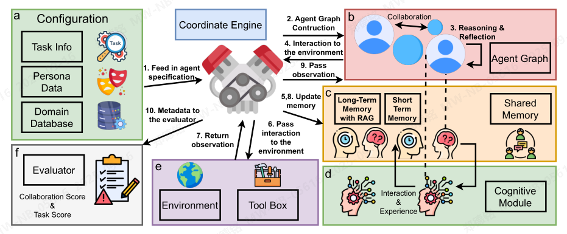

MultiAgentBench：评估大型语言模型代理的协作与竞争

伊利诺伊大学厄本那-香槟分校

摘要  
大型语言模型（LLMs）在作为自主智能体方面展现出显著能力；然而，现有的评估基准要么聚焦于单智能体任务，要么局限于狭窄领域，难以捕捉多智能体协作与竞争的动态特性。本文提出 MultiAgentBench，一个全面的基准测试框架，旨在评估基于 LLM 的多智能体系统在多样化、交互式场景中的表现。我们的框架不仅衡量任务完成情况，还通过新颖的、基于里程碑的关键性能指标，评估协作与竞争的质量。此外，我们评估了多种协调协议（包括星型、链式、树状和图状拓扑结构）以及创新策略，如群体讨论和认知规划。值得注意的是，gpt-4o-mini 在平均任务得分上达到最高，图状结构在科研场景中表现最佳，而认知规划使里程碑达成率提升了3%。代码与数据集已公开，获取地址为 https://github.com/MultiagentBench/MARBLE。

1 引言  

大型语言模型（LLMs），如 GPT-3（Brown 等，2020）、GPT-4（Achiam 等，2023）、Gemini（团队等，2023）以及 Deepsek-R1（Guo 等，2025），如今已展现出类人的语言理解与生成能力，使其能够作为自主智能体，与环境、工具及其他智能体进行交互（Wang 等，2023c；Park 等，2023a；OpenAI，2023）。尽管单智能体系统已展现出令人瞩目的能力，但其孤立运行的模式可能限制任务执行效率，并在模拟复杂、动态的社会场景时显得力不从心。相比之下，多智能体系统(Li 等，2023a；Wang 等，2023b，2024b)通过多个基于 LLM 的智能体协作、协调与联合规划，有效应对上述挑战。这一范式不仅提升了任务执行效率，还实现了对社会互动与动态过程的真实模拟，从而在战略决策、游戏博弈（Silver 等，2017）以及软件开发（Wang 等，2023c）等领域显著提升性能。

图1：MultiAgentBench评估流程概览：在各种交互环境中进行多智能体系统协调，重点关注任务性能与协调能力。

尽管大语言模型（LLM）能力取得了显著进展，当前的评估范式在多智能体场景中仍显不足。传统的单智能体基准测试——如AgentBench（Liu等人，2023）、VisualAgentBench（Sun等人，2023）、GAIA（Mialon等人，2023）、ToolBench（Qin等人，2024）以及HumanEval（Chen等人，2021）——主要关注孤立的推理与生成任务，忽视了多智能体交互中固有的动态特性。

为弥补这一空白，我们引入了MultiAgent-Bench，这是一个全面的基准测试平台，旨在跨多种任务求解与仿真场景评估基于大语言模型（LLM）的多智能体系统。MultiAgentBench 具备以下几项关键优势：（1）多领域评估：该基准涵盖从协作编程到游戏等多样化的领域，确保了广泛的真实世界适用性。（2）捕捉协作与竞争关系：与传统的单智能体基准不同，MultiAgentBench 明确衡量协作动态与竞争互动，凸显多智能体环境中的独特挑战。（3）定制化指标与灵活协议：我们提出了新颖的评估指标，包括一项关键绩效指标（KPI），可追踪进度里程碑及个体贡献，从而系统评估规划质量与通信效率。此外，我们的框架MARBLE（基于LLM引擎的多智能体协作骨干）支持多种通信拓扑结构——如星型、链式、树形以及一种创新的图结构方法——并兼容多种推理策略。

我们的贡献可以总结如下：  
(1) 我们提出了 MultiAgentBench 以及 MARBLE 框架，这是一个全面的基准测试体系，能够在一个涵盖六种多样化交互场景的严格评估环境中，对基于大语言模型的多智能体系统进行测评，全面捕捉协作与竞争动态。值得注意的是，认知规划功能将里程碑达成率提升了3%。  
(2) 我们提出了一系列创新的评估指标，不仅衡量任务完成情况，还评估协作质量。我们的指标包括基于里程碑的关键绩效指标（KPI）、结构化规划与沟通评分，以及专门用于捕捉目标冲突任务、内部性能表现以及规划与沟通中竞争性的竞赛得分。  
(3) 我们的实验揭示了多智能体协调中的若干“顿悟时刻”——智能体开始展现出涌现的社会行为，为迈向通用人工智能（AGI）级别的协作提供了令人振奋的洞见（Feng 等，2024）。

2 相关工作 

2.1 基于大语言模型的多智能体系统 

基于大语言模型（LLM）的多智能体系统已在多个领域实现了协作式问题求解（Park等, 2023a；Li等, 2023b；Chen等, 2023b）。这些系统通过文献综述和实验设计支持科学研究（Zhou等, 2024a；Agarwal等, 2024），应用于软件工程任务（Huang等, 2023；Wu等, 2023a；Zhou等, 2023a；Hong等, 2024；Ishibashi和Nishimura, 2024；Islam等, 2024；Wang等, 2024a；Zhuge等），包括代码生成与维护（Bouzenia等, 2024），以及游戏应用（Chen等, 2023a）。在《我的世界》（Minecraft）游戏中，智能体能够完成从建筑建造到导航等复杂任务（Wang等, 2023a；Chen等, 2023b；Yu等, 2024b；Dong等, 2024）。  

GameNGen实现了在《毁灭战士》（DOOM）中的实时交互（Valevski等, 2024），而 CUISINEWORLD 则用于基准测试多智能体协作（Gong等, 2023）。应用范围还扩展至社交推理类游戏、博弈论（Xu等, 2023）、医疗健康（Ke等, 2024；Kim等, 2024）、商业（Chen等, 2024）、教育（Gösling等, 2024）以及城市规划（Zhou等, 2024b）。尽管已取得显著进展，但在通信机制、涌现行为以及可扩展性方面仍存在挑战（Agashe等, 2024），这促使了对稳健评估框架的迫切需求。

2.2 多智能体协作  

近年来，多智能体系统的发展凸显了两种互补的扩展范式：认知扩展，通过提升智能体的推理能力与适应性来增强系统性能；以及群体扩展，利用大规模智能体集体实现涌现行为（Zhuge 等；Qian 等，2024）。  

认知扩展探索动态架构自适应与自组织协调策略等机制，以寻找最有效的智能体通信模式（Zhuge 等）。与此同时，基于群体的扩展展现出非线性的性能提升：随着更多智能体通过多样化的协作模式（如层级委托与去中心化共识）进行集体互动，系统整体性能显著增强（Qian 等，2024）。这些方法已成功应用于从地缘政治冲突模拟（Hua 等，2024）到科学发现工作流（Zhou 等，2024a；Zhang 等，2025）等复杂场景。

3 方法论  

3.1 框架设计

我们提出的评估框架MARBLE（见图2）通过互联模块构建了一个稳健的多智能体协作系统，实现了自适应协作、高效的通信以及战略任务执行。其核心是协调引擎（Coordination Engine），负责初始化并同步关键模块——包括智能体图（Agent Graph）、认知模块（Cognitive Module）和协调引擎（Coordinate Engine），以确保系统各部分之间无缝交互。请在附录 A.2 中查找有关附加模块的详细描述。

图2：MARBLE：通过坐标引擎和认知模块展示任务信息、人格数据、领域数据库、记忆模块与环境之间的交互。

这张图展示了一个**多智能体协作系统的架构**，包含多个核心模块与流程，各部分功能及协作关系如下：  

### 1. 核心模块拆解  
- **Configuration（配置模块a）**：  
  包含 `Task Info（任务信息）`、`Persona Data（角色数据）`、`Domain Database（领域数据库）`，负责提供系统运行的基础配置（如任务需求、智能体角色设定、领域知识），并**将“智能体规范”传递给协调引擎（1）**。  

- **Coordinate Engine（协调引擎）**：  
  作为系统核心中枢，统筹各模块协作。它接收配置信息后，触发后续流程：构建 `Agent Graph（智能体图，2）`、支持智能体间 `Collaboration（协作）` 与 `Reasoning & Reflection（推理反思，3）`；同时管理智能体与环境的互动（4、6、7）及记忆更新（5,8）。  

- **Agent Graph Construction（b模块）**：  
  展示智能体群体的互动结构，包含 `Agent Graph（智能体图）`，体现智能体间的协作与推理关系。  

- **Memory Modules（c模块）**：  
  提供**不同维度的记忆支持**：`Long-Term Memory with RAG（长时记忆，带检索增强生成）` 存储领域知识；`Short-Term Memory（短时记忆）` 处理即时信息；`Shared Memory（共享记忆）` 支持智能体间信息共享，辅助协作决策。  

- **Cognitive Module（d模块）**：  
  负责 `Interaction & Experience（互动与经验）`，结合记忆模块驱动智能体的认知过程（如决策、学习）。  

- **Environment & Tool Box（e模块）**：  
  提供 `Environment（环境）`（外部场景）和 `Tool Box（工具箱）`（任务执行工具），支持智能体与环境交互及工具调用。  

- **Evaluator（f模块）**：  
  作为评估单元，接收系统元数据（10），输出 `Collaboration Score & Task Score（协作分数、任务分数）`，衡量智能体协作效果与任务完成质量。  

### 2. 流程逻辑  
系统以“**配置输入→协调统筹→协作互动→记忆更新→环境交互→评估反馈**”为核心循环：  
1. 配置模块将“智能体规范”传递给协调引擎；  
2. 协调引擎触发“智能体图构建”，启动智能体间协作与推理；  
3. 智能体通过 `Interaction to the environment（4）` 向环境传递互动，环境返回 `observation（观察结果，7）`；  
4. 系统同步更新记忆（5,8），并由认知模块处理“互动与经验”；  
5. 协调引擎将“观察结果”传递给智能体（9），最终由评估器输出协作与任务评分（10）。  

### 3. 整体价值  
该架构通过“配置-协调-互动-记忆-认知-评估”的闭环，支持多智能体在复杂任务中高效协作，同时量化协作效果，适用于需要群体智能的场景（如多智能体模拟、协同任务执行等）。

代理图模块 该模块将配置数据转换为结构化的图 G = (A, E)，其中 A = {a₁, a₂, ..., aₙ} 表示代理集合，而 E 中的每条边定义为三元组 (aᵢ, r, aⱼ)，其中 r ∈ R 表示代理 aᵢ 和 aⱼ 之间的关系。例如，协作关系表示为 (aᵢ, collaborates, aⱼ)，监督关系表示为 (aᵢ, supervises, aⱼ)，协商关系表示为 (aᵢ, negotiates, aⱼ)。通过基于这些三元组关系构建图结构，我们确保后续的通信与协调仅在具有显式定义关系的代理之间进行，从而模拟现实世界中的互动模式。

认知模块 

认知模块是多智能体协同中负责任代理演化与社交智能的核心。该模块持续维护并更新一个全面的内部状态，其中包括每个智能体的性格特征、智能体之间的关系以及推理策略（例如，思维链法（Wei等，2023）、ReACT（Yao等，2023））。关键的是，这一方法通过融合心智理论与社交智能的要素，模拟了人类的认知过程（例如，Premack与Woodruff，1978）——正如人类会根据社交线索、过往经验与情境信息持续更新自身的心理模型。认知、社交与适应性机制的融合构成了我们系统的基础，使智能体能够动态调整自身策略，并在复杂环境中协作演化。

3.1.1 协调引擎 

协调引擎负责统筹系统的整体执行流程。它通过一个专用的配置模块初始化代理（agents）、任务以及代理之间的相互关系，并构建代理图（Agent Graph）来表示这些动态关系。在我们的框架中，区分为两种核心角色：规划者和执行者。规划者负责制定任务输入、制定策略以及管理整体任务分配；而执行者则通过代理图进行表示，通过可用工具与环境及其他代理交互，执行具体任务。  

我们的方法支持四种不同的协调协议，类似于 Qian 等人（2025）的研究，分别为星型、树状、图状和链状。

集中协调：星型与树型结构。在星型结构中，由一个中央规划者负责分配所有参与者任务并整合他们的反馈，虽然提供了强有力的监督，但可能限制了可扩展性。树型结构在此基础上进一步扩展，通过层次化组织 agent：顶层规划者将任务委派给下级规划者，而这些下级规划者再与具体行动者进行协调。这种层级化方法在保持集中控制的同时，提升了处理更复杂任务的可扩展性。

去中心化协同：图-网格与链式结构。图-网格配置采用相互连接的参与者网络，它们直接通信，从而实现并行规划和分布式决策。反之，链式配置会将主体按顺序排列，其中每个主体会将决策传递给下一个主体。这种顺序交接方式非常适用于具有内在依赖关系的任务，尽管它可能会限制并行处理的能力。

图3：协调协议与规划提示策略的示意图。(a) 展示了集中式与分散式规划结构（例如，星型、树型、图结构和链式结构）。(b) 描述了团队讨论和认知提示等策略，通过迭代反馈和任务更新实现有效规划。

这张图片展示了两种不同的规划相关机制：**协调协议（Coordination Protocol）** 和 **规划提示策略（Planning Prompt Strategy）**，以下是详细解释：  

### a. Coordination Protocol（协调协议）  
该部分分为 **集中式规划器（Centralized Planner）** 和 **去中心化自主规划（Decentralized Self-Planning）** 两大类，每类下包含不同的网络结构：  

- **集中式规划器**：  
  - **Star（星型）**：以“Planner”为中心节点，直接连接多个“Actor”（执行节点），形成“Planner→Actor”的星型拓扑。  
  - **Tree（树型）**：呈分层结构，“Planner”位于顶层，向下连接“Planner/Actor”（兼具规划和执行职能的节点），再由“Planner/Actor”连接底层“Actor”，形成树状层次。  

- **去中心化自主规划**：  
  - **Graph-Mesh（图-网格）**：多个“Agent”（Agent1~Agent4）之间形成无中心的对等交互网络，节点间通过边互相连接，体现分布式协作。  
  - **Chain（链型）**：节点按顺序线性连接（Agent1→Agent2→Agent3），形成单向或双向的信息/任务传递链。  

### b. Planning Prompt Strategy（规划提示策略）  
该部分围绕“**认知进化规划（Cognitive Evolve Planning）**”展开，包含**规划提示类型**和**认知进化流程**两部分：  

- **规划提示类型（顶部按钮）**：  
  提供3种规划策略选项：  
  - *Vanilla*：基础规划模式；  
  - *Chain-of-Thought*：思维链模式（通过分步推理提升规划逻辑性）；  
  - *Group Discussion*：小组讨论模式（多智能体协作决策）。  

- **认知进化流程**：  
  描述“Planner（规划者）”与“Agent（执行者）”的协作逻辑：  
  1. **输入层**：任务（Task）和经验（Experience）作为输入，经验由Agent的认知模块（Cognitive Module）更新（结合过往结果优化）。  
  2. **规划层**：Planner接收任务后，生成**期望（Expectation）** 和 **任务计划（Task Plan）**。  
  3. **执行与反馈层**：Agent依据任务计划执行，产生**结果（Result）**；结果反向更新经验 **（Experience）**，同时直接影响Agent的认知模块，形成“经验-认知-执行”的闭环进化。  

整体来看，图片通过结构化示意图，清晰呈现了“多智能体系统中任务协调的网络拓扑”和“规划流程与认知进化的逻辑”，为理解分布式协作与智能规划提供了可视化框架。

规划器设计与优化。在我们的集中式协作协议中，规划器支持四种不同的规划方法，这些方法反映了人类决策过程：基础提示、思维链（CoT）（Wei等，2022）、集体讨论以及认知自我进化规划。基础提示方法采用直接的零样本指令，生成任务计划。思维链方法通过提供详细的输入信息——例如目标任务、智能体角色（包括职能、专长及历史表现）以及过往子任务的总结——来促进逐步推理，引导逻辑性推进。集体讨论方法（Chen等，2023b）允许多个智能体共享见解和约束条件，促进协作讨论，从而优化整体计划。最后，类似Reflexion方法（Shinn等，2023），我们的认知自我进化规划方法通过为每个任务生成预期结果和进展，将其存储于记忆中，并在后续迭代中将实际表现与预期进行对比，从而产生不断演进的经验，持续指导并调整未来的规划（详见附录A.12中的详细提示设计）。这四种方法共同结合了个体推理与协作优化，经星型协作模式的消融实验证实，显著提升了协调效率。

3.2 基准设计  

为系统性地评估我们的多智能体框架，我们构建了一个涵盖多样化场景的基准，这些场景跨越任务导向型环境与基于社会模拟的环境（如图1所示）。这些场景通过以下两种方式构建：(1) 从先前工作或数据集改编而来的现有多智能体任务（例如，数据库错误分析、科研协作）。(2) 由大语言模型生成、并经人类验证与优化的任务（例如，狼人杀、讨价还价）。这种双重方法既保证了场景的真实性（通过采用已有任务），又实现了创新性（通过生成式扩展），同时人类验证确保了每个场景在逻辑上连贯且可行。

具有共同目标的代理。在任务导向的场景中，代理们共享一个共同目标，即完成某一项特定任务。我们重点关注四项具有代表性的任务：(1) 研究任务遵循ResearchTown（Yu等，2024a）的设定，具有互补研究背景的代理合作撰写一个新的研究提案；(2) 基于Minecraft的建造任务要求代理在共享环境中协同构建结构；(3) 数据库错误分析任务恰好由五名代理参与，每位代理专注于诊断系统不一致性的不同根本原因；(4) 编程挑战要求代理共同解决问题并开发软件模块。在这些任务中，代理必须有效地协调、分工并整合输出。我们通过为每个任务创建100个测试样例来扩展场景多样性，这些样例包括研究主题、Minecraft创建、数据库错误或编码目标的变化。

具有冲突目标的代理。在基于社会仿真的场景中，我们通过引入“狼人”和“谈判”场景来增强竞争元素。在“狼人”场景中，两组代理在对抗性环境中展开对抗，根据预设的叙事采用欺骗性策略。谈判环境则模拟对共享资源的谈判过程，代理通过战略性让步或结盟来最大化自身的利益。两种场景均用于评估代理在不确定性条件下的适应能力、冲突解决能力以及谈判技巧。

角色分配与图结构。为了强调多智能体协作，每个场景都设定了不同的智能体角色（例如，项目经理、领域专家、技术专家），并定义了特定的图关系（星型、树型、链式或网状）。这些结构反映了现实中的团队动态或竞争关系，指导智能体如何共享信息、做出决策以及协调行动。

情景中的里程碑生成  

为了便于评估MARBLE迭代过程，每个任务被划分为一系列灵活的里程碑。与固定的检查点不同，这些里程碑的定义较为宽泛。例如，在研究任务中，完成五项关键查询（5q）以形成研究提案（更多细节见附录A.4）即视为达成一个里程碑，或通过提升之前的一组5q也可达到该里程碑。在MARBLE的迭代过程中，语言模型会持续监测里程碑m₁, m₂, ...是否已达成，并记录结果。该方法将人类或大语言模型生成的提纲与动态的、基于执行情况的评估相结合，确保中间进展和团队协作均能得到有效衡量。

不同情景下的更详细的环境设置、交互工具及额外示例见附录A.4、A.5、A.6、A.7、A.8和A.9。

3.3 评价指标

如图1(b)(c)所示，我们的评估考虑了两个主要维度：任务完成表现与协作能力。

任务完成指标。如第3.2节所述，每个任务被划分为一系列灵活的里程碑。基于大语言模型（LLM）的检测器持续监控迭代过程，识别已完成的里程碑，并记录相应贡献的智能体。对于每个智能体，其贡献的里程碑数量记为 $ n_j $，其个体关键绩效指标（KPI）定义为 $ n_j $ 与总里程碑数 $ M $ 的比值。整体KPI定义为所有 $ N $ 个智能体个体KPI的平均值，计算公式如下：

$$
\text{KPI}_{\text{overall}} = \frac{1}{N} \sum_{j=1}^{N} \text{KPI}_j = \frac{1}{NM} \sum_{j=1}^{N} n_j
$$

除了基于里程碑检测得出的KPI外，还额外计算了一个基于任务的评分，用于评估最终输出质量。对于研究类或谈判类任务，采用LLM定义的评分标准生成得分；而对于Minecraft游戏、狼人杀、数据库错误修复或编程等任务，则使用基于规则的度量方式（如准确率）进行评估。这些任务导向评估的详细评分标准和评估提示分别列于附录A.9、A.5、A.6和A.7中，展示了在评估协作能力时各项指标的有效性。

协作指标。协作能力通过量化智能体的沟通与规划能力进行评估。沟通得分（C score）由基于LLM的评估得出，输入包括任务描述、智能体角色信息以及整合后的通信数据，最终在五分制量表上给出得分（若无任何通信发生，则 C score = 0）。规划得分（P score）则通过评估智能体在组织任务、维持角色分工以及根据自身角色与整合规划数据调整策略方面的能力获得，同样采用五分制量表。整体协作得分（CS）由这两个子得分的平均值得出。关于评估流程及输出格式的更多细节见附录A.12。此外，我们还进行了人工评估，对比人类判断与这些指标的一致性，结果见附录A.3。

4 实验设置  

4.1 实验配置  

模型。由于我们的MARBLE框架需要函数调用能力，因此我们选取了三种开源模型：Meta-Llama-3.3-70B（Dubey等，2024）、Meta-Llama-3.1-70B-Instruct-Turbo（Dubey等，2024）和Meta-Llama-3.1-8B-Instruct-Turbo，以及两种闭源模型：GPT-3.5-turbo-0125和GPT-4o-mini¹。开源模型通过togetherai²服务平台获取，并采用默认的参数设置。  

针对智能体行为，我们为模型配置最大令牌数（max_token_num）为1024，温度（temperature）为0.7，top_p为1.0，以在交互过程中平衡智能体响应的创造性和一致性。研究任务的最大迭代次数设定为5，Minecraft任务设定为20，更多细节见附录。在我们的评估中，涵盖任务完成与仿真两种场景，我们从两个主要维度评估模型表现：任务得分（Task Score, TS）和协作得分（Coordination Score, CS），采用与“指标”部分相同的度量标准。最大通信迭代次数同样设为5。此外，每个智能体的长期基础记忆容量设为无限制。最后，在主实验中，采用了图网格协作协议以促进智能体间的交互。

4.2 主实验一：模型在不同场景下的表现  

在本实验中，我们评估了五种模型在多种场景下的表现，结果总结于表1。我们的分析得出若干关键洞察：

1. gpt-4o-mini 在各项任务中表现出卓越性能：  
在多个任务中，gpt-4o-mini 均展现出较高的任务得分（TS）。例如，在“研究”场景中，其 TS 达到 84.13%，优于其他模型如 Meta-Llama-3.1-8B（80.87%）和 Meta-Llama-3.1-70B（80.80%）。在“编码”领域，gpt-4o-mini 的 TS 为 65.10，同样高于其竞争对手。这些结果表明，模型底层能力是实现优异任务表现的决定性因素。

2. 协作（协作）得分的复杂作用：  
尽管协作得分（CS）旨在衡量模型的协作能力，但我们的研究发现其对整体任务表现的影响较为复杂。例如，在“Minecraft”场景中，Meta-Llama-3.1-70B 的 CS 高达 75.00，但其 TS 低至 0.21，对此现象的深入分析请参见附录21。这一显著差异表明，虽然协作有助于提升性能，但无法弥补任务执行能力的根本短板。相比之下，那些在 TS 和 CS 之间保持平衡（如 gpt-4o-mini）的模型，在各类场景中展现出更稳健、更可靠的整体表现。

3. 模型特有优势与情境依赖性表现：  
我们的结果表明，不同模型在不同任务中表现出各异的优势。例如，Meta-Llama-3.3-70B 在“研究”（72.00）和“狼人杀”（76.30）任务中展现出突出的协作得分，但在多个场景中的任务得分仍明显落后于 gpt-4o-mini。这些差异凸显，单一指标无法全面反映模型的综合效能，必须同时考虑任务特定能力与协作技能。总体而言，本研究强调，虽然协作能力具有一定作用，但模型内在能力才是决定其在多样化任务中取得成功的主要驱动力。

4.3 主实验二：协作协议与规划策略的影响 

我们研究了不同协作协议——星型、树型、图型和链型——在研究场景中对模型性能的影响。如图5所示，图型协议在研究场景中表现最优，其任务完成度、规划效率和 token 使用量均表现最佳；而星型协议与图型协议的任务得分相近。相比之下，树型协议表现较差，消耗大量 token，且任务得分和协调得分均最低。如图6所示，认知演化规划在协调能力方面表现出色，显著优于其他方法，并取得了与最佳方法 COT 相当的任务得分。出人意料的是，小组讨论方法在所有指标上得分最低，这可能是因为规划群体规模过大抑制了效率，类似于现实世界中大型组织的运作困境。

5 消融研究  

本消融研究的目标是识别影响性能的关键模块和参数。  

不同最大迭代次数的消融实验

我们使用六个不同的最大迭代次数，对Minecraft场景中的10个任务进行了评估。如图7所示，任务得分和协作得分在迭代次数从1增加到7时均有所提升，但在迭代10次时急剧下降。当迭代次数达到20次时，尽管任务得分有所恢复，但协作得分在超过7次迭代后几乎保持不变。这一现象表明，对于高难度任务而言，过多的迭代可能导致协作性能下降——这可能是由于通信开销增加，或产生了相互冲突的指令所致。在长时间的互动中，这些发现强调了需要采用适应性迭代策略，以在任务执行与有效协调之间达成平衡。

不同智能体数量的消融实验 

我们在研究场景中评估了1、3、5和7个智能体的配置，选取了至少包含7位主要作者的20篇论文作为实验对象。如图8所示，增加智能体数量会导致整体KPI下降，这与预期的协作复杂性增加与性能之间的权衡关系一致。值得注意的是，从1个智能体增加到3个智能体时，平均协调得分显著提升，而平均任务得分则增长较为平缓。这表明团队规模适度扩展可提高协调效率，但进一步增加智能体数量可能会带来额外的协调挑战，从而抵消任务性能的提升。

6 涌现行为分析 

在MultiagentBench中，目标驱动的涌现行为对于团队协作至关重要——我们主张，这些“顿悟时刻”不仅标志着个体代理者行动向共同目标的对齐，还催化了自发的多智能体动态，揭示出新颖的协作策略与适应性的集体智能。（参见附录A.5.6）在信息不对称和角色冲突的情况下，代理者展现出三种关键行为模式（参见A.5.6和A.5.6中的狼人情景，以及第18节中的谈判场景）：

策略性信息共享 代理者基于信任与情境，选择性地披露关键信息（例如，先知隐瞒查验结果），这与人类互动中观察到的“策略性沉默”现象相呼应（Park等，2023b）。例如，在A.5.6中，先知和女巫（gpt-4o）均过于谨慎，错失了最佳信息共享机会，导致任务失败。另一例见图26，两名研究代理者战略性地演进研究提案内容，融合了双方的背景知识优势。

信任极化协作 角色身份驱动协作分化：过于多疑的村民可能转而攻击自己人，而狼人则通过欺骗（Fehr和Gächter，2000）和内部执行（Woolley等，2010），制造“虚假共识”。如A.5.6所示，村民的过度谨慎使狼人得以利用混乱局势；类似内部摩擦在谈判场景中也十分明显（第18节）。

角色驱动的策略迭代 在游戏过程中，如先知和女巫等角色不断调整其策略。例如，先知从保守姿态转向领导角色（见A.5.6），而女巫则从保守囤积转变为采取风险行动。这些转变支持了任务目标驱动决策的观点，与AutoGen框架的研究发现一致（Wu等，2023b）。

7 结论  

在本工作中，我们提出了 MultiAgentBench 与 MARBLE 框架，构建了一个全面的基准测试体系，用于评估基于大语言模型的多智能体系统在多样化交互场景中的表现。我们提出的评估指标超越了任务完成率，通过结构化规划、沟通评分以及竞争驱动的评估方式，有效捕捉了多智能体间的协作质量。实验结果揭示了若干新兴的社会行为，为未来多智能体系统的研究提供了有价值的洞见。

8 局限性  

尽管我们提出的多智能体基准与框架涵盖了丰富的任务类型与评估指标，但仍有一些方面需进一步探索，以提升其适用性与鲁棒性：

扩展场景与模型覆盖范围。目前，我们的基准主要聚焦于特定领域，如科研合著、Minecraft 建造、数据库错误分析、代码协作以及部分竞速场景（如狼人杀与讨价还价）。为了更真实地反映现实世界中多智能体互动的复杂性，未来工作可引入更多样化的环境，包括开放世界场景、需要更强社会认知能力的任务，以及面向实际应用的场景，如任务导向对话。在模型方面，当前研究尚未涵盖全部主流模型。未来可纳入其他最新模型（如 DeepSeek 模型族）的测试结果。

增强消融研究。目前我们的分析主要集中在整体协作与竞争性能上，对具体组件的细粒度洞察尚显不足。未来实验可聚焦于不同的记忆机制（如长期记忆、短期记忆、共享记忆）以及多智能体的不同工作流方法。

推进竞争机制的设计。尽管我们的基准已包含竞争性任务，但尚未充分涵盖现实生活中的复杂多智能体互动，如多方谈判、重复博弈或涉及随机性的场景。探究智能体在动态演化环境中如何在合作与对抗角色之间灵活切换，仍是一个极具潜力的研究方向。

应对开放性与定义不清的任务。目前框架中的大多数任务均具有明确的目标，例如完成科研提案或修复数据库不一致问题。然而，现实应用往往要求智能体在开放、模糊或缺乏明确成功标准的情境中运行。未来研究可探索多智能体系统如何适应探索性、非目标导向的场景。
