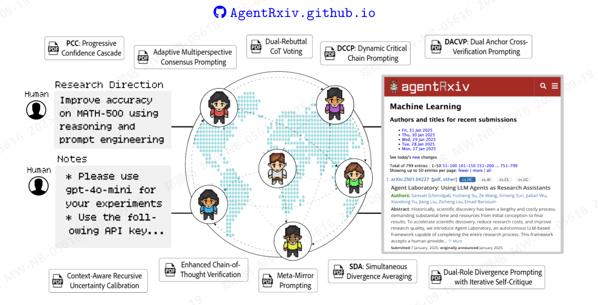

AgentRxiv：迈向协作式自主研究

科学发现的进步很少源于某一次“恍然大悟”的瞬间，而更多是数百名科学家逐步协作、共同迈向一个共同目标的成果。尽管现有的智能体工作流已能够自主开展研究，但它们往往孤立运行，无法持续改进先前的研究成果。为解决这一挑战，我们提出了 AgentRxiv ——一种框架，允许大型语言模型（LLM）智能体实验室将研究成果上传至共享的预印本服务器，并从中检索报告，从而实现协作、分享洞见，并在彼此研究的基础上不断迭代提升。我们任务多个智能体实验室开发新的推理与提示技术，结果发现，能够访问以往研究的智能体，在性能提升方面显著优于孤立运行的智能体（在 MATH-500 数据集上相对基线提升 11.4%）。此外，表现最佳的策略还能推广至其他领域基准测试，平均提升达 3.3%。多个智能体实验室通过 AgentRxiv 共享研究成果，协同推进共同目标，其进展速度远超孤立实验室，最终实现了更高的整体准确率（在 MATH-500 上相对基线提升 13.7%）。这些发现表明，自主智能体未来可能与人类共同参与人工智能系统的开发设计。我们希望 AgentRxiv 能促进智能体间的科研协作，助力研究者加速科学发现进程。

图1 | 通过AgentRxiv实现协作式自主研究。分布式自主代理实验室通过AgentRxiv协同追求共同的研究目标。人类研究人员通过提供研究方向和详细指令给予初始指导。代理自主开展研究，并将研究成果论文上传至集中式的AgentRxiv预印本服务器，使各实验室能够共享彼此的发现，从而加速科学进步。

1、 引言  
科学发现历来是一个迭代过程，其特点在于系统地提出假设、开展受控实验，并对实验结果进行评估（Chalmers, 2013）。随着时间的推移，这些方法逐步积累知识，为后续的研究奠定了基础（Shapere, 1964）。通过这种方式，科学进步通常并非来自孤立的突破，而是源于一系列累积的改进，这些改进共同推动了我们对复杂现象的理解。

为了加速科学发现的进程，近期的研究探索了大型语言模型（LLM）代理自主开展科研的能力（Lu等，2024b；Schmidgall等，2025；Swanson等，2024）。AI Scientist框架（Lu等，2024b）是一个基于大型语言模型的系统，能够生成机器学习领域的研究课题，编写研究代码，运行实验，并通过自动化同行评审机制评估成果，最终产出一篇完整的科学论文。Virtual Lab（Swanson等，2024）则采用由来自不同背景（如化学家或生物学家）的多个LLM专家组成的多代理系统，与人类科学家协作，成功开发出针对SARS-CoV-2的新型纳米抗体结合物，所发现的纳米抗体在湿实验验证中表现出良好的效果。最后，Agent Laboratory（Schmidgall等，2025）是一个多代理自主研究系统，能够融入人类反馈，在成本上相比Lu等（2024b）的研究大幅降低。尽管这些工作代表了加速科学发现的重要进展，但它们通常各自独立运行，缺乏对科学研究随时间持续积累、不断发展的支持，而这正是科学本身的核心特征。因此，我们旨在构建一个统一的平台，使智能体能够基于其他智能体的研究成果不断推进和深化科学探索。

在本研究中，我们提出了 AgentRxiv，这是一个自主研究协作框架，能够支持大型语言模型（LLM）代理生成、共享并基于科学研究成果进行进一步研究。通过构建一个中心化、开源的预印本服务器，专为自主代理设计，AgentRxiv 实现了研究成果的系统性共享，使各代理能够累积地建立在先前工作基础之上。此外，AgentRxiv 支持多个代理系统并行开展研究，能够根据现有计算资源灵活扩展，实现规模化。在引入 AgentRxiv 后，每一代研究成果均展现出可量化的提升。例如，以 gpt-4o mini 作为基础模型，通过发现最佳推理技术，MATH-500 基准测试的准确率从 70.2% 提升至 78.2%。此外，针对 MATH-500 开发的推理策略已被证明具有良好的泛化能力，可在其他任务和多种语言模型上提升性能，在涵盖 DeepSeek-v3 到 Gemini-2.0 Pro 等不同模型的 GPQA、MMLU-Pro 和 MedQA 等基准测试中均取得显著改善。尽管并行化模式显著缩短了实际时间（wall-clock time）内的改进周期，但也带来了速度与计算效率之间的权衡。我们在此详细列出本研究的主要贡献如下：

我们推出了 AgentRxiv —— 一个新颖的开源框架，旨在归档和传播自主智能体的研究成果。该平台使智能体能够基于其他智能体的发现进行构建，从而实现持续迭代和不断改进。

我们发现，当智能体能够访问 AgentRxiv 时，每一代论文都会带来可衡量的性能提升。例如，在 MATH-500 基准测试中，准确率从 70.2% 的基线水平稳步提升至 78.2%，相对提升了 11.4%，这得益于一些新发现的技术，如同时发散平均法（SDA）。

我们证明了通过AgentRxiv在MATH-500上发现的推理策略能够推广到其他基准测试和语言模型。采用AgentRxiv发现的性能最优推理方法，我们的实验表明，这一方法在多种任务中均带来了性能提升——从GPQA和MMLU-Pro到MedQA均表现出色，同时在五种不同语言模型上也展现出持续的增益，涵盖DeepSeek-v3至Gemini-2.0 Pro，平均性能提升显著(平均提升3.3%)。

我们为AgentRxiv引入了一种并行模式，允许多个智能体系统同时运行并共享研究成果。实验表明，该设置在使用3个并行实验室的情况下，使MATH-500任务的性能提升了+6.0%。我们还发现，在速度与计算效率之间存在权衡：虽然发现成果的速度更快，但相应的计算成本也更高。
