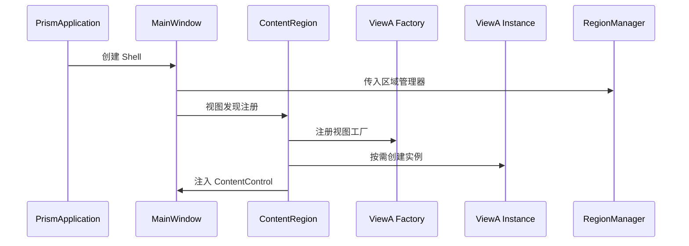

# 04-ViewDiscovery 学习笔记 - 视图发现机制深入解析

## 项目概述

04-ViewDiscovery 是 Prism WPF Samples 中的第四个示例，它在前三个示例的基础上引入了 **"视图发现"（View Discovery）** 的核心模式。这个示例标志着从"静态声明"到"动态装配"的关键转折，真正展现了 Prism 框架模块化开发的精髓所在。

## 核心突破
- **✅ 视图自动发现**：打破了XAML静态绑定限制
- **✅ 运行时装配**：程序启动时动态注入视图
- **✅ 区域填充**：从占位到激活的完整生命周期
- **✅ 模块解耦**：Shell与视图的彻底分离

## 项目结构

```
04-ViewDiscovery/
├── ViewDiscovery.sln
└── ViewDiscovery/
    ├── App.config
    ├── App.xaml
    ├── App.xaml.cs
    ├── ViewDiscovery.csproj
    └── Views/
        ├── MainWindow.xaml (Shell)
        ├── MainWindow.xaml.cs
        ├── ViewA.xaml (视图模块)
        └── ViewA.xaml.cs
```

## 模式演进历史

### 从静态到动态的进化轨迹

```
🔄 01 -> 02 -> 03 -> 04
  Bootstrapper -> Region 占位 -> 自定义适配器 -> 动态视图注入

示例里程碑：
  • 基础启动      • 区域概念      • 控件扩展      • 内容管理
  • 框架初始化    • 占位符       • 适配器策略    • 动态视图
```

## 核心概念：视图发现 vs 视图注入

### 视图管理方式的比较矩阵

| 发现模式 | 实现时机 | 控制方式 | 耦合度 | 适用场景 |
|----------|----------|----------|--------|----------|
| **视图发现** (View Discovery) | 初始化时自动 | 声明式注册 | 低耦合 | 固定视图组合 |
| **视图注入** (View Injection) | 运行时手动 | 程序化控制 | 高可控 | 按需加载场景 |

本示例专注 **视图发现模式** 的实现。

## 代码深度解析

### 1. 程序启动与视图发现流程

#### 关键启动序列
```
1. App.xaml → PrismApplication 启动
2. CreateShell() → MainWindow实例化  
3. MainWindow(IRegionManager) → 依赖注入
4. RegisterViewWithRegion() → 视图注册
5. Prism自动发现与注入 → 区域激活
```

### 2. MainWindow.xaml.cs - 视图发现的核心实现

```csharp
public partial class MainWindow : Window
{
    public MainWindow(IRegionManager regionManager)
    {
        InitializeComponent();
        
        /* 🎯 核心 API：视图发现注册 */
        regionManager.RegisterViewWithRegion(
            "ContentRegion",     // 目标区域名称
            typeof(ViewA)        // 要注册的视图类型
        );
        
        /* 执行时机：
         * • Shell窗口实例化时
         * • 视图发现注册
         * • Prism自动完成注入
         */
    }
}
```

#### 三大核心组件关系

```
IRegionManager ←→ Region ←→ ViewA
     │              │           │  
注册提供者    容器位置    内容提供者
  (服务)      (占位符)    (视图模块)
```

### 3. 视图发现的生命周期详解

#### 注册流程 (RegisterViewWithRegion)

```csharp
// 实际执行的完整流程
public sealed class RegistrationToken
{
    public void RegisterViewWithRegion(
        string regionName, 
        Type viewType)
    {
        // 1. 验证区域存在性
        var region = _regionManager.Regions[regionName];
        
        // 2. 注册视图工厂
        region.RegisterViewMapping(
            viewType, 
            () => _container.Resolve(viewType)
        );
        
        // 3. 触发视图创建与注入
        _regionBehaviorFactory
            .GetBehavior<AutoPopulateRegionBehavior>()
            .Execute(region);
    }
}
```

#### 自动发现触发时机

| 阶段 | 触发器 | 处理内容 | 结果 |
|------|--------|----------|------|
| **Shell创建** | View Discovery注册 | 视图映射建立 | 视图工厂注册 |
| **区域激活** | AutoPopulateBehavior | 视图实例化 | 视图注入区域 |
| **首次显示** | 视图生命周期 | UI 元素初始化 | 视图完全渲染 |

#### 依赖注入的角色

```csharp
// 视图实例化的标准流程
ViewA view = (ViewA)_container.Resolve(typeof(ViewA));

// 支持构造函数注入
public class ViewA
{
    public ViewA(SomeService service)
    {
        // 可以在视图中使用注册的服务
    }
}
```

### 4. ViewA 的设计模式

#### 标准视图结构
```xml
<!-- Views/ViewA.xaml -->
<UserControl x:Class="ViewDiscovery.Views.ViewA"
             ... xmlns 声明 ... >
    <Grid>
        <TextBlock Text="View A" FontSize="38" />
    </Grid>
</UserControl>
```

#### 视图作为业务单元的完整性

| 视图组件 | 职责 | 本例体现 |
|----------|------|----------|
| **XAML (UI)** | 界面表现 | 文本标签 |
| **Code-behind** | 控制逻辑 | 空实现（预留扩展） |
| **资源/样式** | 外观一致性 | 标准Grid布局 |
| **事件绑定** | 交互处理 | 未使用（后续示例展示） |

## 区域行为深度解析

### 视图发现涉及的核心行为

```csharp
// AutoPopulateRegionBehavior - 核心行为类
public AutoPopulateRegionBehavior : IRegionBehavior
{
    protected override void OnAttached()
    {
        this.Region.Views.CollectionChanged += ViewsCollectionChanged;
    }
    
    private void ViewsCollectionChanged(object sender, NotifyCollectionChangedEventArgs e)
    {
        if(e.Action == NotifyCollectionChangedAction.Add)
        {
            // 新视图添加到区域的逻辑
        }
    }
}
```

### 视图的三种绑定方式对比

| 绑定方式 | 实现位置 | 使用场景 | 耦合度 |
|----------|----------|----------|--------|
| **XAML 绑定** | MainWindow.xaml | 简单静态内容 | 高耦合 |
| **代码注册** | MainWindow.xaml.cs | 视图发现 | 中耦合 |
| **模块配置** | IModule 实现 | 完整模块化 | 低耦合 |

本示例采用 **代码注册模式**。

## 运行原理分析

### 完整的视图发现流程



### 初始化时序验证

设置断点可观测的完整调用链：
```
1. App.OnStartup()
2. MainWindow.MainWindow() 
3. RegisterViewWithRegion()
4. ViewA.ViewA() 
5. ContentControl加载完成
```

## 与生产实际的连接

### 企业级扩展应用

#### 1. 视图分组管理

```csharp
public void ConfigureViewDiscovery(IRegionManager regionManager)
{
    // 仪表板区域
    regionManager.RegisterViewWithRegion(
        "DashboardMain", 
        typeof(DashboardView));
        
    // 工具栏区域
    regionManager.RegisterViewWithRegion(
        "ToolbarMain", 
        typeof(ToolbarView));
        
    // 状态栏区域  
    regionManager.RegisterViewWithRegion(
        "StatusMain", 
        typeof(StatusBarView));
}
```

#### 2. 模块间视图协调

```csharp
// 在模块初始化中的使用
public class CustomerModule : IModule
{
    public void OnInitialized(IContainerProvider containerProvider)
    {
        var regionManager = containerProvider.Resolve<IRegionManager>();
        
        regionManager.RegisterViewWithRegion(
            "ContentRegion", 
            typeof(CustomerListView));
            
        regionManager.RegisterViewWithRegion(
            "DetailRegion", 
            typeof(CustomerDetailView));
    }
}
```

#### 3. 动态视图配置

```csharp
// 根据用户权限注册视图
public class ViewConfiguration
{
    public void RegisterViewsForRole(string role, IRegionManager regionManager)
    {
        switch(role)
        {
            case "Admin":
                regionManager.RegisterViewWithRegion("ContentRegion", 
                   typeof(AdminDashboardView));
                break;
                
            case "User":
                regionManager.RegisterViewWithRegion("ContentRegion", 
                   typeof(UserDashboardView));
                break;
        }
    }
}
```

## 性能与最佳实践

### 视图发现的性能特点

| 维度 | 特点 | 优化建议 |
|------|------|----------|
| **启动时延** | 注册即创建 | 轻量级视图 |
| **内存占用** | 立即占用 | 懒加载策略 |
| **扩展性** | 依赖容器 | 合理规划区域 |
| **可测试性** | 可mock注册 | 接口驱动开发 |

### 企业开发实践要点

#### 1. 视图生命周期管理

```csharp
// 视图注册模式的最佳实践
public interface IViewRegistration
{
    void RegisterGlobalViews(IRegionManager regionManager);
    void RegisterUserViews(IRegionManager regionManager);
    void RegisterAdminViews(IRegionManager regionManager);
}
```

#### 2. 异常处理策略

```csharp
// 安全的视图注册
public void SafeViewRegistration(IRegionManager regionManager)
{
    try
    {
        regionManager?.RegisterViewWithRegion(
            "ContentRegion", 
            typeof(ViewA));
    }
    catch (Exception ex)
    {
        // 视图注册失败的优雅降级
        Log.Error($"视图注册失败: {ex}");
    }
}
```

#### 3. 单元测试支持

```csharp
[TestMethod]
public void MainWindow_ShouldRegisterViewWithRegion()
{
    // Arrange
    var mockRegionManager = new Mock<IRegionManager>();
    var mockRegion = new Mock<IRegion>();
    
    mockRegionManager.Setup(rm => 
        rm.Regions["ContentRegion"]).Returns(mockRegion.Object);
    
    // Act
    var window = new MainWindow(mockRegionManager.Object);
    
    // Assert
    mockRegionManager.Verify(rm => 
        rm.RegisterViewWithRegion(
            "ContentRegion", 
            It.Is<Type>(t => t == typeof(ViewA))), 
        Times.Once);
}
```

## 视图发现 vs 视图注入的决策树

### 使用场景决策矩阵

```csharp
应用场景分析：

✅ 视图发现 (View Discovery) 适用于：
- 启动时就能确定全部视图
- 固定不变的布局结构
- 简单的静态展示需求
- 低耦合的企业应用框架

❌ 不适合视图发现的场景：
- 需要运行时动态加载
- 用户交互驱动的视图切换
- 复杂的状态管理需求
- 按需加载的模块功能
```

## 学习收获与架构意义

### 从静态到动态的思维转换

视图发现模式体现了 **"声明式设计"** 的核心思想：

1. **"告诉系统需要什么，而不是如何构建"**
2. **"配置先于编码，约定优于实现"**  
3. **"关注点分离，接口驱动开发"**

### Prism 架构成熟度标志

通过本示例的学习，标志着掌握：

✅ **基础架构**: 框架启动 + 区域定义 + 视图管理   
✅ **开发模式**: 从编码到配置的范式转移
✅ **模块化思维**: 代码解耦与可测试设计
✅ **企业级准备**: 具备构建复杂应用的核心能力

### 下一跳板的铺垫

视图发现为后续学习奠定了：

- **区域管理基础**: 区域的生命周期理解
- **容器应用**: 依赖注入的实际运用
- **模块开发**: IModule 的上下文感知
- **测试驱动**: 接口设计思维建立

这从 **"框架可用"** 到 **"设计可用"** 的关键跨越，标志着我们已经具备了基于 Prism 构建企业级复杂应用的核心思维准备。