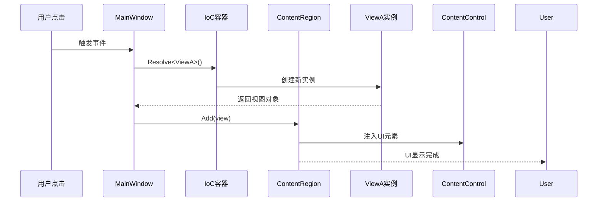

# 05-ViewInjection 学习笔记 - 视图注入机制与运行时控制

## 项目概述

05-ViewInjection 是 Prism WPF Samples 中的第五个示例，它引入了 **"视图注入"（View Injection）** 这一强大的概念，实现了从声明式视图发现到程序化视图控制的**关键跃迁**。这个示例展现了 Prism 框架最具实践价值的动态 UI 管理能力，为开发复杂交互应用解锁了核心能力。

## 核心突破
- **✅ 程序化控制**：运行时决定何时、如何添加视图
- **✅ 响应式交互**：用户动作即时触发 UI 变更
- **✅ 动态生命周期**：视图的添加、移除、切换完全可控
- **✅ 深度解耦**：Shell 与视图行为的彻底分离

## 项目结构

```
05-ViewInjection/
├── ViewInjection.sln
└── ViewInjection/
    ├── App.xaml
    ├── App.xaml.cs
    ├── ViewInjection.csproj
    └── Views/
        ├── MainWindow.xaml (Shell + 交互控制)
        ├── MainWindow.xaml.cs (视图注入逻辑)
        ├── ViewA.xaml (可注入的视图组件)
        └── ViewA.xaml.cs
```

## 核心概念：视图注入 vs 视图发现

### 两模式的根本差异矩阵

| 维度深度 | 视图发现 | 视图注入 | 关键区别 |
|----------|----------|----------|----------|
| **触发时机** | 应用初始化时 | 任意时刻 | 时间控制权 |
| **控制方式** | 声明式注册 | 程序化操作 | 行为驱动 |
| **生命周期** | 自动管理 | 手动管理 | 生命周期粒度 |
| **适用场景** | 固定布局 | 动态交互 | 业务复杂度 |
| **测试难度** | 较低 | 中等 | 状态管理 |

## 代码深度解析

### 1. 视图注入的核心实现

#### MainWindow.xaml.cs - 注入逻辑详解

```csharp
public partial class MainWindow : Window
{
    IContainerExtension _container;
    IRegionManager _regionManager;

    public MainWindow(
        IContainerExtension container,       // 依赖注入容器
        IRegionManager regionManager)        // 区域管理器
    {
        InitializeComponent();
        _container = container;
        _regionManager = regionManager;
    }

    private void Button_Click(object sender, RoutedEventArgs e)
    {
        /* 🎯 视图注入的核心 API 调用 */
        
        // 1. 通过容器创建视图实例
        var view = _container.Resolve<ViewA>();
        
        // 2. 获取目标区域实例
        IRegion region = _regionManager.Regions["ContentRegion"];
        
        // 3. 向区域添加视图
        region.Add(view);
        
        /* 执行特点：
         * • 完全运行时常量
         * • 每次点击创建新实例
         * • 区域状态即时变化
         */
    }
}
```

#### 依赖注入的角色增强

```csharp
// 构造函数注入 vs 静态访问
public MainWindow(
    IContainerExtension container, 
    IRegionManager regionManager)
{
    // ✅ 推荐：构造函数注入
    // ❌ 不推荐：ServiceLocator
    // var _container = ContainerLocator.Container;
}
```

### 2. 区域管理深度分析

#### 区域实例的获取链

```csharp
// 区域查找的完整流程
IRegion region = _regionManager.Regions["ContentRegion"];
```

实际执行过程：
```
1. _regionManager 注入
   ↓
2. Regions 集合查询
   ↓
3. "ContentRegion" 键匹配
   ↓
4. 返回 IRegion 实例
   ↓
5. 视图操作 API 暴露
```

#### 区域操作 API 全景

```csharp
// 完整的区域操作能力
public interface IRegion
{
    // ✨ 视图管理
    void Add(object view);
    void Remove(object view);
    
    // 💡 激活控制
    void Activate(object view);
    void Deactivate(object view);
    
    // 🔄 导航支持
    void RequestNavigate(Uri target, Action<NavigationResult> callback);
    
    // 📊 状态查询
    object SelectedItem { get; set; }
    IViewsCollection Views { get; }
    IViewsCollection ActiveViews { get; }
}
```

### 3. 生命周期管理范例

#### 动态视图实例的生命周期



### 4. 交互界面的架构设计

#### MainWindow.xaml - Shell + 控制混合模式

```xml
<Window ...>
    <DockPanel LastChildFill="True">
        <!-- 🎯 交互触发器 -->
        <Button DockPanel.Dock="Top" Click="Button_Click">
            Add View
        </Button>
        
        <!-- 🎯 内容目标区域 -->
        <ContentControl prism:RegionManager.RegionName="ContentRegion" />
    </DockPanel>
</Window>
```

#### 响应式交互模式

| 组件角色 | 实现方式 | 交互效果 |
|----------|----------|----------|
| **触发器** | 按钮点击事件 | -> 运行命令 |
| **处理器** | MainWindow.xaml.cs | -> 注入视图 |
| **渲染器** | ContentControl | -> 显示内容 |
| **结果** | 区域状态变化 | -> 用户可见 |

## 视图注入的进阶模式

### 1. 多重视图的动态管理

#### 基于点击次数的视图创建

```csharp
private int _viewCounter = 0;

private void Button_Click(object sender, RoutedEventArgs e)
{
    _viewCounter++;
    var view = _container.Resolve<ViewA>();
    
    // 视图实例化支持
    view.DataContext = new { Index = _viewCounter };
    
    IRegion region = _regionManager.Regions["ContentRegion"];
    region.Add(view);
}
```

#### 视图的唯一标识管理

```csharp
// 为每个实例分配唯一标识
public class ViewInstance
{
    public Guid Id { get; } = Guid.NewGuid();
    public string Name { get; set; }
    public DateTime CreatedTime { get; } = DateTime.Now;
}
```

### 2. 视图状态的精细控制

#### 激活/停用控制

```csharp
private void ToggleViewActivation(object view)
{
    IRegion region = _regionManager.Regions["ContentRegion"];
    
    if (region.ActiveViews.Contains(view))
    {
        region.Deactivate(view);
    }
    else 
    {
        region.Activate(view);
    }
}
```

#### 添加/移除完整操作

```csharp
private void RemoveView(object viewToRemove)
{
    IRegion region = _regionManager.Regions["ContentRegion"];
    
    if (region.Views.Contains(viewToRemove))
    {
        region.Remove(viewToRemove);
        
        // 可选：清理资源
        if (viewToRemove is IDisposable disposableView)
        {
            disposableView.Dispose();
        }
    }
}
```

### 3. 区域与容器的配合模式

#### 容器注册的策略支持

```csharp
// 在App.xaml.cs中的预注册
protected override void RegisterTypes(IContainerRegistry containerRegistry)
{
    // 单例视图（共享实例）
    containerRegistry.RegisterSingleton<ViewA>();
    
    // 瞬时视图（每次新实例）- 当前使用模式
    containerRegistry.Register<ViewA>();
}
```

#### 依赖注入的视图支持

```csharp
// 支持复杂视图注入
public ViewA(ICustomerService service, ILogger logger)
{
    InitializeComponent();
    
    // 视图内部业务逻辑
    service.GetCustomers();
    logger.LogViewDisplay();
}
```

## 扩展场景实现

### 1. 多视图类型支持

#### 工厂模式实现

```csharp
public class ViewFactory : IViewFactory
{
    private readonly IContainerExtension _container;
    
    public object CreateView(string viewType)
    {
        return viewType switch
        {
            "ViewA" => _container.Resolve<ViewA>(),
            "ViewB" => _container.Resolve<ViewB>(), 
            _ => throw new ArgumentException($"未知的视图类型: {viewType}")
        };
    }
}
```

### 2. 导航式视图控制

#### 视图栈管理

```csharp
public class ViewStackManager
{
    private readonly Stack<object> _viewStack = new();
    private readonly IRegion _region;
    
    public void PushView(object view)
    {
        _viewStack.Push(view);
        _region.Add(view);
        _region.Activate(view);
    }
    
    public void PopView()
    {
        if (_viewStack.Any())
        {
            var current = _viewStack.Pop();
            _region.Remove(current);
            
            if (_viewStack.Any())
            {
                _region.Activate(_viewStack.Peek());
            }
        }
    }
}
```

### 3. 数据驱动的视图注入

#### 基于模型的视图创建

```csharp
private void CreateCustomerView(CustomerModel customer)
{
    var view = _container.Resolve<CustomerDetailView>();
    
    // 数据绑定到视图
    view.DataContext = new CustomerViewModel(customer);
    
    // 可选：带参数的视图配置
    RegionManager.SetRegionName(view, "CustomerDetailRegion");
    
    IRegion region = _regionManager.Regions["ContentRegion"];
    region.Add(view);
}
```

## 性能与最佳实践

### 1. 内存管理策略

#### 视图生命周期管理

```csharp
public class ViewLifecycleManager
{
    public void AddViewWithLifecycle(string viewType)
    {
        var view = _container.Resolve(Type.GetType(viewType));
        
        // 注册视图到区域
        IRegion region = _regionManager.Regions["ContentRegion"];
        region.Add(view);
        
        // 事件监听 - 内存清理
        region.Views.CollectionChanged += (s, e) =>
        {
            if (e.Action == NotifyCollectionChangedAction.Remove)
            {
                foreach (var removed in e.OldItems)
                {
                    CleanupView(removed);
                }
            }
        };
    }
    
    private void CleanupView(object view)
    {
        if (view is IDisposable disposable)
        {
            disposable.Dispose();
        }
        
        // 释放事件订阅
        if (view is INotifyPropertyChanged npc)
        {
            npc.PropertyChanged -= View_PropertyChanged;
        }
    }
}
```

### 2. 异常处理与安全模式

#### 安全的视图注入

```csharp
public class SafeViewInjector
{
    public bool TryInjectView(string regionName, Type viewType)
    {
        try
        {
            var region = _regionManager.Regions[regionName];
            var view = _container.Resolve(viewType);
            
            region.Add(view);
            return true;
        }
        catch (Exception ex)
        {
            _logger.LogError($"视图注入失败: {ex}");
            return false;
        }
    }
}
```

### 3. 单元测试支持

#### 视图注入的测试场景

```csharp
[TestClass]
public class ViewInjectionTests
{
    [TestMethod]
    public void MainWindow_ShouldBeAbleToAddView()
    {
        // Arrange
        var mockContainer = new Mock<IContainerExtension>();
        var mockRegionManager = new Mock<IRegionManager>();
        var mockRegion = new Mock<IRegion>();
        
        var view = new ViewA();
        mockContainer.Setup(c => c.Resolve<ViewA>()).Returns(view);
        mockRegionManager.Setup(rm => rm.Regions["ContentRegion"])
                          .Returns(mockRegion.Object);
        
        var window = new MainWindow(mockContainer.Object, 
                                   mockRegionManager.Object);
        
        // Act
        window.Button_Click(null, null);
        
        // Assert
        mockRegion.Verify(r => r.Add(view), Times.Once);
    }
}
```

## 设计模式的价值体现

### DIP 原则的体现

| 设计原则 | 实现体现 | 代码位置 |
|----------|----------|----------|
| **依赖倒置** | 注入而非实现 | 构造函数注入 |
| **单一职责** | Shell只负责协调 | MainWindow角色定位 |
| **开闭原则** | 扩展功能而非修改 | View注入支持 |
| **里氏替换** | 接口而非实现 | IRegion/View抽象 |

### 微架构的设计价值

视图注入模式带来的架构优势：

#### 1. **插件式架构**
- 视图可以独立开发
- 运行时动态组装
- 完全的热插拔支持

#### 2. **分层边界清晰**
```
UI 层     Shell (MainWindow)
          ↑  管理边界  
业务层    视图 (ViewA)
          ↑  数据边界
数据层    底层服务
```

#### 3. **开发与运维优势**
- **独立开发** - 视图可以独立构建
- **按需部署** - 只有需要的视图加载
- **灰度发布** - 新旧视图版本切换
- **问题跟踪** - 视图级别错误隔离

## 与视图发现的完整决策树

### 应用模式选择指南

```csharp
// 场景决策代码化
public interface IViewStrategy
{
    IViewDecision ChooseStrategy(ViewContext context);
}

public class ViewStrategySelector : IViewStrategy
{
    public IViewDecision ChooseStrategy(ViewContext context)
    {
        return context switch
        {
            { IsStatic: true } => new ViewDiscoveryDecision(),
            { IsInteractive: true } => new ViewInjectionDecision(),
            { IsComplex: true } => new ModuleViewDecision(),
            _ => new ViewDiscoveryDecision()
        };
    }
}
```

### 企业级应用场景

```
实际应用中的策略矩阵：

✅ ViewDiscovery 场景：
- 工具面板固定模块
- 菜单导航系统
- 登录状态显示区

✅ ViewInjection 场景：
- 多文档界面 (MDI)
- 模态对话框管理
- 动态仪表板构建
- 用户自定义布局
```

## 学习收获总结

### 技术能力跃迁

**从声明到控制的思维模式转换：**

| 阶段 | 体现维度 | 思维升级 |
|------|----------|----------|
| **01-04** | 静态架构 | 构建能力 |
| **本示例** | 动态控制 | 交互能力 |
| **下一阶段** | 生命周期管理 | 治理能力 |

### 架构能力解锁

掌握视图注入后，具备的能力：

✅ **复杂交互系统** - 动态界面管理  
✅ **用户定制系统** - 个性化布局支持  
✅ **企业级应用** - 专业工作流界面  
✅ **测试驱动架构** - 代码和状态独立测试  

### 核心认知升华

**视图注入的真正价值**在于展现了 **"容器管理"** 的核心思想：

- **创建分离** - 谁创建 vs 谁使用
- **生命周期管理** - 何时生 vs 何时灭
- **状态追踪** - 谁活跃 vs 谁休眠
- **资源治理** - 内存 vs 状态的平衡

这标志着从 **"框架可用"** 到 **"架构可控"** 的实质性跨越，为后续学习**导航、生命周期、模块化**等高级功能奠定了**控制和治理思维**的基础。