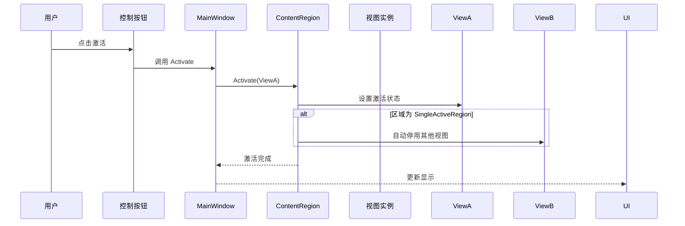

# 06-ViewActivationDeactivation 学习笔记 - 视图生命周期管理精要

## 项目概述

06-ViewActivationDeactivation 是 Prism WPF Samples 中的第六个示例，它引入了 **"视图激活/停用"（View Activation/Deactivation）** 这一关键概念，实现了从"视图的物理管理"到"视图的状态治理"的**架构跃迁**。这个示例展现了 Prism 框架在生命周期管理方面的完整能力，为开发企业级复杂交互应用奠定了**管理和控制思维**的基础。

## 核心突破
- **✅ 生命周期管理**：理解视图不仅存在，更有状态
- **✅ 运行时状态控制**：激活/停用的程序化控制
- **✅ 状态内存管理**：UI内存的高效利用策略
- **✅ 用户交互建模**：从用户动作到系统状态的映射

## 项目结构

```
06-ViewActivationDeactivation/
├── ActivationDeactivation.sln
└── ActivationDeactivation/
    ├── App.config
    ├── App.xaml
    ├── App.xaml.cs
    ├── ActivationDeactivation.csproj
    └── Views/
        ├── MainWindow.xaml (Shell + 控制面板)
        ├── MainWindow.xaml.cs (状态管理核心逻辑)
        ├── ViewA.xaml (可激活的视图1)
        └── ViewB.xaml (可激活的视图2)
```

## 核心概念：视图状态管理机制

### 状态管理的三重维度

| 管理维度 | 物理存在 | 可见状态 | 交互能力 | 内存占用 |
|----------|----------|----------|----------|----------|
| **添加/移除** | 是/否 | 是/否 | 是/否 | 分配/回收 |
| **激活/停用** | ✅ 是 | 是/否 | 是/否 | 保持 |
| **销毁/创建** | 是/否 | 是/否 | 是/否 | 保持/释放 |

激活/停用模式专注于**状态的转换**，而非物理存在。

## 代码深度剖析

### 1. 完整生命周期管理实现

#### MainWindow.xaml.cs - 状态控制的核心架构

```csharp
public partial class MainWindow : Window
{
    // 🔧 核心管理依赖
    IContainerExtension _container;
    IRegionManager _regionManager;
    IRegion _region;

    // 🎯 视图实例池管理
    ViewA _viewA;
    ViewB _viewB;

    public MainWindow(
        IContainerExtension container,   // 容器 - 实例创建
        IRegionManager regionManager)    // 管理器 - 区域控制
    {
        InitializeComponent();
        _container = container;
        _regionManager = regionManager;

        /* ✨ 关键差异：使用 Loaded 事件而非构造函数 */
        this.Loaded += MainWindow_Loaded;
    }

    /* 🎯 关键：延迟初始化策略 */
    private void MainWindow_Loaded(object sender, RoutedEventArgs e)
    {
        _viewA = _container.Resolve<ViewA>();
        _viewB = _container.Resolve<ViewB>();

        _region = _regionManager.Regions["ContentRegion"];

        /* ✨ 状态管理的完整初始化 */
        _region.Add(_viewA);    // 物理添加 - 但不可见
        _region.Add(_viewB);    // 物理添加 - 但不可见
        
        // 此时两个视图都处于 "已添加但未激活" 状态
    }

    // 视图生命周期状态操作
    private void Button_Click(object sender, RoutedEventArgs e)
        => _region.Activate(_viewA);     // ViewA: 不可见 → 可见
    
    private void Button_Click_1(object sender, RoutedEventArgs e)
        => _region.Deactivate(_viewA);   // ViewA: 可见 → 不可见
    
    private void Button_Click_2(object sender, RoutedEventArgs e)
        => _region.Activate(_viewB);     // ViewB: 不可见 → 可见
    
    private void Button_Click_3(object sender, RoutedEventArgs e)
        => _region.Deactivate(_viewB);   // ViewB: 可见 → 不可见
}
```

### 2. 延迟初始化模式的架构价值

#### 使用 Loaded 事件而非构造函数的关键考量

| 因素考量 | 构造函数模式 | Loaded事件模式 | 选择理由 |
|----------|--------------|----------------|----------|
| **依赖注入可用性** | ❌ 有限 | ✅ 完整 | 容器和服务确保 |
| **UI 完整性** | ❌ 可能不完整 | ✅ 完全构建 | 确保布局计算完成 |
| **生命周期管理** | ❌ 过早 | ✅ 时机恰当 | 系统状态就绪 |
| **调试便利性** | ✅ 简单 | ✅ 追踪点清晰 | 性能/行为分析 |

```csharp
// ✅ 推荐实践：生命周期对齐
public MainWindow()
{
    InitializeComponent();
    this.Loaded += OnFullyInitialized;
}

private void OnFullyInitialized(object sender, RoutedEventArgs e)
{
    // 此时系统准备就绪，可以进行状态操作
    InitializeViewState();
}
```

### 3. 状态管理系统深度解析

#### 区域的完整生命周期状态管理

```csharp
public interface IRegion
{
    /* 🎯 物理管理 */
    void Add(object view);
    void Remove(object view);
    
    /* 🎯 状态管理 */
    void Activate(object view);      // 标记为"活跃可交互"
    void Deactivate(object view);     // 标记为"非活跃不可交互"
    
    /* 🎯 查询状态 */ 
    IViewsCollection Views { get; }          // 物理视图集合
    IViewsCollection ActiveViews { get; }    // 活跃视图集合
    
    /* 🎯 导航支持 */
    object ActiveItem { get; set; }  // 当前活跃项
}
```

#### 状态转换的完整流程



### 4. 区域类型的状态策略差异

#### SingleActiveRegion vs AllActiveRegion 的状态行为

| 区域策略 | 同时激活限制 | 自动停用行为 | 适用场景 | 本例适用性 |
|----------|--------------|--------------|----------|-------------|
| **SingleActiveRegion** | 仅一个活跃 | 🎯 自动停用其他 | 主内容区域 | ✅ 理想选择 |
| **AllActiveRegion** | 无限制 | 🎯 无自动行为 | 工具面板 | ❌ 不适用 |

```csharp
// 区域策略的实际应用
public class RegionConfiguration
{
    public void Configure()
    {
        // MainWindow 使用 SingleActiveRegion
        // ViewA 激活 → ViewB 自动停用
        // ViewB 激活 → ViewA 自动停用
    }
}
```

### 5. 用户交互的完整建模

#### MainWindow.xaml - 状态控制的用户界面

```xml
<Window x:Class="ActivationDeactivation.Views.MainWindow" ...>
    <DockPanel LastChildFill="True">
        <!-- 🎯 状态控制面板 -->
        <StackPanel>
            <Button Content="Activate ViewA" Click="Button_Click"/>
            <Button Content="Deactivate ViewA" Click="Button_Click_1"/>
            <Button Content="Activate ViewB" Click="Button_Click_2"/>
            <Button Content="Deactivate ViewB" Click="Button_Click_3"/>
        </StackPanel>
        
        <!-- 🎯 状态显示区域 -->
        <ContentControl prism:RegionManager.RegionName="ContentRegion" 
                       HorizontalAlignment="Center" 
                       VerticalAlignment="Center" />
    </DockPanel>
</Window>
```

#### 状态与动作的精确映射关系

| 用户动作 | 系统响应 | 状态变化 | UI效果 |
|----------|----------|----------|--------|
| 激活A | Activate | A: 活跃, B: 停用 | 显示A内容 |
| 停用A | Deactivate | A: 停用, B: 保持| 隐藏A内容 |
| 激活B | Activate | B: 活跃, A: 停用| 显示B内容 |
| 停用B | Deactivate | B: 停用, A: 保持| 隐藏B内容 |

## 生命周期治理模式

### 1. 视图实例的完整生命周期状态

```csharp
public enum ViewLifecycleState
{
    /* 📦 创建阶段 */
    Instantiated,    // 对象已创建
    
    /* 🔧 注册阶段 */ 
    Registered,      // 已注册到区域
    
    /* 👀 可见性管理 */
    Activated,       // 可见可交互
    Deactivated,     // 不可见不交互
    
    /* 🗑️ 清理阶段 */
    Removed,         // 从区域移除
    
    /* 💀 销毁阶段 */
    Disposed         // 资源清理完成
}
```

### 2. 内存管理策略

#### 激活/停用的内存优势

```csharp
public class MemoryEfficiencyDemo
{
    private Dictionary<string, object> _viewPool = new ();
    
    public void ShowViewStrategy()
    {
        // 💡 避免重复创建的策略
        if (!_viewPool.ContainsKey("ViewA"))
        {
            _viewPool["ViewA"] = _container.Resolve<ViewA>();
        }
        
        // 状态切换而非创建/销毁
        var view = _viewPool["ViewA"];
        _region.Activate(view);   // 内存保持
    }
}
```

### 3. 性能优化的最佳实践

#### 预加载 vs 按需加载策略

| 策略类型 | 适用场景 | 内存代价 | 响应速度 | 实现复杂度 |
|----------|----------|----------|----------|------------|
| **预加载** | 常用视图 | 较高 | 极高 | 简单 |
| **懒加载** | 少用视图 | 低 | 中等 | 中等 |
| **混合加载** | 核心+次要 | 可控制 | 可优化 | 复杂 |

```csharp
// ✅ 本例的预加载策略
private void MainWindow_Loaded(object sender, RoutedEventArgs e)
{
    // 所有视图预加载 - 适用于小数量视图
    _viewA = _container.Resolve<ViewA>();
    _viewB = _container.Resolve<ViewB>();
    
    _region = _regionManager.Regions["ContentRegion"];
    _region.Add(_viewA);
    _region.Add(_viewB);
}
```

## 企业级扩展模式

### 1. 标签页管理器实现

#### 完整的 TabControl 状态管理

```csharp
public class TabManager
{
    private readonly IRegionManager _regionManager;
    private readonly Dictionary<string, object> _tabViews;
    
    public void OpenTab(string tabName, Type viewType)
    {
        if (!_tabViews.ContainsKey(tabName))
        {
            var view = _container.Resolve(viewType);
            _tabViews[tabName] = view;
            _region.Add(view);
        }
        
        _region.Activate(_tabViews[tabName]);
    }
    
    public void CloseTab(string tabName)
    {
        if (_tabViews.TryGetValue(tabName, out var view))
        {
            _region.Deactivate(view);
            // 可选：_region.Remove(view);
        }
    }
}
```

### 2. 工具窗控制面板

#### Visual Studio 风格的面板管理系统

```csharp
public class PanelManager
{
    public void ConfigurePanels()
    {
        // 预加载所有工具窗口，但初始化为停用状态
        _solutionExplorer = _container.Resolve<SolutionExplorerView>();
        _outputWindow = _container.Resolve<OutputWindowView>();
        _properties = _container.Resolve<PropertiesView>();
        
        _region.Add(_solutionExplorer);
        _region.Add(_outputWindow);
        _region.Add(_properties);
        
        // 初始状态：全部停用
        _region.DeactivateAllViews();
    }
    
    public void TogglePanel(string panelName)
    {
        var view = GetViewByName(panelName);
        if (_region.Views.Contains(view))
        {
            if (_region.ActiveViews.Contains(view))
                _region.Deactivate(view);
            else
                _region.Activate(view);
        }
    }
}
```

### 3. 主窗口内容管理

#### 工作流式的状态切换

```csharp
public class DashboardStateManager
{
    private enum DashboardState
    {
        Overview, Detail, Settings
    }
    
    private readonly Dictionary<DashboardState, object> _stateViews;
    
    public void SwitchState(DashboardState newState)
    {
        // 停用当前状态
        var currentState = GetCurrentState();
        if (currentState.HasValue)
        {
            _region.Deactivate(_stateViews[currentState.Value]);
        }
        
        // 激活新状态
        _region.Activate(_stateViews[newState]);
    }
}
```

## 测试驱动架构

### 1. 状态管理的单元测试

#### 激活/停用行为的验证

```csharp
[TestClass]
public class ViewActivationTests
{
    [TestMethod]
    public void Activate_Should_Make_View_Active()
    {
        // Arrange
        var mockRegion = new Mock<IRegion>();
        var view = new ViewA();
        
        // Act
        mockRegion.Object.Activate(view);
        
        // Assert
        mockRegion.Verify(
            r => r.Activate(view), 
            Times.Once, 
            "视图应该被激活");
    }
    
    [TestMethod]  
    public void Deactivate_Should_Make_View_Inactive()
    {
        // Arrange
        var mockRegion = new Mock<IRegion>();
        var view = new ViewA();
        
        // Act
        mockRegion.Object.Activate(view);
        mockRegion.Object.Deactivate(view);
        
        // Assert
        Assert.IsFalse(mockRegion.Object.ActiveViews.Contains(view));
    }
}
```

### 2. 边界条件测试

#### 异常情况的优雅处理

```csharp
[TestMethod]
public void Activate_Nonexistent_View_Should_HandleGracefully()
{
    // 测试非注册视图的激活行为
    var region = _regionManager.Regions["ContentRegion"];
    
    Assert.Throws<ArgumentException>(() => 
        region.Activate(new NonRegistrationView()));
}
```

## UI 设计模式的价值体现

### 1. MVC/MVVM 模式的完美实现

#### 状态管理的分层架构

```
用户交互层    (UI Button)
    ↓
控制逻辑层    (MainWindow.xaml.cs)  
    ↓  
状态管理层    (IRegion)
    ↓
视图表现层    (ViewA/ViewB)
```

### 2. 状态与表现的分离

#### Prism 的状态治理思维

```csharp
// ✅ 状态管理由Region负责
// ✅ 视图表现由View负责
// ✅ 用户交互由Shell负责
// ✅ 业务逻辑由VM负责
```

## 实际生产应用案例分析

### 1. IDE 界面管理

#### Visual Studio 的窗口管理模式

```csharp
public class IDEWindowManager
{
    public void ConfigureIDE()
    {
        // 代码编辑器 - 主要工作区
        var codeEditor = new CodeEditorView();
        _mainRegion.Add(codeEditor);
        _mainRegion.Activate(codeEditor);
        
        // 方案资源管理器 - 辅助工具
        var solutionExplorer = new SolutionExplorerView();
        _toolRegion.Add(solutionExplorer);
        _toolRegion.Activate(solutionExplorer);
        
        // 输出窗口 - 辅助信息，默认停用
        var output = new OutputWindowView();
        _toolRegion.Add(output);
        _toolRegion.Deactivate(output);
    }
}
```

### 2. 文档管理系统

#### Office 风格的多文档界面

```csharp
public class DocumentManager
{
    public void OpenDocument(string documentId, string content)
    {
        // 检查是否已经打开
        if (_region.Views.OfType<DocumentView>()
                          .Any(v => v.DocumentId == documentId))
        {
            _region.Activate(
                _region.Views.OfType<DocumentView>()
                             .First(v => v.DocumentId == documentId)
            );
            return;
        }
        
        // 新文档创建
        var documentView = new DocumentView(documentId, content);
        _region.Add(documentView);
        _region.Activate(documentView);
    }
    
    public void CloseDocument(string documentId)
    {
        var view = _region.Views.OfType<DocumentView>()
                                .FirstOrDefault(v => v.DocumentId == documentId);
        
        if (view != null)
        {
            _region.Deactivate(view);
            // 可选择移除以保持状态
            // _region.Remove(view);
        }
    }
}
```

### 3. 配置向导界面

#### 分步式向导的状态管理

```csharp
public class WizardStateManager
{
    private readonly IReadOnlyList<object> _steps;
    private int _currentStep = -1;
    
    public void NextStep()
    {
        if (_currentStep >= 0)
        {
            _region.Deactivate(_steps[_currentStep]);
        }
        
        _currentStep++;
        if (_currentStep < _steps.Count)
        {
            _region.Activate(_steps[_currentStep]);
        }
    }
    
    public void PreviousStep()
    {
        if (_currentStep >= 0)
        {
            _region.Deactivate(_steps[_currentStep]);
        }
        
        _currentStep--;
        if (_currentStep >= 0)
        {
            _region.Activate(_steps[_currentStep]);
        }
    }
}
```

## 性能与内存管理的进阶技巧

### 1. 懒加载与状态切换的混合模式

#### 智能的生命周期管理

```csharp
public class SmartViewManager
{
    private readonly Dictionary<Type, WeakReference> _lazyViews = new();
    
    public void EnsureViewAvailable<T>() where T : class, new()
    {
        if (!_lazyViews.ContainsKey(typeof(T)) || 
            !_lazyViews[typeof(T)].IsAlive)
        {
            _lazyViews[typeof(T)] = 
                new WeakReference(_container.Resolve<T>());
        }
    }
    
    public void ShowViewIfLoaded<T>() where T : class
    {
        if (_lazyViews.TryGetValue(typeof(T), out var weakRef) && 
            weakRef.IsAlive)
        {
            var view = (T)weak