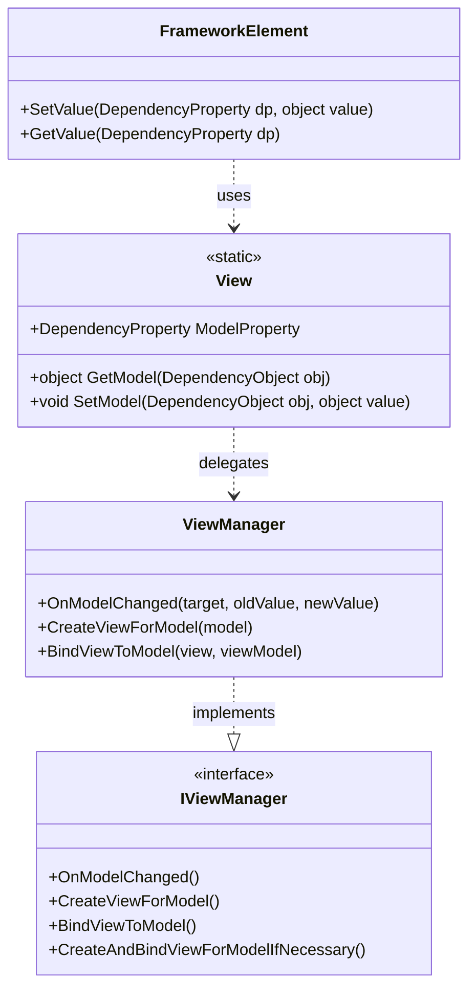
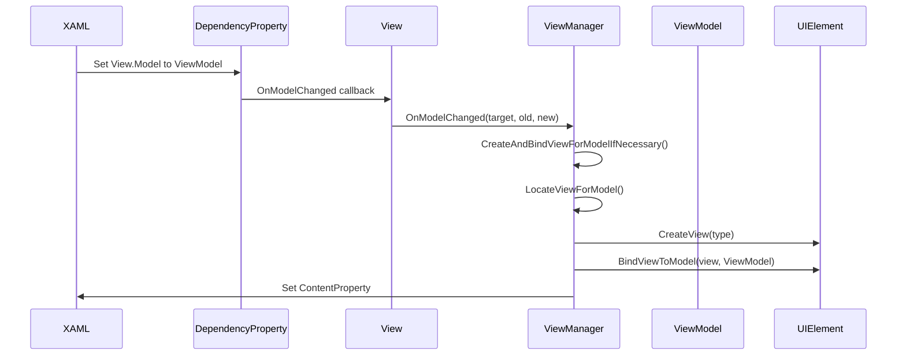

# Stylet框架中s:View.Model="{Binding}"完整技术剖析

## 一、前言

`s:View.Model`是Stylet框架中连接View与ViewModel的核心机制，通过依赖属性和视图管理器实现了MVVM模式中视图与视图模型的解耦。本文档将深入剖析其设计与实现细节。

## 二、架构概览

### 2.1 核心组件关系



### 2.2 生命周期时序图



## 三、核心实现详解

### 3.1 View.Model依赖属性定义

在[`View`](Stylet/Xaml/View.cs:76)中的完整定义：

```csharp
private static readonly object defaultModelValue = new();

public static readonly DependencyProperty ModelProperty =
    DependencyProperty.RegisterAttached(
        name: "Model",
        propertyType: typeof(object),
        ownerType: typeof(View),
        typeMetadata: new PropertyMetadata(
            defaultValue: defaultModelValue,
            propertyChangedCallback: (d, e) =>
            {
                var frameworkElement = (FrameworkElement)d;
                
                if (frameworkElement.TryFindResource(ViewManagerResourceKey) 
                    is not IViewManager viewManager)
                {
                    // 设计时模式下的特殊处理
                    if (Execute.InDesignMode)
                    {
                        HandleDesignMode(frameworkElement, e);
                    }
                    else
                    {
                        throw new InvalidOperationException(
                            "The ViewManager resource is unassigned. " +
                            "This should have been set by the Bootstrapper");
                    }
                }
                else
                {
                    // 实际运行时逻辑
                    object newValue = e.NewValue == defaultModelValue ? null : e.NewValue;
                    viewManager.OnModelChanged(frameworkElement, e.OldValue, newValue);
                }
            }
        )
    );

private static void HandleDesignMode(FrameworkElement element, 
                                   DependencyPropertyChangedEventArgs e)
{
    var bindingExpression = BindingOperations.GetBindingExpression(element, ModelProperty);
    string text;
    
    if (bindingExpression == null)
        text = "View for [Broken Binding]";
    else if (bindingExpression.ResolvedSourcePropertyName == null)
        text = $"View for child ViewModel on {bindingExpression.DataItem.GetType().Name}";
    else
        text = $"View for {bindingExpression.DataItem.GetType().Name}.{bindingExpression.ResolvedSourcePropertyName}";
    
    SetContentProperty(element, new TextBlock { Text = text });
}
```

### 3.2 ViewManager关键方法解析

#### 3.2.1 视图定位算法

[`ViewManager.LocateViewForModel`](Stylet/ViewManager.cs:250)中的视图定位逻辑：

```csharp
protected virtual Type LocateViewForModel(Type modelType)
{
    string modelFullName = modelType.FullName;
    
    // 1. 命名空间变换处理
    string viewName = ApplyNamespaceTransformations(modelFullName);
    
    // 2. 命名约定变换
    viewName = TransformViewModelNameToViewName(viewName);
    
    // 3. 类型查找
    Type viewType = FindTypeInAssemblies(viewName, modelType.Assembly);
    
    return ValidateViewType(viewType, modelFullName);
}

private string ApplyNamespaceTransformations(string modelName)
{
    foreach (var transformation in _namespaceTransformations)
    {
        if (modelName.StartsWith(transformation.Key + "."))
        {
            return transformation.Value + modelName.Substring(transformation.Key.Length);
        }
    }
    return modelName;
}

private string TransformViewModelNameToViewName(string modelName)
{
    return Regex.Replace(modelName,
        $@"(?<=.){Regex.Escape(_viewModelNameSuffix)}(?=s?\.)|{Regex.Escape(_viewModelNameSuffix)}$",
        _viewNameSuffix);
}

private Type FindTypeInAssemblies(string viewName, Assembly modelAssembly)
{
    return _viewAssemblies.Concat(new[] { modelAssembly })
        .Select(a => a.GetType(viewName))
        .FirstOrDefault(t => t != null);
}
```

#### 3.2.2 视图实例化策略

[`ViewManager.CreateViewForModel`](Stylet/ViewManager.cs:278)：

```csharp
public virtual UIElement CreateViewForModel(object model)
{
    logger.Info($"Creating view for ViewModel {model}");
    
    // 1. 视图类型定位
    Type viewType = this.LocateViewForModel(model.GetType());
    
    // 2. 类型有效性验证
    ValidateViewType(viewType);
    
    // 3. 视图实例化
    var view = (UIElement)this.ViewFactory(viewType);
    
    // 4. 视图初始化
    this.InitializeView(view, viewType);
    
    // 5. 验证视图类型
    if (view is Window window)
    {
        throw new StyletInvalidViewTypeException(
            $"Cannot use Window as View in s:View.Model. Use UserControl instead.");
    }
    
    return view;
}
```

### 3.3 绑定机制实现

[`ViewManager.BindViewToModel`](Stylet/ViewManager.cs:315)：

```csharp
public virtual void BindViewToModel(UIElement view, object viewModel)
{
    // 1. ActionTarget绑定 - 支持Stylet Actions
    logger.Info($"Setting {view}'s ActionTarget to {viewModel}");
    View.SetActionTarget(view, viewModel);
    
    // 2. DataContext绑定 - 标准WPF绑定
    if (view is FrameworkElement frameworkElement)
    {
        logger.Info($"Setting {view}'s DataContext to {viewModel}");
        frameworkElement.DataContext = viewModel;
    }
    
    // 3. IViewAware通知
    if (viewModel is IViewAware viewAware)
    {
        logger.Info($"Setting {viewModel}'s View to {view}");
        viewAware.AttachView(view);
    }
}
```

## 四、实际使用场景分析

### 4.1 标准模式配置

**ShellView.xaml**
```xml
<Window x:Class="App.Views.ShellView"
        xmlns:s="https://github.com/canton7/Stylet">
    <Grid>
        <ContentControl s:View.Model="{Binding ActiveItem}" />
    </Grid>
</Window>
```

**ShellViewModel.cs**
```csharp
public class ShellViewModel : Conductor<object>
{
    public void ShowUser()
    {
        var userViewModel = new UserViewModel();
        this.ActivateItem(userViewModel); // ActiveItem变更触发View.Model
    }
}
```

### 4.2 嵌套视图场景

**ParentView.xaml**
```xml
<UserControl ...>
    <Grid>
        <ContentControl Grid.Row="0" s:View.Model="{Binding Header}" />
        <ContentControl Grid.Row="1" s:View.Model="{Binding MainContent}" />
        <ListBox Grid.Row="2" ItemsSource="{Binding Items}" 
                 SelectedItem="{Binding SelectedItem}">
            <ListBox.ItemTemplate>
                <DataTemplate>
                    <ContentControl s:View.Model="{Binding}" />
                </DataTemplate>
            </ListBox.ItemTemplate>
        </ListBox>
    </Grid>
</UserControl>
```

### 4.3 动态导航模式

**NavigationShellView.xaml**
```xml
<Window ...>
    <Grid>
        <Border>
            <ContentControl s:View.Model="{Binding NavigationViewModel}" />
        </Border>
    </Grid>
</Window>
```

## 五、高级配置与自定义

### 5.1 命名空间映射配置

**Bootstrapper.cs**
```csharp
protected override void Configure()
{
    base.Configure();
    
    // 自定义命名空间映射
    this.ViewManager.NamespaceTransformations["App.ViewModels"] = "App.Views";
    this.ViewManager.ViewNameSuffix = "Screen";
    this.ViewManager.ViewModelNameSuffix = "ScreenViewModel";
}
```

### 5.2 视图工厂扩展

```csharp
this.ViewManager.ViewFactory = (viewType) =>
{
    // 自定义视图创建逻辑，支持构造函数注入
    if (container.IsRegistered(viewType))
        return container.Resolve(viewType);
    
    return Activator.CreateInstance(viewType);
};
```

### 5.3 定位策略自定义

```csharp
public class CustomViewManager : ViewManager
{
    protected override string ViewTypeNameForModelTypeName(string modelTypeName)
    {
        // 自定义的视图-ViewModel映射逻辑
        if (modelTypeName.EndsWith("ViewModel"))
            return modelTypeName.Replace("ViewModel", "Page");
            
        return base.ViewTypeNameForModelTypeName(modelTypeName);
    }
}
```

## 六、故障排查与调试

### 6.1 常见问题及解决方案

| 问题现象 | 原因分析 | 解决方案 |
|---------|----------|----------|
| "找不到视图类型"异常 | 视图类不存在或命名不符合约定 | 检查视图类是否存在，确认命名约定 |
| "ViewManager resource未设置" | Bootstrapper未正确初始化 | 确保Bootstrapper继承了BootstrapperBase |
| "不能使用Window作为视图" | 视图继承了Window类 | 改为继承UserControl或其他UIElement |
| 设计时显示异常 | 缺少无参数构造函数或依赖服务 | 添加无参数构造函数或使用Execute.InDesignMode检查 |

### 6.2 调试技巧

```csharp
// 启用详细日志
#if DEBUG
LogManager.GetLogger<ViewManager>().IsEnabled = true;
#endif

// 自定义错误处理
public class DiagnosticViewManager : ViewManager
{
    protected override Type LocateViewForModel(Type modelType)
    {
        try
        {
            return base.LocateViewForModel(modelType);
        }
        catch (StyletViewLocationException ex)
        {
            // 记录详细的诊断信息
            Debug.WriteLine($"视图定位失败: {modelType} -> {ex.ViewTypeName}");
            throw;
        }
    }
}
```

### 6.3 性能监控

```csharp
public class PerfViewManager : ViewManager
{
    private readonly ILogger logger = LogManager.GetLogger<PerfViewManager>();
    
    public override UIElement CreateAndBindViewForModelIfNecessary(
        object model)
    {
        var sw = Stopwatch.StartNew();
        var result = base.CreateAndBindViewForModelIfNecessary(model);
        sw.Stop();
        
        logger.Info($"视图创建耗时: {sw.ElapsedMilliseconds}ms - {model}");
        return result;
    }
}
```

## 七、性能优化与最佳实践

### 7.1 缓存策略

```csharp
public class CachingViewManager : ViewManager
{
    private readonly ConcurrentDictionary<Type, Type> _viewTypeCache = new();
    
    protected override Type LocateViewForModel(Type modelType)
    {
        return _viewTypeCache.GetOrAdd(modelType, base.LocateViewForModel);
    }
}
```

### 7.2 预加载策略

```csharp
public static class Preloader
{
    public static void PreloadAssembly(Type fromType)
    {
        var assembly = fromType.Assembly;
        var viewManager = IoC.Get<IViewManager>();
        
        Task.Run(() =>
        {
            var viewModels = assembly.GetTypes()
                .Where(t => t.Name.EndsWith("ViewModel"));
                
            foreach (var vm in viewModels)
            {
                viewManager.LocateViewForModel(vm);
            }
        });
    }
}
```

### 7.3 内存管理

```csharp
// 在ViewModel中实现IDisposable
public class MyViewModel : Screen, IDisposable
{
    private bool disposed;
    
    protected override void OnViewDetached()
    {
        base.OnViewDetached();
        Dispose();
    }
    
    public void Dispose()
    {
        if (!disposed)
        {
            // 清理资源
            disposed = true;
        }
    }
}
```

## 八、总结

`s:View.Model`机制通过依赖属性和视图管理器的协作，实现了MVVM模式中视图与ViewModel的松耦合连接。其核心价值在于：

1. **自动协调**：无需手动创建和绑定视图
2. **约定优于配置**：通过命名约定简化开发
3. **运行时可扩展**：支持自定义定位策略和视图创建逻辑
4. **设计时友好**：在Visual Studio中提供直观的反馈
5. **性能优化**：通过缓存和批量处理提升运行效率

该机制不仅简化了MVVM模式的实现，也为构建大型、可维护的WPF应用程序提供了坚实的基础架构支持。