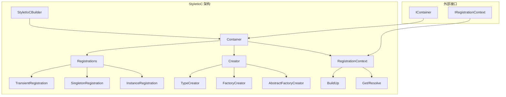
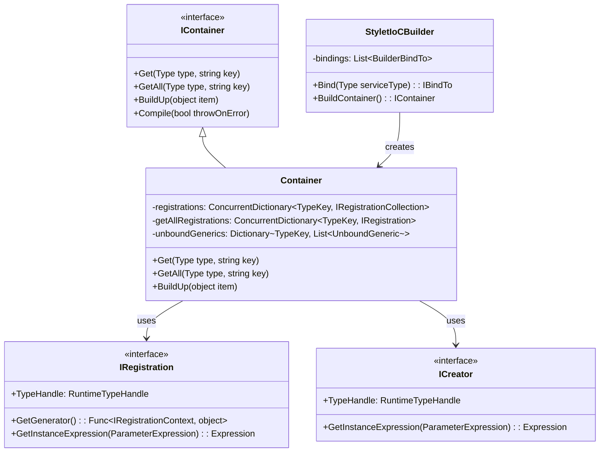
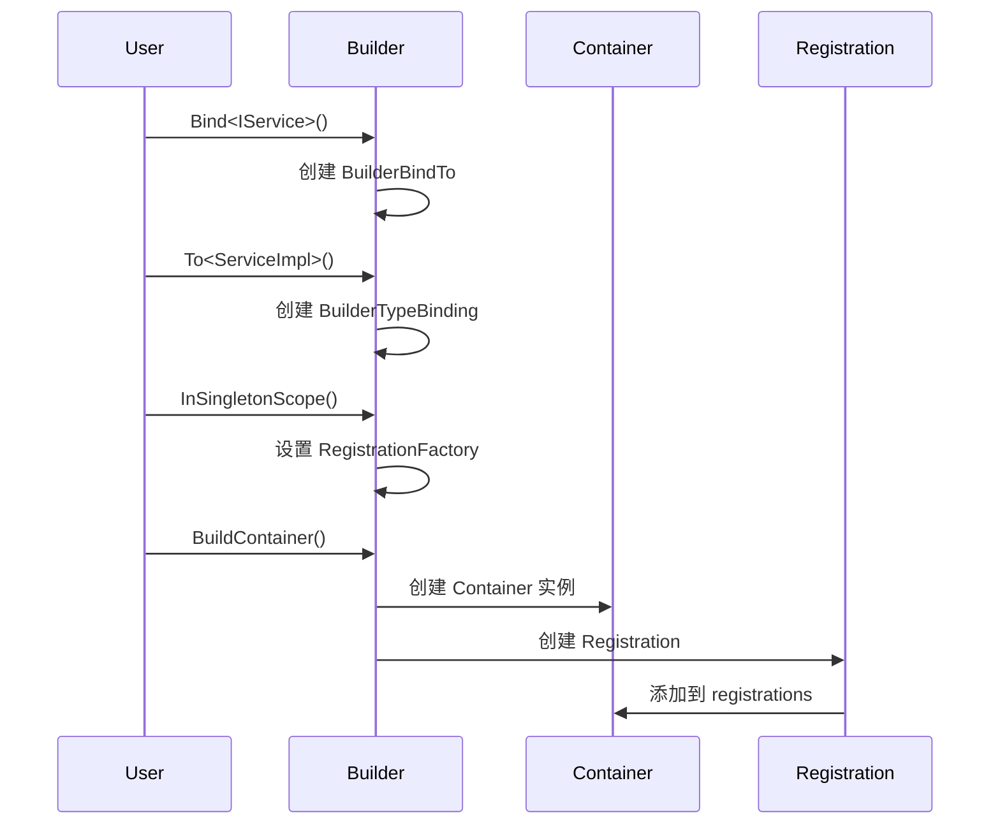
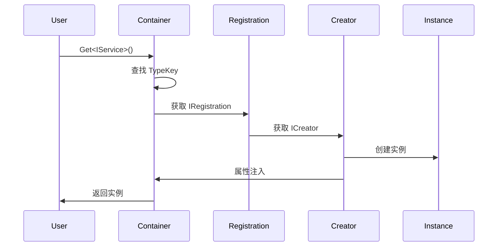
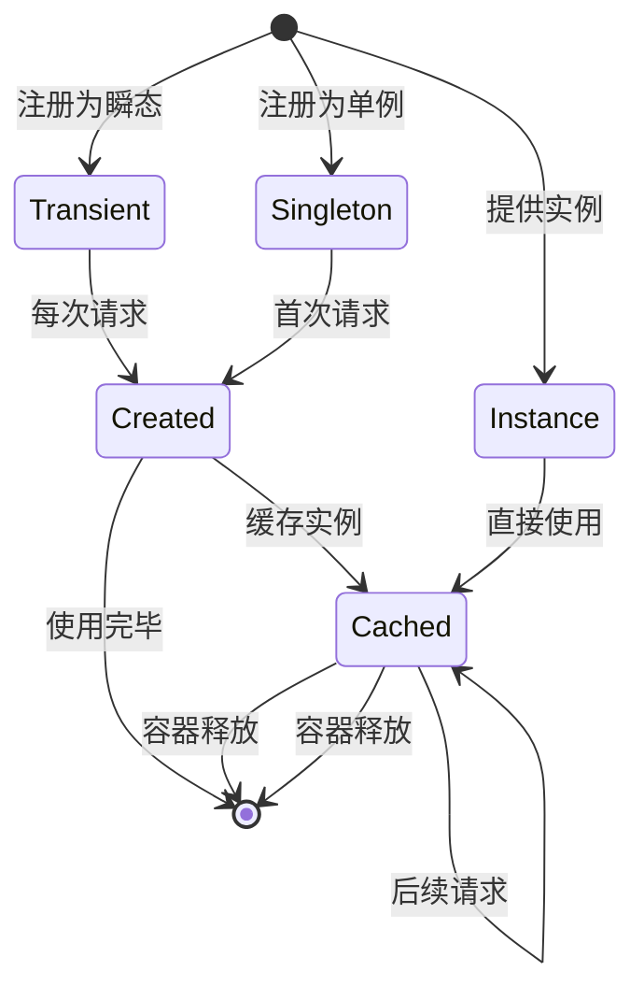
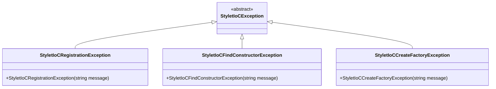

# StyletIoC 详细设计与实现文档

## 概述

StyletIoC 是一个轻量级、高性能的依赖注入容器，专为 Stylet MVVM 框架设计。它提供了完整的 IoC（Inversion of Control）功能，包括类型注册、依赖注入、生命周期管理等核心特性。

## 核心架构

### 系统架构图



### 核心组件关系



## 核心接口设计

### 1. 容器接口 (IContainer)

`IContainer` 是 StyletIoC 的核心接口，定义了容器的所有基本操作：

- **实例获取**: `Get<T>()` 和 `Get(Type)` 方法用于获取单个实例
- **集合获取**: `GetAll<T>()` 和 `GetAll(Type)` 方法用于获取所有实现
- **属性注入**: `BuildUp(object)` 方法用于对已创建对象进行属性注入
- **预编译**: `Compile(bool)` 方法用于提前验证所有注册的依赖关系

### 2. 构建器接口 (IStyletIoCBuilder)

`IStyletIoCBuilder` 提供了流畅的 API 用于配置依赖注入：

- **类型绑定**: `Bind<T>()` 和 `Bind(Type)` 方法
- **自动绑定**: `Autobind()` 方法用于自动注册程序集中的具体类型
- **模块支持**: `AddModule()` 和 `AddModules()` 方法支持模块化配置
- **容器构建**: `BuildContainer()` 方法创建最终的容器实例

### 3. 流畅接口设计

StyletIoC 采用了流畅接口设计模式，提供了直观的配置体验：

```mermaid
graph LR
    A[Bind<T>()] --> B[To<T>()]
    A --> C[ToSelf()]
    A --> D[ToFactory()]
    A --> E[ToInstance()]
    
    B --> F[InSingletonScope()]
    C --> F
    D --> F
    E --> G[DisposeWithContainer()]
    
    F --> H[WithKey()]
    G --> H
    
    H --> I[AsWeakBinding()]
```

## 依赖注入流程

### 1. 注册阶段



### 2. 解析阶段



## 生命周期管理

### 生命周期类型

StyletIoC 支持三种主要的生命周期：

1. **Transient (瞬态)**: 每次请求都创建新实例
2. **Singleton (单例)**: 整个容器生命周期内只创建一个实例
3. **Instance (实例)**: 使用预先提供的实例



### 单例实现机制

```csharp
// SingletonRegistration 核心实现
internal class SingletonRegistration : RegistrationBase
{
    private readonly IRegistrationContext parentContext;
    private object instance;
    
    public SingletonRegistration(IRegistrationContext parentContext, ICreator creator)
        : base(creator)
    {
        this.parentContext = parentContext;
        this.parentContext.Disposing += (o, e) => {
            // 释放资源
            var disposable = this.instance as IDisposable;
            if (disposable != null)
                disposable.Dispose();
        };
    }
    
    public override Expression GetInstanceExpression(ParameterExpression registrationContext)
    {
        if (this.instance == null)
        {
            lock (this.LockObject)
            {
                if (this.instance == null)
                    this.instance = // 创建实例
            }
        }
        return Expression.Constant(this.instance);
    }
}
```

## 依赖注入机制

### 构造函数注入

StyletIoC 使用以下策略选择构造函数：

1. **优先选择** 带有 `[Inject]` 特性的构造函数
2. **次优选择** 参数最多的可解析构造函数
3. **支持默认值** 对于无法解析的参数使用默认值

```mermaid
flowchart TD
    A[请求类型 T] --> B{是否有 [Inject] 构造函数?}
    B -->|是| C{是否有多个?}
    B -->|否| D[查找所有构造函数]
    C -->|是| E[抛出异常]
    C -->|否| F[使用标记构造函数]
    D --> G[选择参数最多且可解析的]
    G --> H{是否找到?}
    H -->|是| I[使用选中构造函数]
    H -->|否| J[抛出异常]
```

### 属性注入

```mermaid
flowchart TD
    A[BuildUp 对象] --> B[获取对象类型]
    B --> C[查找所有 [Inject] 属性/字段]
    C --> D[解析每个依赖]
    D --> E[设置属性值]
    E --> F[检查 IInjectionAware]
    F --> G[调用 ParametersInjected()]
```

## 高级特性

### 1. 泛型支持

StyletIoC 支持开放泛型（unbound generics）的注册：

```csharp
// 注册开放泛型
builder.Bind(typeof(IRepository<>)).To(typeof(Repository<>));

// 解析封闭泛型
var userRepo = container.Get<IRepository<User>>();
var orderRepo = container.Get<IRepository<Order>>();
```

### 2. 抽象工厂

支持自动生成抽象工厂接口的实现：

```csharp
public interface IServiceFactory
{
    IService CreateService(string name);
    ILogger CreateLogger(Type type);
}

// 注册
builder.Bind<IServiceFactory>().ToAbstractFactory();
```

### 3. 弱绑定机制

允许框架提供默认绑定，用户可以轻松覆盖：

```csharp
// 框架提供弱绑定
builder.Bind<IService>().To<DefaultService>().AsWeakBinding();

// 用户覆盖
builder.Bind<IService>().To<CustomService>(); // 覆盖弱绑定
```

### 4. 键控注册

支持使用键区分同一接口的多个实现：

```csharp
builder.Bind<IService>().To<ServiceA>().WithKey("A");
builder.Bind<IService>().To<ServiceB>().WithKey("B");

var serviceA = container.Get<IService>("A");
var serviceB = container.Get<IService>("B");
```

## 性能优化

### 1. 表达式树缓存

使用 `System.Linq.Expressions` 生成高效的实例创建代码：

```csharp
// TypeCreator 中的表达式树生成
Expression creator = Expression.New(ctor, ctorParams);
Expression completeExpression = this.CompleteExpressionFromCreator(creator, registrationContext);
```

### 2. 并发安全

- 使用 `ConcurrentDictionary` 存储注册信息
- 单例模式使用双重检查锁定
- 不可变数据结构保证线程安全

### 3. 延迟初始化

- 注册信息在首次使用时才编译
- 支持预编译验证（`Compile()` 方法）

## 异常处理

StyletIoC 定义了专门的异常层次结构：



## 使用示例

### 基本用法

```csharp
// 创建构建器
var builder = new StyletIoCBuilder();

// 注册服务
builder.Bind<IService>().To<ServiceImpl>().InSingletonScope();
builder.Bind<IRepository>().To<Repository>().InTransientScope();

// 构建容器
var container = builder.BuildContainer();

// 获取服务
var service = container.Get<IService>();
```

### 模块化配置

```csharp
public class MyModule : StyletIoCModule
{
    protected override void Load()
    {
        Bind<IService1>().To<Service1Impl>();
        Bind<IService2>().To<Service2Impl>();
    }
}

// 使用模块
var builder = new StyletIoCBuilder();
builder.AddModule(new MyModule());
```

### 属性注入

```csharp
public class MyViewModel
{
    [Inject]
    public IService Service { get; set; }
    
    [Inject("Special")]
    public ILogger Logger { get; set; }
}

// 使用
var vm = new MyViewModel();
container.BuildUp(vm); // 自动注入依赖
```

## 总结

StyletIoC 通过精心设计的架构实现了以下特点：

1. **轻量级**: 核心代码简洁，依赖少
2. **高性能**: 使用表达式树和缓存机制
3. **功能完整**: 支持各种依赖注入场景
4. **易用性**: 流畅的 API 设计和良好的异常信息
5. **扩展性**: 支持模块化配置和自定义扩展

其设计充分体现了现代 IoC 容器的最佳实践，为 Stylet 框架提供了强大的依赖注入支持。