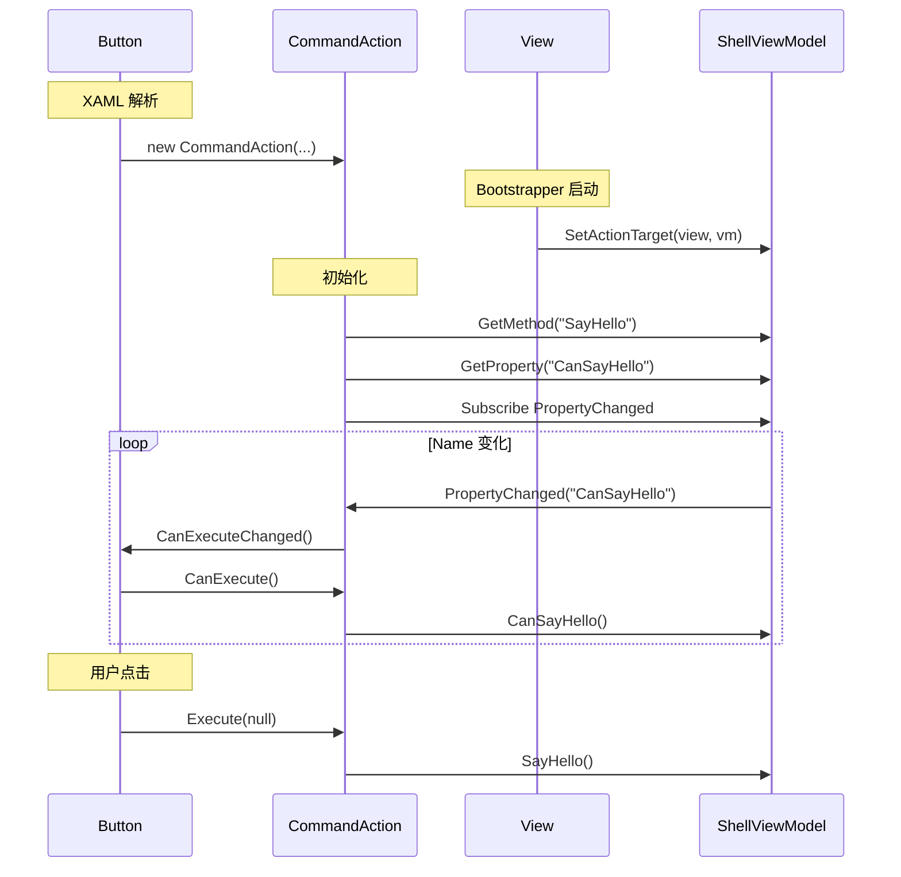

# Stylet 中 `s:Action` 的设计与实现详解  
> 以 `Samples/Stylet.Samples.Hello` 为例，彻底剖析为什么一行 `<Button Command="{s:Action SayHello}">` 就能直接调用到 `ShellViewModel.SayHello()`。

---

## 1. 现象回顾

在 `ShellView.xaml` 中，只有一行看似“魔法”的代码：

```xml
<Button Command="{s:Action SayHello}">Say Hello</Button>
```

与之对应的 `ShellViewModel.cs`：

```csharp
public class ShellViewModel : Screen
{
    public void SayHello() => windowManager.ShowMessageBox($"Hello, {Name}");
    public bool CanSayHello => !string.IsNullOrEmpty(Name);
}
```

运行时，只要 `CanSayHello == true`，点击按钮即可触发 `SayHello()`；当 `Name` 为空时按钮自动置灰。  
**这一切只靠一行 XAML，没有 Command 对象、没有事件处理器、没有绑定代码。** 下面逐层拆解其工作原理。

---

## 2. 总体流程鸟瞰

| 阶段 | 关键组件 | 职责 |
|---|---|---|
| ① XAML 解析 | `ActionExtension` | 将 `{s:Action SayHello}` 翻译成 `CommandAction` 实例 |
| ② 寻找目标 | `View.ActionTarget` | 通过附加属性把 ViewModel 注入到可视化树 |
| ③ 生成命令 | `CommandAction` | 实现 `ICommand`，反射查找 `SayHello`/`CanSayHello` |
| ④ 状态同步 | `INotifyPropertyChanged` | 监听 `CanSayHello` 变化，自动更新按钮可用状态 |
| ⑤ 命令执行 | `CommandAction.Execute` | 反射调用 `SayHello()` |

---

## 3. 阶段详解

### 3.1 XAML 解析：`ActionExtension`

`{s:Action SayHello}` 是 `Stylet.Xaml.ActionExtension` 的标记扩展，继承自 `MarkupExtension`。

```csharp
// Stylet/Xaml/ActionExtension.cs
[MarkupExtensionReturnType(typeof(ICommand))]
public class ActionExtension : MarkupExtension
{
    [ConstructorArgument("method")]
    public string Method { get; set; } = null!;

    public override object ProvideValue(IServiceProvider serviceProvider)
    {
        // 1. 确定目标属性是 Command
        var valueService = (IProvideValueTarget)serviceProvider
                           .GetService(typeof(IProvideValueTarget))!;
        var targetObject = (DependencyObject)valueService.TargetObject;
        var targetProperty = (DependencyProperty)valueService.TargetProperty;

        if (targetProperty.PropertyType == typeof(ICommand))
        {
            // 2. 创建 CommandAction（ICommand 实现）
            return CreateCommandAction(serviceProvider, targetObject);
        }
        ...
    }
}
```

- `Method="SayHello"` 被注入到 `ActionExtension.Method`。
- 返回一个 `CommandAction` 对象，赋值给 `Button.Command`。

---

### 3.2 寻找目标：`View.ActionTarget`

`CommandAction` 需要知道“在哪个对象上找 `SayHello`”。  
Stylet 通过附加属性 `View.ActionTarget` 把 **ViewModel** 注入到可视化树，并允许继承。

```csharp
// Stylet/Xaml/View.cs
public static class View
{
    public static readonly DependencyProperty ActionTargetProperty =
        DependencyProperty.RegisterAttached(
            "ActionTarget",
            typeof(object),
            typeof(View),
            new FrameworkPropertyMetadata(
                InitialActionTarget,
                FrameworkPropertyMetadataOptions.Inherits)); // 关键：子元素自动继承
}
```

在 `HelloBootstrapper` 启动时：

```csharp
// HelloBootstrapper.cs
public class HelloBootstrapper : Bootstrapper<ShellViewModel> { }
```

`Bootstrapper` 会调用 `WindowManager.ShowWindow(ShellViewModel)`，内部逻辑：

```csharp
var view = ViewLocator.GetViewFor(vm); // 找到 ShellView
View.SetActionTarget(view, vm);        // 把 ShellViewModel 设为 ActionTarget
```

由于 `Inherits=true`，`ShellView` 下的所有子元素（包括 `Button`）都继承了同一个 `ActionTarget`，即 `ShellViewModel` 实例。

---

### 3.3 生成命令：`CommandAction`

`CommandAction` 是 `ICommand` 的完整实现，核心字段：

```csharp
// Stylet/Xaml/CommandAction.cs
public class CommandAction : ActionBase, ICommand
{
    private readonly string guardName = "Can" + MethodName; // "CanSayHello"
    private Func<bool>? guardPropertyGetter;                // 缓存 CanSayHello 的委托
}
```

#### 3.3.1 构造函数

```csharp
public CommandAction(
    DependencyObject subject,      // Button
    DependencyObject backupSubject, // ShellView
    string methodName,
    ...)
    : base(subject, backupSubject, methodName, ...)
{
    // 通过绑定表达式监听 View.ActionTarget
    // this.Target = View.GetActionTarget(subject) ?? backupSubject
}
```

#### 3.3.2 反射查找方法

基类 `ActionBase.UpdateActionTarget`：

```csharp
private void UpdateActionTarget(object oldTarget, object newTarget)
{
    var method = newTarget.GetType().GetMethod(MethodName); // "SayHello"
    var guard  = newTarget.GetType().GetProperty("Can" + MethodName); // "CanSayHello"
    ...
    TargetMethodInfo = method;
    OnTargetChanged(...);
}
```

#### 3.3.3 生成 `CanExecute` 委托

```csharp
protected override void OnTargetChanged(object oldTarget, object newTarget)
{
    if (newTarget is INotifyPropertyChanged inpc)
    {
        // 监听 CanSayHello 变化
        PropertyChangedEventManager.AddHandler(inpc, PropertyChangedHandler, "CanSayHello");
    }

    // 编译表达式树生成快速委托
    var prop = newTarget.GetType().GetProperty("CanSayHello");
    if (prop?.PropertyType == typeof(bool))
    {
        var targetExpr = Expression.Constant(newTarget);
        var propAccess = Expression.Property(targetExpr, prop);
        guardPropertyGetter = Expression.Lambda<Func<bool>>(propAccess).Compile();
    }
}
```

---

### 3.4 状态同步：`CanExecuteChanged`

`CommandAction` 实现 `ICommand.CanExecute`：

```csharp
public bool CanExecute(object parameter)
{
    if (guardPropertyGetter == null) return true;
    return guardPropertyGetter(); // 调用 ShellViewModel.CanSayHello
}
```

当 `ShellViewModel.Name` 改变时：

```csharp
public string Name
{
    get => _name;
    set
    {
        SetAndNotify(ref _name, value);
        NotifyOfPropertyChange(() => CanSayHello); // 触发 PropertyChanged
    }
}
```

`CommandAction.PropertyChangedHandler` 捕获事件，调用：

```csharp
Stylet.Execute.OnUIThread(() => CanExecuteChanged?.Invoke(this, EventArgs.Empty));
```

`Button` 自动重新查询 `CanExecute`，实现可用/禁用状态切换。

---

### 3.5 命令执行：`Execute`

```csharp
public void Execute(object parameter)
{
    AssertTargetSet(); // 确保 ViewModel 已绑定
    TargetMethodInfo.Invoke(Target, parameters: null); // 调用 ShellViewModel.SayHello()
}
```

---

## 4. 完整调用链（时序图）



---

## 5. 关键点总结

| 机制 | 作用 | 位置 |
|---|---|---|
| `ActionExtension` | 把字符串 `"SayHello"` 翻译成 `ICommand` | `Stylet.Xaml.ActionExtension` |
| `View.ActionTarget` | 通过附加属性把 ViewModel 注入到可视化树，子元素继承 | `Stylet.Xaml.View` |
| `CommandAction` | 实现 `ICommand`，反射查找方法/守卫属性，监听 `INPC` | `Stylet.Xaml.CommandAction` |
| 命名约定 | `CanSayHello` 自动与 `SayHello` 配对，零配置 | 约定优于配置 |
| 表达式树 | 运行时生成 `Func<bool>`，避免反射性能损耗 | `System.Linq.Expressions` |

---

## 6. 扩展阅读

- **异步命令**：`SayHello` 可返回 `Task`，`CommandAction` 会自动 `await`。
- **参数传递**：`CommandParameter` 会作为 `SayHello(object parameter)` 的参数。
- **异常策略**：通过 `ActionUnavailableBehaviour` 可配置方法不存在或目标为 null 时的行为（抛出、禁用、忽略）。

---

至此，一行 `<Button Command="{s:Action SayHello}"/>` 背后的完整魔法已彻底揭开。