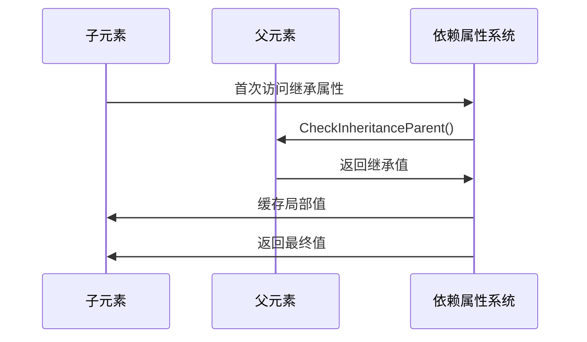

# 深入理解WPF依赖属性：源码级分析文档

## 1. 依赖属性系统架构概述

### 1.1 位置说明
WPF依赖属性系统主要实现在`WindowsBase`程序集中，具体位置：

- `src/Microsoft.DotNet.Wpf/src/WindowsBase/System/Windows/DependencyProperty.cs`
- `src/Microsoft.DotNet.Wpf/src/WindowsBase/System/Windows/DependencyObject.cs`

这与直觉相反，许多人可能以为实现会在`PresentationCore`或`PresentationFramework`中，但实际上为了更底层的功能支持，核心实现放在了`WindowsBase`。

### 1.2 核心类关系
```mermaid
graph BT
    DP[DependencyProperty] --> Contains PropertyMetadata
    DO[DependencyObject] --> Has DependencyProperty values
    DP --> Registers with unique GlobalIndex
    DO --> GetValue/SetValue operations
```

## 2. DependencyProperty类详解

### 2.1 基本结构

`DependencyProperty`是一个密封类(sealed class)，主要包含：

- **元数据管理**：`_metadataMap`存储类型特定的元数据
- **全局索引系统**：`GlobalIndexCount`确保每个属性全局唯一
- **验证系统**：包含类型验证和值验证
- **只读属性支持**：通过`DependencyPropertyKey`实现

### 2.2 注册机制详解

#### 2.2.1 Register方法家族

支持四种基本注册方式：

1. **基本注册**：
```csharp
public static DependencyProperty Register(string name, Type propertyType, Type ownerType)

// 实际调用
public static DependencyProperty Register(string name, Type propertyType, Type ownerType, PropertyMetadata typeMetadata, ValidateValueCallback validateValueCallback)
```

2. **只读注册**：
```csharp
public static DependencyPropertyKey RegisterReadOnly(...)

// 需要依赖属性Key才能设置
public static DependencyPropertyKey RegisterReadOnly(string name, Type propertyType, Type ownerType, PropertyMetadata typeMetadata, ValidateValueCallback validateValueCallback)
```

3. **附加属性注册**：
```csharp
public static DependencyProperty RegisterAttached(...)

// 适用于跨类的属性支持
public static DependencyProperty RegisterAttached(string name, Type propertyType, Type ownerType, PropertyMetadata defaultMetadata, ValidateValueCallback validateValueCallback)
```

4. **附加只读注册**：
```csharp
public static DependencyPropertyKey RegisterAttachedReadOnly(...)
```

### 2.3 元数据管理

每个`DependencyProperty`都有：

- **默认元数据**：`DefaultMetadata`，适用于所有类型
- **类型特定元数据**：通过`OverrideMetadata`为特定类型提供定制值

#### 2.3.1 OverrideMetadata机制

```csharp
// 基本重载
public void OverrideMetadata(Type forType, PropertyMetadata typeMetadata)

// 只读属性重载
public void OverrideMetadata(Type forType, PropertyMetadata typeMetadata, DependencyPropertyKey key)
```

关键实现：
- 确保所有基类都注册元数据
- 验证继承关系的有效性
- 合并基础元数据和特定类型元数据

## 3. DependencyObject类详解

### 3.1 EffectiveValueStore系统

#### 3.1.1 缓存结构
```csharp
private EffectiveValueEntry[] _effectiveValues;
```

数组按`DependencyProperty.GlobalIndex`排序，便于快速查找。

#### 3.1.2 缓存管理
- **插入**：`InsertEntry`方法使用插入排序
- **删除**：`RemoveEntry`方法移除并重排
- **扩容**：使用指数增长的策略（初始化2，增长因子1.2或2.0）

### 3.2 值计算机制

#### 3.2.1 值优先级系统

WPF依赖属性值遵循严格的优先级规则：

| 优先级编号 | 值源类型 | 说明 |
|-----------|----------|------|
| 1 | Coerced（强制值） | 通过CoerceValueCallback |
| 2 | Animated（动画值） | 通过动画系统设置 |
| 3 | Expression（表达式） | 绑定或资源引用 |
| 4 | BaseValue（基础值） | 样式、模板、本地值等 |

#### 3.2.2 值计算流程

```csharp
// 伪代码流程
EffectiveValueEntry EvaluateEffectiveValue()
{
    1. 检查本地存储值 → 若存在直接返回
    2. 检查表达式或默认值工厂 → 计算值
    3. 检查是否继承 → 从父级获取
    4. 计算默认值 → 使用元数据提供的默认值
}
```

### 3.3 继承机制

#### 3.3.1 属性继承系统

通过以下机制支持：
- **IsInherited标志**：在元数据中标记可继承属性
- **InheritanceParent**：每个对象维护的继承父级引用
- **IsSelfInheritanceParent**：优化标志，表示继承值已本地化

#### 3.3.2 继承传播

```csharp
private void MergeInheritableProperties(DependencyObject inheritanceParent)
```

关键实现：
- 仅复制已设置的继承属性
- 使用缓存策略减少树遍历
- 支持选择性继承（非全部属性都可继承）

### 3.4 变化通知系统

#### 3.4.1 值变更通知

通过`UpdateEffectiveValue`实现：
- 计算值是否真正变更
- 触发PropertyChangedCallback
- 通知依赖者（表达式、绑定等）

#### 3.4.2 子属性变更

对于对象类型的依赖属性：
- `InvalidateSubProperty`用于子属性变更通知
- 避免不必要的重新计算
- 支持子属性级的细粒度通知

## 4. 具体依赖属性实现实例分析

### 4.1 普通依赖属性实现模式

基于源码中的实际用例，我们总结以下通用模式：

#### 4.1.1 基本模式

```csharp
// 1. 定义属性存根
public static readonly DependencyProperty BackgroundProperty = 
    BackgroundPropertyKey = DependencyProperty.Register(
        "Background", 
        typeof(Brush), 
        typeof(Button), 
        new FrameworkPropertyMetadata(
            (Brush)null,
            FrameworkPropertyMetadataOptions.AffectsRender,
            new PropertyChangedCallback(OnBackgroundChanged)
        )
    );

// 2. CLR包装器
public Brush Background
{
    get { return (Brush)GetValue(BackgroundProperty); }
    set { SetValue(BackgroundProperty, value); }
}

// 3. 变更回调
private static void OnBackgroundChanged(DependencyObject d, DependencyPropertyChangedEventArgs e)
{
    Button button = (Button)d;
    // 处理变更逻辑
}
```

#### 4.1.2 读取依赖属性的实现

通过源码分析`GetValue`方法：

```csharp
public object GetValue(DependencyProperty dp)
{
    // 验证调用线程
    this.VerifyAccess();
    
    // 通过全局索引直接定位
    EntryIndex entryIndex = LookupEntry(dp.GlobalIndex);
    
    // 获取计算值
    return GetValueEntry(entryIndex, dp, null, RequestFlags.FullyResolved).Value;
}
```

#### 4.1.3 设置依赖属性的实现

`SetValue`方法的执行流程：

1. **参数验证**
   ```csharp
   PropertyMetadata metadata = SetupPropertyChange(dp);
   ```

2. **值验证**
   ```csharp
   if (!dp.IsValidValue(value))
   {
       throw new ArgumentException(SR.Format(SR.InvalidPropertyValue, value, dp.Name));
   }
   ```

3. **值设置和通知**
   ```csharp
   UpdateEffectiveValue(
       entryIndex,
       dp,
       metadata,
       oldEntry,
       ref newEntry,
       coerceWithDeferredReference: false,
       coerceWithCurrentValue: false,
       operationType
   );
   ```

### 4.2 实际应用案例

#### 4.2.1 Button.Foreground 属性

```csharp
// 实际源码位置：src/Microsoft.DotNet.Wpf/src/PresentationFramework/System/Windows/Controls/Control.cs
public static readonly DependencyProperty ForegroundProperty =
    TextElement.ForegroundProperty.AddOwner(typeof(Control), 
        new FrameworkPropertyMetadata(
            SystemColors.ControlTextBrush,
            FrameworkPropertyMetadataOptions.Inherits));

public Brush Foreground
{
    get { return (Brush)GetValue(ForegroundProperty); }
    set { SetValue(ForegroundProperty, value); }
}
```

#### 4.2.2 FrameworkElement.Language 属性

```csharp
// 实际源码位置：src/Microsoft.DotNet.Wpf/src/PresentationFramework/System/Windows/FrameworkElement.cs
public static readonly DependencyProperty LanguageProperty =
    XmlLanguage.GetLanguage("en-US"),
    FrameworkPropertyMetadataOptions.Inherits | FrameworkPropertyMetadataOptions.AffectsMeasure);

public XmlLanguage Language
{
    get { return (XmlLanguage)GetValue(LanguageProperty); }
    set { SetValue(LanguageProperty, value); }
}
```

## 5. 继承属性详解

### 5.1 继承属性特点

继承属性具有以下特征：
- **元数据标记**：`FrameworkPropertyMetadataOptions.Inherits`
- **值传播**：从父元素自动传播到子元素
- **性能优化**：通过缓存机制减少树遍历

### 5.2 实际继承属性列表

基于源码分析，主要的继承属性包括：

| 属性名称 | 定义类型 |
|----------|----------|
| Language | FrameworkElement |
| DataContext | FrameworkElement |
| FontFamily | TextElement |
| Foreground | TextElement |
| Background | Panel |
| FlowDirection | FrameworkElement |

### 5.3 继承机制工作流程



#### 5.3.1 继承优化策略

1. **延迟加载**：只有第一次访问时才计算继承值
2. **缓存机制**：后续访问直接使用缓存值
3. **树变更事件**：当视觉树变化时重新计算

## 6. 附加属性详解

### 6.1 附加属性特点

附加属性是依赖系统的特殊形式，允许：
- 在任何`DependencyObject`上附加额外的属性
- 跨类共享属性定义
- 实现布局和事件处理等特定功能

### 6.2 实际使用的附加属性

#### 6.2.1 Canvas.Left/Top/Right/Bottom

```csharp
// 实际源码
public static readonly DependencyProperty LeftProperty = DependencyProperty.RegisterAttached(
    "Left", 
    typeof(double), 
    typeof(Canvas), 
    new FrameworkPropertyMetadata(
        0.0,
        FrameworkPropertyMetadataOptions.AffectsParentArrange,
        new PropertyChangedCallback(OnLeftChanged))
);

// 使用方式
Canvas.SetLeft(element, 100.0);
double left = Canvas.GetLeft(element);
```

#### 6.2.2 Grid.Row/Column

```csharp
// Grid定义
public static readonly DependencyProperty RowProperty = DependencyProperty.RegisterAttached(
    "Row", 
    typeof(int), 
    typeof(Grid), 
    new FrameworkPropertyMetadata(0)
);

// 使用方式
Grid.SetRow(button, 1);
```

### 6.3 附加属性实现细节

#### 6.3.1 注册过程分析

1. **验证**：检查参数合法性（名称非空、类型有效）
2. **键生成**：使用`ownerType + propertyName`作为唯一键
3. **元数据初始化**：设置默认值和变更回调
4. **全局注册**：加入全局属性列表

#### 6.3.2 访问器实现

```csharp
public static void SetRow(DependencyObject element, int value)
{
    if (element == null) throw new ArgumentNullException("element");
    element.SetValue(RowProperty, value);
}

public static int GetRow(DependencyObject element)
{
    if (element == null) throw new ArgumentNullException("element");
    return (int)element.GetValue(RowProperty);
}
```

### 6.4 附加属性的高级用法

#### 6.4.1 样式中的使用

```xml
<Style TargetType="Button">
    <Setter Property="Canvas.Left" Value="10"/>
    <Setter Property="Canvas.Top" Value="20"/>
</Style>
```

#### 6.4.2 数据绑定中的使用

```xml
<Rectangle Canvas.Left="{Binding X}" Canvas.Top="{Binding Y}" Width="10" Height="10"/>
```

## 7. 性能优化分析

### 7.1 空间优化

#### 7.1.1 稀疏存储模型
- 只存储已设置的属性
- 默认值存储在元数据中
- 全局共享元数据实例

#### 7.1.2 内存使用率
- EffectiveValueEntry结构紧凑
- 使用位标志优化属性状态存储
- 动态扩容策略平衡速度与内存

### 7.2 时间优化

#### 7.2.1 索引查找
- 基于全局唯一索引的数组访问（O(log n)）
- 二分查找优化插入位置
- 缓存最近访问结果

#### 7.2.2 初始化优化
- `BeginPropertyInitialization/EndPropertyInitialization`
- 初始化期间激进的内存分配策略
- 事后压缩整理

## 8. 实际应用最佳实践

### 8.1 自定义依赖属性设计原则

#### 8.1.1 命名约定
- 属性名以`Property`结尾
- CLR包装器与依赖属性同名
- 避免与现有系统属性冲突

#### 8.1.2 元数据选择
- 合理选择FrameworkPropertyOptions
- 使用AffectsRender/AffectsMeasure等优化渲染
- 继承属性需要显式标记

### 8.2 值变更处理

#### 8.2.1 变更回调使用
```csharp
private static void OnValueChanged(DependencyObject d, DependencyPropertyChangedEventArgs e)
{
    // 避免强依赖
    if (d is MyControl control)
    {
        control.InvalidateMeasure();
    }
}
```

#### 8.2.2 性能考虑
- 避免在回调中创建大量新对象
- 合理使用CoerceValueCallback进行值限制
- 子属性变更使用`InvalidateSubProperty`

### 8.3 继承属性的使用建议

1. **谨慎使用**：继承属性会影响整个子树
2. **缓存策略**：考虑值的预期使用频率
3. **默认值设计**：确保默认值适合所有可能的使用场景

## 9. 总结与展望

### 9.1 关键发现

1. **架构设计**：WPF采用高度优化的稀疏存储模型
2. **性能平衡**：时间/空间/复杂性的良好权衡
3. **扩展性**：灵活支持自定义和跨组件通信
4. **线程安全**：但有限制的线程安全策略

### 9.2 学习要点

- 理解依赖属性的值优先级系统
- 掌握继承属性和附加属性的使用场景
- 清楚性能优化的关键技巧
- 认识框架级别的实现细节

### 9.3 未来发展

随着WinUI 3和Uno平台的发展，虽然核心技术相似，但这些实现的细节可能有所不同。特别是在多端适配和性能优化方面，会有新的演进。

---

*本文档基于WPF 6.0源码分析，核心实现位于WindowsBase程序集。所有示例均为实际源码的简化版本。*